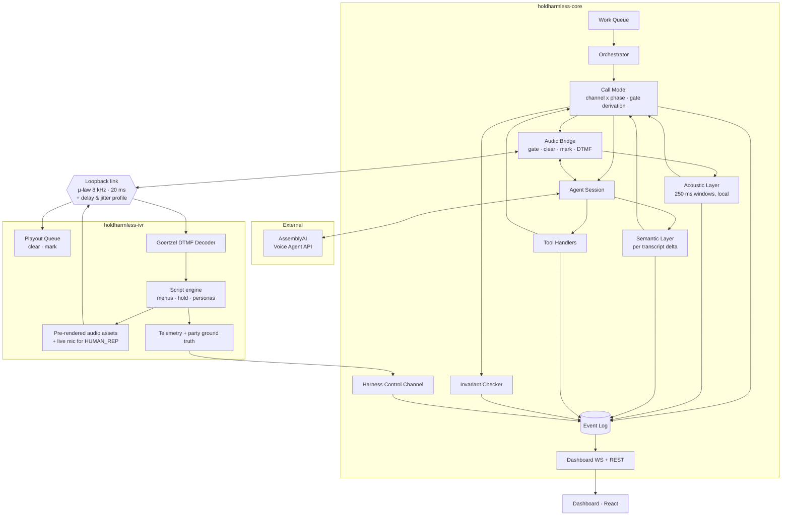

# HoldHarmless — Architecture Single Source of Truth

| | |
|---|---|
| **Version** | 1.3 |
| **Status** | Day-0 experiments run 2026-09-21; results folded in. A-2, A-18, A-24, A-25 closed; A-33 measured for its Day-0 half. Week 1 may begin |
| **Scope** | AssemblyAI Voice Agent Hackathon — 30-day build |
| **Transport** | Local audio transport with a synthetic telephony profile. No carrier, no phone numbers |

---

## 0. How to read this document

This is the only document. If code and this document disagree, one of them is wrong and must change.

**Read before writing any code:** §0.1 (error classes), §2 (decisions and why), §5 (the call model), §12 (package interfaces), §17 (invariants), §21 (build order), §23 (Day-0 experiments).

**Two process rules bind this project.**

1. Any mechanism that touches the call model must appear as a row in §18 and be checked against every channel and every phase before the document is considered consistent.
2. Every error class in §0.1 must have an automated checker in `scripts/`. Manual cross-reading is not relied upon; it has demonstrably missed whole classes.

### 0.1 Error classes and their checkers

Six failure classes are known to recur in systems of this shape. Each has a checker that runs in CI. No release proceeds with any of them red.

| Code | Class | Checker |
|---|---|---|
| **K-1** | **Value-dependent dead end.** A state is reachable with a field value that has no exit | `INV-11` — checked over the cartesian product of the two call dimensions |
| **K-2** | **Incomplete mechanism coverage.** A correct mechanism is applied to some but not all of the positions that need it | `INV-6` — checked over every phase, in both directions |
| **K-3** | **Tool without a transition.** A tool is permitted somewhere, but its effect has no corresponding transition | `INV-17` |
| **K-4** | **Claim without a reachable mechanism.** One section says something is enforced; the named mechanism cannot enforce it | `scripts/check-doc-claims.ts` — twelve checks, §17.3 |
| **K-5** | **Ordering race between speech and side effect.** The agent utters a closing before the system has written the result | `INV-19`, `INV-20` |
| **K-6** | **Transition without a producer.** A transition exists in the model, but no observation, tool, timer, or session event can produce it | `INV-21` |

**K-6 is the reason §5 is structured the way it is.** A model that enumerates transitions will always drift ahead of the mechanisms that fire them, because drawing an arrow is easier than building the thing that pulls it. The two-dimensional model in §5 makes that drift impossible: each dimension has exactly one class of producer, and `INV-21` refuses to build a transition whose producer is not named.

---

## 1. Overview and scope

### 1.1 What this system is

A voice agent that places outbound calls to another organization's phone system, navigates its IVR menu, waits on hold, and negotiates with a human representative to complete a prior authorization request on behalf of a medical clinic.

The agent discloses that it is an AI in its first sentence to every human it speaks with, supplies only the patient data the representative asks for, and hands off to clinic staff whenever a clinical question arises.

**The call runs over a local audio transport, not a carrier network.** Both endpoints — the agent and the simulated payer switchboard — are processes this project owns, exchanging G.711 μ-law frames at 8 kHz on a 20 ms cadence, through a transport that applies a configured network delay and jitter profile. §1.7 states exactly what that does and does not demonstrate, and §12.3 defines the interface that a carrier implementation would satisfy.

### 1.2 Why this is technically hard

An ordinary voice agent waits to be called by a cooperative human trying to be understood. This one faces three adversarial conditions in sequence:

1. **An impatient machine.** IVR menus read quickly, expect a keypress within seconds, and restart from the top on timeout.
2. **Ten to twenty minutes of hold audio.** During which the agent must say nothing, while staying attentive enough to notice the instant a human returns.
3. **A human who interrupts.** Representatives talk over the agent, backchannel while it reads numbers aloud, put it back on hold mid-sentence, and transfer it to other departments without warning.

These attack the hardest parts of any voice agent: turn detection, deciding when to stay silent, and barge-in handling. The design centers on those three rather than on conversation quality, which is comparatively easy here.

### 1.3 Market position and narrative constraints

**This category is occupied.** Infinitus Systems has operated voice agents calling payers and pharmacy benefit managers commercially since 2019, with substantial funding, millions of calls, and AI disclosure at call start. Others operate in adjacent space.

These constraints bind every external description of this project:

- **Never claim** this is a new category, an untouched problem, or the first automation of prior authorization calls.
- **The defensible claim:** a technical demonstration of the hardest sub-problem in the Voice Agent API — turn detection, silence decisions, barge-in under adversarial audio — in a market whose value well-funded incumbents already validate.
- Infinitus existing is **evidence of business value, not a threat**.
- Contributions that belong to this project: mid-call session reconfiguration (ADR-006), a gate derived from channel rather than bound to workflow progress (ADR-007), per-party disclosure verified against the counterparty's own ground truth (ADR-017, ADR-018), outcome written before any closing utterance (ADR-015), and every safety claim measured from the far end (§16.1).

### 1.4 Target segment

Phone-to-human is the channel for **complex, high-value cases**: specialty drugs, oncology, biologics, step therapy, and requests that already failed through a payer portal.

This channel typically **precedes** appeal and peer-to-peer review rather than conducting them. Those are clinician-to-clinician conversations and are outside scope (Appendix B).

CMS-0057-F, the US rule mandating FHIR-based prior authorization APIs, does not cover traditional Medicare, standalone Part D, or commercial employer-sponsored plans — together the largest share of prior authorization volume at many specialty practices. Electronification is proceeding slowly and unevenly; what remains on the phone is the high-value exception set.

### 1.5 Data claim boundaries

| Claim | May be stated as | May not be stated as |
|---|---|---|
| Share of PA by phone | The CAQH Index groups phone, fax, mail, and email into one "fully manual" category (~26–33%); phone-to-human is a subset that cannot be isolated | A precise "X% is done by phone" |
| PA burden | AMA survey: ~39 requests per physician per week, ~13 combined hours per week, across all channels | That those 13 hours are phone time |
| Hold times | RCM sources consistently report ~20 minutes or more | A precise industry average |
| ROI | An illustrative scenario with its assumptions stated | A savings figure as industry fact |
| Harness realism | Designed from documented industry patterns | A precise simulation of any specific payer |
| Transport | A local transport at telephony format and a configured network profile | A live call over the public telephone network |
| API cost | Verified against current public pricing (§20.1) | — |

### 1.6 Non-goals

- Calling a real insurance payer, or any real telephone number.
- Clinical decision-making. The agent never summarizes, selects from, or interprets clinical documentation (ADR-016).
- Caller identity verification beyond NPI and member ID, and the HIPAA Business Associate Agreement chain.
- Live transfer to a human staff member (ADR-014).
- Multi-tenancy, RBAC, compliance-grade audit trails.
- Scale. One active call at a time.
- **Real patient data.** Every `AuthRequest`, fixture, and harness script must be synthetic (`INV-12`).

A register of correct-but-out-of-scope concerns is in **Appendix B**.

### 1.7 What the local transport does and does not demonstrate

Stated here rather than buried, because it is the first thing a careful judge will ask.

**What is real and unchanged by the absence of a carrier:**

| Property | Why it survives |
|---|---|
| Audio format | G.711 μ-law, 8 kHz, 20 ms frames — the exact encoding a telephony platform delivers, and the exact encoding AssemblyAI receives |
| Network delay and jitter | Applied by the transport from a configured profile (§4.5), not zero |
| Playback buffering | The harness holds a real playout queue, so `clear` and `mark` accounting (ADR-007) are exercised against a buffer that genuinely holds audio |
| DTMF | Real dual-tone audio, synthesized by the agent and decoded by a Goertzel filter bank — not a signaling shortcut |
| Everything above the transport | Session reconfiguration, turn detection, the gate, the classifier, disclosure, tool contracts, invariants. None of it knows what carries the frames |

**What is not demonstrated, and must be said plainly:**

| Gap | Consequence |
|---|---|
| No carrier in the path | Codec transcoding, packet loss patterns, and carrier-side DTMF relay are not exercised |
| The jitter profile is configured, not observed | It models documented telephony behavior; it is not a measurement of one |
| Playout buffer depth is ours | A real platform's buffer is not under our control; ours is |

**The sentence to use.** "The transport layer is abstracted behind one interface with a local implementation running at telephony format and a configured network profile. A carrier implementation satisfies the same interface and is specified in the architecture, gated on an experiment we have not run." That is a stated boundary, not a concealed weakness — the same pattern §1.5 and Appendix B use throughout.

---

## 2. Architecture Decision Records

### ADR-001 — Local audio transport at telephony format

**Decision.** The call runs between two processes this project owns. `holdharmless-core` hosts the agent; `holdharmless-ivr` hosts the simulated payer switchboard. They exchange G.711 μ-law frames at 8 kHz, 20 ms per frame, over one bidirectional WebSocket. No carrier, no SIP, no phone numbers.

**Rationale.** Every technical claim this project makes lives above the transport. Session reconfiguration, the derived gate, the two-layer classifier, per-party disclosure, and the outcome-ordering guarantee are all indifferent to what carries the frames — provided the frames arrive in the right format, at the right cadence, with realistic delay, and through a buffer that can actually hold them. A local transport supplies all four.

Removing the carrier also removes a class of risk that belonged to the carrier and not to the problem: whether in-band tones survive an operator's network, how many forked media streams a platform permits, and which of a platform's two stream verbs is bidirectional. None of those are questions about voice agents.

**Rejected alternatives.**

| Alternative | Reason rejected |
|---|---|
| Carrier PSTN between two owned numbers | Real, and specified in §12.3 as a future implementation. Rejected for this build because it costs money and adds three fatal-ranked assumptions that belong to the carrier rather than to the system under test |
| SIP between two local softswitches | Gives genuine RTP and codec negotiation, but two to three days of media-server work for properties §4.5 models directly |
| Provider-native SIP into the voice API | Removes the audio bridge entirely, and with it the gate, the local classifier, and DTMF injection — the contributions the project exists to show (Appendix A) |

**Consequences.**
- Both processes run on one host, sharing one clock. Harness telemetry needs no offset estimation (§10.4).
- No public endpoint, no webhooks, no inbound routing.
- The transport must inject delay and jitter deliberately, or every latency measurement is fiction (ADR-003, §4.5).
- The claim made to judges is bounded by §1.7 and is never stretched.

### ADR-002 — One transport interface, one implementation built

**Decision.** All core code speaks to the `CallTransport` interface (§12.3). `LoopbackTransport` is the implementation that exists. `TwilioTransport` is specified by the same interface and is not built.

**Rationale.** The interface is what makes §1.7's claim honest: the carrier path is not hand-waved, it is a named implementation of a defined contract, with its open questions written down as assumptions that were not run. Keeping the abstraction also prevents transport details from leaking into the call model, which is what would make a later carrier implementation a rewrite rather than an addition.

**Consequences.**
- No transport-specific concept appears above `packages/transport`. Enforced by an ESLint boundary rule.
- `CallTransport` must be expressible by both implementations, which is why `clear()` and `mark()` are on the interface rather than being loopback conveniences: a carrier platform requires them, so the local implementation honors them too.

### ADR-003 — Single host; region is a declared, measured parameter

**Decision.** Core and harness run on the same host. The host's network distance to the AssemblyAI endpoint is a declared parameter, measured by E3 from **the host the demo will actually run from**.

**Rationale.** With no carrier, there is no public endpoint to host and no reason to deploy anything. But AssemblyAI is reached over the internet, and round-trip time to it is a real term in §4.2. A latency figure measured on one continent and presented from another is a number that collapses under a follow-up question.

**Two configurations, both legitimate.**

| Configuration | Round trip to AssemblyAI | Use |
|---|---|---|
| **Local host** | Whatever your connection gives | Development, and a live demo if the measured figure is acceptable |
| **Cloud host near the API region** | Lower and more stable | Measurement runs and a recorded demo |

**Consequence.** E3 is run on the demo host, and its numbers are the ones reported. If the demo is given from a different host than the one measured, the measurement is invalid and must be repeated. `A-33` covers this.

**Consequence for `HUMAN_REP`.** Live human audio comes from a local microphone (§10.5). If the harness runs on a cloud host, that audio has to travel there, adding delay that is not part of the system under test. `HUMAN_REP` sessions therefore run on the local host, and their latency figures are reported separately from `BOT_REP` figures.

### ADR-004 — TypeScript throughout

**Decision.** Node 20+, TypeScript, pnpm monorepo.

**Rationale.** The dominant workload is coordinating three concurrent WebSockets — transport, AssemblyAI, dashboard. A single event loop maps this cleanly. Event types are shared between backend and dashboard. Most importantly, the correctness of §5 rests on exhaustiveness checking over union types, which is what makes several invariants hold by construction rather than by inspection.

**Consequence.** μ-law encoding, the DTMF generator, and the Goertzel detector are hand-written (roughly 120 lines). That is an advantage: no opaque dependency sits in the audio path when it needs debugging.

### ADR-005 — DTMF is synthesized as real audio

**Decision.** Menu navigation in `dtmf` mode uses genuine dual-tone audio — 697/770/852/941 Hz against 1209/1336/1477/1633 Hz, 100 ms tone, 50 ms gap — generated by the orchestrator, injected into the outbound frame stream, and decoded by the harness with a Goertzel filter bank.

**Rationale.** The alternative would be a side-channel message saying "the agent pressed 2." That would make navigation work while demonstrating nothing: no tone generation, no detection, no evidence the technique is real. Tones in the audio stream are the honest version, and they cost about sixty lines.

**What the local transport changes, and what it does not.** Against a carrier, the open question is whether in-band tones survive the operator's network or are converted to out-of-band signaling. Here both ends are ours, so survival is guaranteed by construction and that question is not tested. The tone synthesis and the decoder are real; the carrier's treatment of them is not exercised. Say exactly that if asked.

### ADR-006 — The AssemblyAI session is reconfigured, never recreated

**Decision.** One session lives for the whole call. Configuration is pushed with `session.update` whenever the channel or phase changes.

**Rationale.** Creating a new session mid-call costs connection latency at the worst possible moment — when a human has just said hello. Reconfiguration is faster and preserves conversational context.

**Verified field mutability.** Measured by E0 on 2026-09-21 — fifteen probes, one field per probe, against this account.

| Mutable after `session.ready` | Immutable after the **first** `session.update` |
|---|---|
| `system_prompt`, `tools`, all of `input` (including `turn_detection` and `keyterms`), `transcription_prompt`, `transcription_mode`, `output.volume` | `greeting`, `output.voice`, `output.format` |

All thirteen mutable probes returned `session.updated`. Both immutable probes returned `session.error` with code `immutable_field`, and the change was ignored. None of the three needs to vary.

**The lock is earlier than this document originally claimed.** The server's own message is *"'output.voice' cannot be changed after the first session.update"* — not after `session.ready`. The practical consequence is unchanged, because the first `session.update` is where these are set, but it removes a window that never existed: there is no moment between the first update and `session.ready` in which a correction could land.

**A partial `session.update` MERGES; it does not replace (measured 2026-09-24, module 3.5).** This question is load-bearing for ADR-010: every phase change sends an update carrying `input.transcription_mode` and nothing else, and if that replaced the session it would take `tools` with it — every tool on the call silently disarmed from the first phase change, with nothing in the transcript to show it. The server answers directly. Its `session.updated` echo after a mode-only update still carries the full `tools` array, and capture worked on every turn after it. Updates sent WHILE a reply is outstanding are also harmless: three of them, three captures. Fourteen of fifteen captures across two probe runs and five mid-session updates, the one miss being an ASR-dropped digit of the kind A-24 already characterizes. `scripts/session-update-merge.ts`, `results/session-update-merge.json`.

**The server's echo also states the turn-detection defaults this account runs with**: `vad_threshold` 0.5, `min_silence` 1000 ms, `max_silence` 3000 ms, `interruption_delay` null. ADR-009 declines to set the two silences; this records what declining leaves in place.

**Constraint.** ADR-009 excludes `min_silence` and `max_silence`. ADR-010 and ADR-011 supply the per-position levers that remain.

**This is the primary technical claim made to judges:** one agent that changes its interruption policy, transcription accuracy mode, and persona according to who is detected at the other end of the line.

### ADR-007 — The audio gate is derived from channel, not from workflow progress

**Decision.** `gateIntent` is a **pure function** of the channel dimension and the hold-suspicion flag. It is never stored, never set by hand, and never depends on how far the work has progressed.

```typescript
function gateFor(channel: Channel, holdSuspected: boolean, navMode: NavMode): GateIntent {
  if (holdSuspected) return 'closed';
  switch (channel) {
    case 'HUMAN':    return 'open';
    case 'IVR':      return navMode === 'dtmf' ? 'dtmf_only' : 'open';
    case 'HOLD':
    case 'TRANSFER':
    case 'DIALING':
    case 'CLOSED':   return 'closed';
  }
}
```

**Rationale.** Whether the agent may be heard depends entirely on *who is listening*, and not at all on whether the agent is mid-greeting or mid-read-back. Deriving the gate makes it impossible for the two to disagree, and lets `holdSuspected` — the fast signal — dominate `channel`, the slow one, with no procedural ordering to get wrong.

**The suspicion/confirmation split is preserved and is structural.** `holdSuspected` flips within a few hundred milliseconds of a hold cue and closes the gate immediately. The channel transition to `HOLD` waits for confirmation, which needs slow evidence. Binding the gate to the confirmed transition would leave a one-to-two-second window in which the agent talks over hold audio; deriving it from both closes that window without a second mechanism.

**Three enforcement layers:**

| Layer | Mechanism | Nature |
|---|---|---|
| 1 — Prompt | `HOLD.txt` instructs silence | Soft; can fail |
| 2 — Transport | Gate discards frames **and** sends `clear` | Hard |
| 3 — Observation | `safety.violation` per reply; leakage measured **at the harness** | Measurable |

**Why layer 2 needs `clear`.** The harness holds a playout queue (ADR-008). AssemblyAI emits `reply.audio` faster than real time, so seconds of speech can already be queued when the gate closes. Closing the gate stops future frames; it does not stop what is already queued. `clear` empties the queue and returns `mark` events naming the discarded chunks.

**Three `clear` triggers:** the gate closing, `reply.done` with `status: "interrupted"`, and `input.speech.started`. The third arrives earliest because it marks the *start* of far-end speech. It also fires for speech that is not an interruption, so early flushing must be paired with an adequate `interruption_delay` (ADR-011); A-14 tests both together.

**A fourth consequence, easily missed.** When layer 1 fails and layer 2 discards a reply, the AssemblyAI session still records that reply as delivered in its own turn history — the model has no visibility into the local gate. On return from hold the agent may act as though it conveyed something nobody heard. Whenever a hold segment closes with a recorded `audio_during_hold` violation, the next `session.update` prepends a one-line corrective note (§7.4, `CONTEXT_CORRECTION.txt`).

**Rejected alternative: raising `max_silence` during hold to suppress generation structurally.** It conflicts with ADR-009, trading hold safety for conversation quality in the positions judges evaluate.

**Rejected alternative: a third input to `gateFor()` for one sanctioned probe during hold.** Decided in v1.3. §6.7 had permitted a single spoken "are you still there?" after the hold sensitivity ramp — in channel `HOLD`, where this function always returns `closed`, so the probe was billed and never heard. Making it audible would have meant opening the gate on something other than who is listening, and this ADR's whole claim is that nothing else participates. The probe was removed instead; `HOLD_TIMEOUT_MS` is the only exit from a hold that nobody leaves.

### ADR-008 — The harness holds a real playout queue

**Decision.** The harness does not play frames the instant they arrive. It enqueues them in a `PlayoutQueue` of configured depth (default 200 ms), drains it at the 20 ms frame cadence, and honors two control messages: `clear`, which discards unplayed chunks and returns a `mark` for each, and `mark`, which returns a named acknowledgement when a position in the stream is reached.

**Rationale.** Without a queue that genuinely holds audio, `clear` would be a message with nothing to clear, `INV-3` would be vacuous, `A-3` would measure nothing, and the second of ADR-007's three enforcement layers would exist only on paper. The queue is what makes the silence guarantee testable rather than asserted.

**This is a strength of the local transport, not a compromise.** Against a carrier, the playout buffer is inside the platform: you can observe its effect but not its contents, so `A-3` can only be measured as an outcome. Here the queue is ours, so the same experiment measures both the outcome and the mechanism, and a failure can be attributed rather than guessed at.

**Honesty boundary.** Depth and drain behavior are configured to model documented telephony playout, not measured from one. Against a real platform the depth is not under our control. Stated in §1.7.

**A 200 ms queue only works if the sender is paced — and that relocates the problem ADR-007 describes.** AssemblyAI emits `reply.audio` faster than real time. An unpaced sender would overflow a 200 ms playout queue within a fraction of a second, the queue would drop its oldest frames as §10.3 requires, and the far end would hear only the tail of every reply. So the Audio Bridge must pace output to the 20 ms frame cadence (§3.2 already assigns it "pacing"), buffering the burst on the core side.

The consequence is easy to miss: ADR-007's "seconds of speech already queued when the gate closes" do not sit in the harness's playout queue — which holds at most 200 ms — but in **the Audio Bridge's pacing buffer**. A `clear` that empties only the far-end queue would leave those seconds to be sent the moment the gate reopens. **Closing the gate must therefore flush the pacing buffer as well as send `clear`.** `INV-3`'s "zero unplayed agent frames" has to be checked at both ends, and A-3 must measure both. Recorded here from module 1.3; it lands in code with the Audio Bridge in week 2.

### ADR-009 — Turn detection timing is a session-level decision

**Decision.** `min_silence` and `max_silence` are never set, anywhere.

**Rationale.** The API reference states that setting either explicitly switches the session to fixed timers and disables adaptive pacing and entity-aware waiting **for the remainder of the session**. Adaptive endpointing is what makes human conversation feel natural here and is part of the claim made to judges.

**Verified carve-out.** The warning names only those two fields. Freely variable: `interrupt_response`, `interruption_delay`, `vad_threshold`, `transcription_mode`, `system_prompt`, `tools`, `keyterms`, `transcription_prompt`. ADR-006 is unaffected. E0 confirmed all eight are accepted.

**E0 also confirmed that `min_silence` and `max_silence` are themselves accepted** — both returned `session.updated` rather than an error. That matters: this ADR is a decision to decline a capability the API offers, not a rationalization of a limit it imposes. Had they been rejected, the adaptive-endpointing claim made to judges would rest on the API's behavior rather than on a choice this project made and can defend.

### ADR-010 — `transcription_mode` is the accuracy lever

**Decision.** `transcription_mode` varies by position.

| Position | Mode | Reason |
|---|---|---|
| channel `IVR` | `min_latency` | Menus read quickly; latency beats accuracy |
| channel `HOLD` or `TRANSFER` | `balanced` | The semantic layer needs patterns, not precision |
| channel `HUMAN`, any phase | **`balanced`** | Measured: `max_accuracy` buys no accuracy here and costs ~5.5 s of perceived response (A-13, revised 2026-09-25) |

So the mode now varies across two channels, not three: `min_latency` on `IVR`, `balanced` everywhere a human or a hold is on the line. `max_accuracy` remains in the type; no position selects it.

**Rationale.** `transcription_mode` adjusts how long the model waits in silence before ending a turn and is mutable mid-session. The original rationale — that the vendor recommends `max_accuracy` for values that must not be wrong — was a recommendation, not a measurement. A-13 measured it, and on this rig it does not hold.

**What the original decision was trying to prevent, and what actually answers it.** A representative spells "A as in alpha, four, seven, two, dash, nine" and pauses mid-spelling. The turn splits, the agent replies before the number is complete, read-back fails, attempts increment. That failure is real — A-13 reproduced it 28 times out of 28. What it is not is a transcription-mode problem: `max_accuracy` splits the turn at a 900 ms pause exactly as `balanced` does. What contains the harm is the layer above: the agent asks for the number again rather than recording half of one (§8.2's far-end sanity check), so the cost is a lost turn, not a wrong authorization number. That containment is where the guard belongs, and it is mode-independent.

**Gated on A-13 — the gate did not pass, and the decision changed (measured 2026-09-24, decided by the project owner 2026-09-25).** A-13 was written with two clauses, and both were tested on the same rendered numbers:

| Clause | Bar | Measured |
|---|---|---|
| Capture accuracy improves | better than `balanced` | **No improvement.** `balanced` 45/45 exact across three runs; `max_accuracy` 44/45, the single miss being a dropped digit. Both are at the ceiling this rig can measure |
| `perceived_response_ms` does not regress by more than 300 ms | ≤ 300 ms | **~5.5 s.** End of the representative's audio to the agent's first reply byte: `balanced` median 1397 ms (range 1287–4544), `max_accuracy` median 6871 ms (range 6571–7026). The ranges do not overlap |

**What the measurement does not settle.** The two arms were two sessions, so the latency gap could in principle belong to the session rather than to the mode. The run built to control for that — alternating the mode inside one session — lost capture on every turn after its first update, in both modes, and the probe above then showed that updating mid-session is not what breaks capture. That arm is unexplained and is used as evidence for nothing; the between-session comparison is what stands, with its limitation stated.

**The failure this ADR claims to prevent was then tested directly, and `max_accuracy` does not prevent it.** A 900 ms pause was injected into the middle of the spoken number — a representative looking at their screen mid-spelling. Across 28 trials in two runs, capture failed in **all 28, in both modes**: the turn splits at the pause, and the agent asks for the number again ("I didn't catch the full number. Could you please repeat that?"). It does not record a half number, which is the harm §8.2 guards; it loses the turn. `max_accuracy` behaved exactly as `balanced` did. So the mid-spelling split is real, and `transcription_mode` is not the lever that answers it.

**The decision, taken 2026-09-25 by the project owner: `balanced` on every `HUMAN` position.** The table above is the revised one. The reasoning recorded with it: what is given up is an accuracy improvement that was never observed, and what is bought back is about five and a half seconds per human turn against a 300 ms bar — on the number that panel 7 puts in front of a judge. The limitation stated above was put to the owner with the decision and accepted: the arms were separate sessions, so the direction of the latency result is firm and its exact magnitude is not.

**What would reopen this.** A measurement on which `max_accuracy` captures something `balanced` misses. A-24 already shows where capture actually fails — ASR digit drops and mid-spelling splits — and neither is mode-sensitive, so the reopening evidence would have to be new in kind, not a rerun. `results/a24-capture.json`.

### ADR-011 — `interruption_delay` complements semantic barge-in

**Decision.** Raised where a mis-detection is most expensive; left at default elsewhere.

| Position | Value |
|---|---|
| channel `HUMAN`, phase `EXCHANGE` | 700 ms |
| channel `HUMAN`, phase `READBACK` | 800 ms |
| Everywhere else | Not set |

**Rationale.** Semantic barge-in (§7.5) remains primary: backchannel does not interrupt, because only speech carrying turn intent does. `interruption_delay` is a second layer exactly where being wrong costs most — it raises how long speech must continue before counting as a real turn.

**Field facts.** It lives inside `input.turn_detection`, accepts 0–1000 ms, is mutable mid-session, and defaults to 0 ms for `min_latency` and 500 ms for `balanced` and `max_accuracy`.

**Gated on E0 / A-18**, controlled by `ENABLE_INTERRUPTION_DELAY`.

### ADR-012 — Append-only event log as runtime source of truth

**Decision.** Every transition, gate change, classifier observation, tool call, transcript turn, safety violation, and harness telemetry reading is appended to a log. The dashboard reads the log and holds no state.

**Rationale.** It makes calls replayable, reports derivable, and debugging possible after the call ends. Replay is also the primary cost-control mechanism (ADR-021) and the substrate several invariants check against.

### ADR-013 — The harness decodes DTMF with a Goertzel filter bank

**Decision.** The harness detects menu key presses by running a Goertzel filter bank over the audio it receives, at 40 ms windows across the eight DTMF frequencies, requiring two consecutive detections of the same digit before accepting it.

**Rationale.** The agent sends tones as audio (ADR-005), so the harness must detect them as audio. A Goertzel bank is the standard technique, costs about sixty lines, and needs no dependency.

**Two navigation modes, both built.**

| Mode | Mechanism | Role |
|---|---|---|
| `dtmf` | Agent synthesizes tones; harness decodes | Primary. The agent stays silent through navigation — the cleaner story |
| `speech` | Harness accepts a spoken menu selection; the agent says its choice | Realistic — modern payer IVRs accept speech — and the fallback if tone timing proves fragile |

E1 sets the default for `IVR_NAV_MODE`. Both modes have their own prompt file (§7.4) and their own row in §18; a fallback with no prompt is not a fallback.

**Tone timing is the only real variable.** Detection reliability depends on tone duration against the detector's window and on how the transport's jitter profile disturbs frame spacing. E1 sweeps tone length downward until detection degrades and records the lowest timing that still achieves 20/20.

**E1 result (2026-09-22, `results/e1-dtmf.json`).** Twenty digits per trial (every key, plus four immediate repeats), five trials per timing, each starting at a different offset within a 20 ms frame; a timing passes only if all five are 20/20 with no insertions. Decoded from what the far end's *speaker* emits, underflow silence included (§4.4).

| Tone (ms) ↓ · gap (ms) → | 50 | 40 | 30 | 20 |
|---|---|---|---|---|
| 100 | pass | pass | fail | fail |
| 80 | pass | pass | fail | fail |
| 70 | pass | pass | fail | fail |
| 60 | pass | pass | fail | fail |
| 50 | pass | pass | fail | fail |
| 40 | fail | fail | fail | fail |

Two limits, both mechanisms confirmed from the decoded strings rather than inferred:

- **Gaps under 40 ms merge repeated digits.** "55443300" decodes as "5430" — no window in a 30 ms gap is silent throughout, so the detector's guard against one long tone reading as several presses never resets. Distinct digits are never lost. The agent presses one digit per menu level (`IVR_DTMF.txt`), so in use this bites only on a repeated digit within one `send_dtmf`; `DTMF_GAP_MS` stays at 50 regardless.
- **A 40 ms tone is accepted or rejected depending on where it falls against the frame grid** (0/20 frame-aligned, 20/20 at a 4 ms offset). This is deliberate, and the result of a detector fix E1 forced — below.

**A detector defect found while building E1, and fixed.** A single 20 ms fragment of tone decoded as a digit: consecutive 40 ms windows overlap by half (the fix for repeated digits in module 1.2), so one fragment filled the shared half of two windows, each passed on total energy, and "two consecutive detections" was satisfied by 20 ms of sound. Standard DTMF receivers must reject tones that short (ITU-T Q.24's non-operate bound is in the low 20s of ms). A window now counts only if the pair is present in **both** of its halves, which restores what "two consecutive windows" was meant to require: roughly 60 ms of continuous tone. The consequence for the harness is concrete — a tone the core clears from the playout queue after one frame has played is no longer heard as a key press.

**A fidelity fix, also found here.** The far end decoded from `onPlayed`, which skips ticks on which the playout queue was empty. A listener hears those ticks as silence, so a tone with an underflow hole was being decoded as unbroken. The far end now decodes from `onSpeaker` — every tick, comfort silence included — and counts mid-audio underflow ticks. `TELEPHONY` produced 0–2 per 20-digit trial; none caused a miss **in those trials, and "none caused a miss" was the wrong lesson to take from that** — see below.

**A third limit, found by CI rather than by an experiment (2026-09-24, module 3.6).** The Linux runner, under load, failed the A-1 regression with `00123456789*#55443300`: the leading digit twice. The cause is the fidelity fix above meeting the repeat guard. One comfort-silence frame — 20 ms, emitted because the sender was starved for a single tick — landed inside the first tone, and the guard that stops one long tone reading as several presses treated that hole as the pause between two presses of "0". Reproduced exactly, deterministically, by splicing one silent frame into the same stream.

The fix is a change of what is measured. **Counting windows that failed to classify cannot separate these two cases**: with a 40 ms window, a 20 ms hole inside a tone and a 50 ms pause between presses both produce exactly two unclassifiable windows. Requiring three of them was measured and made things worse — it lost the repeated digits in the clean stream, which is the failure in the first bullet above arriving from the other direction. What distinguishes the cases is how long the line was actually quiet, so the detector now measures that directly, **in samples**: a repeat of the same digit is accepted only after `MIN_INTERDIGIT_SILENCE_MS` (40 ms) of continuous near-silence, which is also the pause a real receiver requires. Window geometry no longer enters into it.

Re-measured after the change, at five sub-frame offsets each: 100/50 ms and **50/40 ms — the lowest timing E1 recorded — still decode 20/20**, so A-1's number is unmoved. A 30 ms gap still merges, as the table above already says. The loopback regression now also reports `underflowCount()` and bounds it by **E1's own measured range, 0–2** — the first version asserted zero, which contradicted the sentence above and failed on a CI runner that starved the sender exactly once. With the repeat guard fixed, a hole no longer corrupts the decode, so the decoded string is the criterion and the underflow count is a report on the host.

### ADR-014 — Escalation is deferred, not a live transfer

**Decision.** `escalate_to_human` means: the agent tells the representative the question needs clinic clinical staff, asks for a call reference number and callback route, **writes the outcome**, then delivers a closing and ends the call. The captured context becomes a task on the dashboard's Escalation Tasks panel (§11).

**Rationale.** Live transfer would require a third participant joining an active call, a conferencing capability the transport does not have and would not gain cheaply. More importantly, live transfer is not a demo moment worth building for: it replaces a visible, auditable handoff artifact with an off-screen conversation.

**This is closer to the real workflow anyway.** Representatives frequently say "we'll fax you the determination" or "check the portal in 24 to 48 hours."

**Mandatory consequences.**
- Every path into the closing phase with escalation intent must produce a `context_summary` (§8.6).
- The agent must never fall silent while closing.
- The outcome is written **before** the closing utterance (ADR-015).
- The handoff has a destination (§11, panel 8) and a way to be marked handled (§9.1, `escalated_resolved`). An escalation that nothing can act on is not a handoff.

### ADR-015 — The outcome is written before any closing utterance

**Decision.** In the closing phase, `record_outcome` is called **before** the agent speaks a conversational closing. Prompt files carry ordered `[[RECORD_OUTCOME]]` and `[[CLOSING]]` markers, and the order is checked statically and at runtime.

**Rationale.** A conversational closing is the social signal that a call is over; the natural response is to hang up. Anything the system still needs after that point races the other party's hand toward the receiver. Losing that race turns a successful call into a recorded failure that gets redialed — producing exactly the duplicate-request harm this product claims to reduce.

The escalation path makes it acute: by the time the agent says thank you, the reference number is captured and nothing remains for the representative to confirm. Nothing holds the line.

**Consequences.**
- `record_outcome` is permitted throughout the closing phase (§5.6).
- Writing the outcome does **not** end the call. The transition to `DONE` is produced by `reply.done` completing on a turn marked as closing, with `outcomeWritten` already true (§5.4). A tool acceptance must never move the call past the utterance it is supposed to precede.
- An independent safety net exists regardless (`INV-19`): if the transport closes while the log already holds sufficient outcome evidence, the Call Model writes that outcome rather than `failed`.

### ADR-016 — Clinical content is read verbatim, never interpreted

**Decision.** `AuthRequest.clinicalSummary` holds a short summary written and approved by clinic clinical staff **before the call**. The agent reads it verbatim when asked and does nothing else with it.

The agent never summarizes a medical record, selects the relevant portion, answers a clinical question from its contents, or quotes part of it. Any request requiring one of those calls `escalate_to_human`.

**Rationale.** This is the single point where "the agent reads a data field aloud" could quietly become "the agent interprets clinical documentation and decides what is relevant" — the boundary §1.6 exists to hold. Real revenue-cycle staff also read pre-vetted summaries rather than raw notes, for the same two reasons: the HIPAA minimum-necessary principle, and the prohibition on clinical interpretation by non-clinicians.

**Enforcement location.** The 300-character limit is validated **once, when the `AuthRequest` is created**. The model never populates this field, so enforcing it in the tool schema or handler would be the wrong place.

**Measured, not merely instructed.** `over_disclosure_count` (§16.2) counts fields returned by `get_auth_request` that the harness persona never asked for.

### ADR-017 — Disclosure is tracked per party, and hedging covers every return to a human

**Decision.** Two fields answer two different questions:

```typescript
disclosedToCurrentParty: boolean;   // does this person know they are talking to an AI?
phase: Phase;                       // where is the work?
```

Prompt selection for disclosure uses the first. The second never participates in that decision.

**The hard case: a short hold with a silent party swap.** A representative says "hold on, let me check," hands over to a colleague for twenty seconds, and a different person returns. No transfer was announced, the hold was too short for any duration-based reset, and no internal signal fires. The system cannot know.

The answer is not a detector; it is a prompt that does not depend on detection. `PARTY_HEDGE.txt` (§7.4) is prepended whenever the channel returns to `HUMAN` from `HOLD` or `TRANSFER` and party continuity is not assured. The model reads the greeting and decides. Because there is exactly one channel transition to guard rather than one per workflow position, this cannot be partially applied.

**Continuity is assured only when the hold segment was shorter than `PARTY_CONTINUITY_MS` (default 5 s)** — too brief for a person to change.

**The hold segment is measured from suspicion, not from confirmation.** `holdSuspectedAt` is stamped when the gate closes on a hold cue or provisional periodicity; `holdDurationMs` is computed from that instant. Measuring from the confirmed channel transition would under-report by the confirmation delay — three seconds on the cue path, up to twenty on the acoustic path — against a five-second threshold, silently suppressing the hedge on real holds twice that long.

**`disclosedToCurrentParty` resets to `false` on:** `notify_transfer`; channel entering `TRANSFER`; channel returning to `IVR` from `HOLD`; and any return to `HUMAN` where the hold segment exceeded `DISCLOSURE_RESET_HOLD_MS` (120 s).

**As built in v1.3 (module 2.5), `createDisclosureTracker` in `packages/callmodel`.** Every reset in the list below has one test; `partyContinuityAssured` is computed from the hold segment and is never assured after a `TRANSFER`, announced or not. The measurement that matters is not here: A-12 and A-20 compare `disclosuresDelivered` against harness ground truth across whole calls in which the model speaks, and until the week-3 call loop exists there is nothing to compare. What is proven today is everything underneath the model — the resets, the hedge trigger, and the rule immediately below.

**It is set to `true` by observation, not by provenance.** A disclosure phrase must actually appear in the agent's own transcript (§7.6). Setting it because a prompt containing disclosure instructions was loaded would mark a party as informed even when the agent's reply skipped the sentence — after which the agent would be free to read a member ID to someone who was never told.

> **Binding principle.** For an ethical commitment the correct direction of failure is **too often**, never too rarely. Repeating a disclosure is awkward. Omitting one is a breach.

**Rejected alternative: a pessimistic party counter** incremented on every hold exit. It would force re-introduction after every short hold with the same representative, discarding the conversational continuity the design otherwise maintains. The hedge delegates the judgment to a model that can hear the greeting; a counter hears nothing.

### ADR-018 — Party count is measured against harness ground truth

**Decision.** The compliance metric `disclosure_delivered_per_party` compares `disclosuresDelivered` (detected from the agent's transcript by §7.6) against **the number of distinct representative personas the harness actually used** — never against an internal estimate.

**Rationale.** An internal count derives from signals that can fail to fire. A short hold with a silent swap produces none of them. If the metric divides by its own estimate, it reports success precisely in the case where the system was blind. A metric that cannot fail is not a metric.

**Mechanism.** The harness emits `harness.telemetry { metric: 'parties_used', value: N }` over the control channel (§10.4).

**Derived metric with independent value.** `party_detection_miss_count` = `parties_used − partiesDetected` measures how blind the internal detector is. Zero means detection was complete; above zero means the hedge, not the detector, kept the call safe — which is the most honest thing this system can display.

**Outside a simulated counterparty.** With a real payer there is no ground truth channel; there the metric becomes a post-call transcript audit. Stated in Appendix B rather than hidden.

### ADR-019 — Transfer is announced by the model, not inferred by the classifier

**Decision.** The channel moves to `TRANSFER` **only** through the `notify_transfer` tool.

**The general rule this expresses:**

> **Speed-critical with closed vocabulary → semantic classifier layer.**
> **Correctness-critical with open vocabulary → LLM tool call.**

`HOLD_CUE` belongs in the classifier: it closes the audio gate, where milliseconds matter, and its phrase set is small and fixed. `notify_transfer` belongs in a tool: it changes disclosure behavior, where being right matters, its vocabulary is open, and its latency is not critical because a transfer is almost always followed by hold.

**`notify_transfer` is permitted in every phase.** A representative can transfer at any moment, including mid read-back and mid closing. Rejecting the tool call does not prevent the transfer; it only discards the disclosure reset.

**Side effects on entry:** `disclosedToCurrentParty = false`, gate closed by derivation.

### ADR-020 — The authorization number is captured by tool, which removes the need to normalize it

**Decision.** `capture_auth_number` is a first-class tool, called the moment the representative states the number. The agent then reads back **the captured value**, and `record_outcome` must carry a value identical to it.

**Rationale, and why the obvious alternative fails.** The alternative is comparing `record_outcome.auth_number` against a transcript. Both readings of that are broken:

- **Against the far-end transcript.** The representative spells "A as in alpha, four, seven, two, dash, nine." Recognition produces prose; the model produces `A472-9`. A literal comparison fails, and because a mismatch is deliberately non-retryable, every successful approval would convert into a forced escalation with a red violation on the panel. Rescuing it requires a canonicalization function covering spoken digits, "as in" phrases, separators, case, and "dash" versus `-` — a function whose reliability would itself need proving.
- **Against the agent's own transcript.** The agent read the number aloud, so it appears there too. But that utterance came from the same model belief that filled `record_outcome`. The check passes tautologically and proves nothing — a validation that cannot fail, the same error §16.1 forbids for metrics.

Capturing the number once, as a structured tool parameter, dissolves both horns. The read-back reads a stored value, and the final comparison is between two copies of that stored value. No normalization is required anywhere.

**The far-end transcript retains a role, but only as a sanity check.** If the captured value does not appear in far-end speech in any recognizable form, `auth_number_capture_suspect` is recorded. That is a signal for review, not a rejection — distinguishing a recognition problem from an integrity problem, which a single combined check would hide.

**Entity-aware waiting now applies where it helps.** The Voice Agent API waits for a complete value when it knows one is being collected, and it knows from tool parameters and their `description`, `examples`, and `pattern`. With the number captured by tool at the moment it is spoken, that mechanism is active when it matters.

**A-24 result, 2026-09-21.** 28 of 30 exact, 93.3%, against a 95% bar. The decision this ADR makes is nevertheless **validated**, and the distinction is the point of running the experiment rather than reasoning about it.

**What was proven.** Zero comparison failures across 30 numbers. No canonicalization function was needed for spoken digits, "as in" phrases, separators, case, or "dash" versus `-`. The model's `capture_auth_number.value` matched the far-end transcript **30 times out of 30** — the model→tool path has no observed error at all.

**What failed, and where.** Both misses were introduced by speech recognition before the model ever saw them:

| Spoken | ASR transcript | Captured |
|---|---|---|
| "zero, zero, seven, one, two, four, four" | `PA00071244` | `PA00071244` |
| "three, three, nine, zero" | `… dash, 331. 9, 0, dash …` | `AUTH-33190-E` |

Both are **inserted digits**, not substituted ones, and in both cases the tool faithfully recorded a transcript that was already wrong. The lever is therefore recognition — `keyterms`, `transcription_mode`, and the audio itself — and not this ADR.

**The second failure was caused by the test rig, and that is worth recording.** The synthesized numbers separate every digit with a comma to stop the voice slurring them. That fixed slurring and introduced grouping ambiguity: "three, three, nine" was recognized as "331" followed by "9". A real representative pauses differently, so this specific error may not survive contact with a human voice — which is one more reason §6.6 puts genuine human turns in the calibration set at week 2.

**This is what `READBACK` is for.** An ASR insertion is precisely the failure the read-back phase exists to catch: the agent reads the stored value aloud, the representative hears a number that is not theirs, and `confirm_readback(matched: false, corrected_value)` replaces it (§8.2). A-24 measures capture in isolation; the workflow does not rely on capture alone.

**A-24 at scale, 2026-09-24 — the assumption closes at 20/20, and one of the two levers below is refuted.**

| Arm | Exact | Tool never called |
|---|---|---|
| Baseline (no lever) | **20/20 (100%)** | 0 |
| `transcription_prompt` | 20/20 (100%) | 0 |
| `pattern` on `value` | 1/20 (5%) | **19** |

**The 93.3% was the rig, not the system.** Day 0's rendering put a comma between every digit; this run says the numbers the way a representative does, spelling each letter with a NATO word and grouping digits in pairs. With that, capture-by-tool is exact on every number, and the model→tool path remains error-free — now 60 out of 60 across three arms.

Reaching that took two discarded runs, and both failures were in the rig rather than the system: the first invented an `AUTH-12345-X` shape and spelled the literal prefix ("Hotel, L" was captured as `AUTHL`, one spoken "dash" came back as "dash, Dash" and became `--`); the second said the same prefix as a word and the recognizer heard "off". A score measured through a rig that says what nobody says measures the rig. **Neither run's numbers are reported as A-24 results.**

**`pattern` is refused as a lever — it suppresses the capture entirely.** With `pattern: '^[A-Z0-9-]{3,20}$'` on `capture_auth_number.value`, the model heard the number correctly (the transcripts show it) and then did not call the tool at all in 19 of 20 cases. Entity-aware waiting may well read the pattern, but the cost here is not a worse value; it is no value. **§8.1 must keep `capture_auth_number.value` free of a `pattern`**, and this paragraph replaces the suggestion below.

**`transcription_prompt` is retained but unproven.** It changed nothing at 100%, which is the only honest reading: a lever cannot be shown to help where there is nothing left to fix. It stays available per position (ADR-006) for the harder audio §6.6 will bring — genuine human turns, where the baseline will not be 100%.

**Two levers, and `keyterms` is not one of them.** An authorization number is not known before the call — discovering it is the point — so it cannot be seeded into `keyterms` the way a CPT code or a payer name can (§7.2). What remains:

| Lever | Why it applies |
|---|---|
| `transcription_prompt` | Mutable per position (ADR-006), and its purpose is exactly this: bias the recognizer toward a domain. A line telling it that a representative is about to read an alphanumeric identifier digit by digit is the intended use |
| A `pattern` on `capture_auth_number.value` | ADR-020 already relies on entity-aware waiting, which the API derives from a tool parameter's `description`, `examples` **and `pattern`**. The §8.1 schema currently supplies the first two and omits the third |

Both are cheap to test and belong in week 1 alongside the `patient_dob` follow-up A-2 raised. **The third lever is `READBACK`, and it is already built.**

### ADR-021 — Fixture replay is the primary development tool

**Decision.** `packages/fixtures` stores raw audio **and the complete AssemblyAI event stream**. Classifier tuning, weights, hysteresis, and most call-model logic are developed offline against fixtures.

**Rationale.** The Voice Agent API bills per **session minute**, not per second of audio. Every iteration through a live call burns credit. With no carrier, the transport itself is free — but the session is not, and the session is the expensive half.

**Consequence.** Built in week 1. It is the highest-leverage infrastructure in the project, and the calibration harness (§6.6) depends on it.

**A second consequence specific to this transport.** Because both endpoints are local, a fixture can be replayed through the *real* transport and the *real* harness at zero cost for everything except the AssemblyAI session. That makes it cheap to verify that a change to the call model did not alter transport behavior, which would be an expensive test against a carrier.

### ADR-022 — The agent can start a turn, under three hard conditions

**Decision.** `AgentSession` exposes `createReply(cause, oneShotInstructions?)`, mapping to the API's client-side reply-creation event. It is the mechanism behind every recovery action in §5.7 and behind the first tier of the escalation procedure in §8.6.

**The event is `reply.create`**, confirmed by E-REPLY on 2026-09-21:

```json
{ "type": "reply.create", "instructions": "Ask whether the representative is still on the line." }
```

`instructions` is optional and is the one-shot channel §8.6 tier 1 depends on. E-REPLY verified it is obeyed, not merely accepted: five instructed calls produced five variations of the instructed question and nothing else.

**One behavior the production client must handle.** A `reply.create` sent while an earlier reply is still streaming is **queued** — not rejected, not merged, and it does not interrupt. The server finishes the first reply, emits its `reply.done`, then emits `reply.started` for the second in the same millisecond. `createReply` is therefore not safe to call speculatively or to retry: a second call during an active reply buys a second utterance, not a faster one. The Call Model must treat an outstanding reply as a precondition, alongside the three in this ADR.

**Rationale.** Every silence-recovery action — repeat the navigation, deliver the opening, ask whether the line is still connected, offer the next item, repeat the read-back, continue the closing — requires the agent to speak without the far end having spoken first. Without this primitive the recovery table is a list of intentions with no surface, and the scenario it exists to prevent — an agent that simply stops acting, not on hold, not failed, just silent — becomes guaranteed rather than prevented.

**Three conditions, all mandatory.**

1. **Forbidden unless the gate admits what the reply is permitted to produce** (refined 2026-09-23; it read "forbidden while `gateIntent ≠ 'open'`"). Otherwise a recovery action generates audio the gate discards — still billed, and testing `INV-2` rather than respecting it. A reply declares its product: `speech` needs an `open` gate; `dtmf` — a reply whose only permitted effect is a `send_dtmf` call — passes a `dtmf_only` gate as well, which is what keeps IVR navigation recovery (§5.7) possible without reopening the gate for speech.
2. **Forbidden while `holdSuspected` is true.** This makes `INV-4` true by construction rather than merely checked.
3. **Logged as its own event** (`reply.requested`, with its cause **and its product**). Otherwise `perceived_response_ms` mixes reactive replies with timer-driven ones and stops meaning anything — and, added in module 3.7, without the product in the log `INV-4` can only ask whether the gate was open, which is the rule condition 1 replaced. `gateAdmitsProduct` lives in `packages/events` for the same reason: the session, the Call Model and the invariant all apply it, and it used to live where the invariant could not see it.

**A-25 closed.** Reply within 1500 ms: measured at 239 ms median, 244 ms p90 with no instructions, and 236 ms median with them. Zero bytes reached the far end with the gate closed, while 3413 ms of audio was discarded — so the gate was exercised, not merely untested.

---

## 3. System architecture

### 3.1 Component diagram



There is exactly one audio link, and it is bidirectional.

**Two arrows corrected in v1.3.** The diagram had `AUD --> PQ` and `LB <--> PQ`. The playout queue holds audio the harness *receives* — "it holds a playout queue for the audio it is sent" (§10.1) — so it is fed by the link and feeds nothing back into it. The pre-rendered assets and the live microphone are what the harness *sends*, so they feed the link, not the queue. Drawn the old way, the diagram showed the harness playing its own IVR prompts into the buffer meant to hold the agent's voice. Found while building check #11, which verifies the audio links but cannot verify direction. `check-doc-claims.ts` check #11 verifies that every link in this diagram has an explicit direction and format statement in §4.

### 3.2 Component responsibilities

| Component | Owns | Does not own |
|---|---|---|
| **Work Queue** | The request queue, `attempts`, redial scheduling, checking status before redial | Anything about an in-progress call |
| **Orchestrator** | Call lifecycle; wiring | Audio decisions |
| **Call Model** | The **only** writer of `channel`, `phase`, `disclosedToCurrentParty`, `holdSuspected`; derives `gateIntent`; owns the tool allowlist; writes `AuthRequest.status` on failure paths | Detecting conditions |
| **Acoustic Layer** | `{SILENCE, PERIODIC, SPEECH_LIKE}` every 250 ms, at two confidence tiers | Distinguishing a human from an IVR prompt |
| **Semantic Layer** | `{IVR_PROMPT, HUMAN, HOLD_CUE}` per transcript delta | Changing the call model |
| **Audio Bridge** | Gate enforcement, `clear`, `mark` accounting, pacing, DTMF injection, jitter policy | Interpreting audio content |
| **Agent Session** | The AssemblyAI connection, per-position configuration, `createReply`, resume | Deciding when the agent may speak |
| **Tool Handlers** | Executing tools **after** Call Model authorization; the validation in §8.5 | Choosing which tool is called |
| **Invariant Checker** | Enforcing §17 on every transition, at call end, on every replay | **Repairing anything** |
| **Playout Queue** | Holding received frames, draining at cadence, honoring `clear` and `mark` | Interpreting content |
| **Harness Script Engine** | Menus, hold, personas, difficulty behaviors, party ground truth | Changing the system under test |
| **Event Log** | Recording | Displaying |

### 3.3 Four strict ownership rules

1. **The classifier never changes the call model.** It emits scored observations; the Call Model decides. This is what allows thresholds to be tuned without touching call logic.
2. **Tool Handlers do not choose which tool is called, but must request authorization before executing one.**
3. **The Invariant Checker repairs nothing.** A system that silently corrects itself cannot be audited, and the audit trail is the product's central claim.
4. **`seq` is assigned exclusively by the core**, including for harness events (§10.4).

---

## 4. Audio path

### 4.1 The link

```
Harness ──μ-law 8 kHz, 20 ms frames──► Loopback link ──► Audio Bridge
(pre-rendered assets, or
 live microphone in HUMAN_REP)
                                       (delay + jitter)        │
                                                               │ passed through unchanged
                                                               ▼
                                                   AssemblyAI (input: audio/pcmu)
                                                               │
                                               reply.audio, μ-law 8 kHz
                                                               ▼
                                                         Audio Bridge
                                                               │ GATE (derived)
                                                               │ + clear / mark
                                                               ▼
Harness Playout Queue ◄── Loopback link ◄──────────────────────┘
                          (delay + jitter)
```

One bidirectional WebSocket. No resampling anywhere. Frame format is identical in both directions and identical to what AssemblyAI expects, which is the whole reason the local transport is faithful enough to build on.

**The Agent Session hop re-frames the audio without re-encoding it.** Added in v1.3; the diagram above draws the Audio Bridge speaking to AssemblyAI directly, and between them sits the Agent Session (§12.6), which owns that WebSocket. Day 0 established what it does to each frame (§7.1): the 160 μ-law bytes travel as **base64 inside JSON** — `{"type": "input.audio", "audio": …}` outbound and `{"type": "reply.audio", "data": …}` inbound, two different field names. The samples are untouched, so "no resampling anywhere" stands. What changes is the envelope: roughly a third more bytes on this hop, and a decode step in each direction that the loopback link, which carries raw binary frames, does not have. Found by check #11, which could not locate the Agent Session anywhere in this section.

### 4.2 Two latency definitions, both measured

**`time_to_first_agent_audio_ms`** — byte to byte.

| Segment | Estimate |
|---|---|
| Harness → core over the loopback link | Configured, default 25 ms one way (§4.5) |
| Inbound jitter buffer | 40–60 ms |
| AssemblyAI: end of speech to first reply byte | **397 ms median, 437 ms p90** — measured, E3, 2026-09-21 |
| Core → harness over the loopback link | Configured, default 25 ms one way |
| **Total** | **~510–560 ms, of which 397 ms is the API** |

**The API term is measured, not estimated.** E3 streamed twenty turns of μ-law 8 kHz and timed the last input frame to the first `reply.audio` byte: min 332 ms, median 397 ms, p90 437 ms, max 534 ms. Time to `reply.started` was 364 ms median. This document previously estimated 500–1000 ms for that segment; the estimate was pessimistic by roughly a factor of two and has been replaced.

Two properties of the measurement matter as much as the number. The spread is narrow — 202 ms between fastest and slowest across twenty turns — which is what makes a p90 meaningful rather than an artifact. And the reply began before the silence tail had finished streaming, which is adaptive endpointing behaving as ADR-009 assumes.

**Measured on a local Windows 11 host, and before the timer-resolution fix in §4.5.** The figure stands, for a specific reason: both timestamps are taken by code running at the moment of the I/O it measures — the last `input.audio` send and the first `reply.audio` arrival — and I/O callbacks are not subject to the 15.625 ms timer quantum. The observed values (332, 347, 365 ms …) are not multiples of it, which confirms the clock was fine-grained. What the coarse timer did affect was input **pacing**: frames reached the API in small bursts rather than one per 20 ms, with the correct average rate. That is unlikely to move the endpoint, but it is a difference from the harness path, so E3 is re-run under the fix on the demo host regardless (A-33).

Per ADR-003 this figure belongs to that host and no other. A demo given from a different machine invalidates it and E3 must be repeated there (`A-33`).

The round trip to the API is a declared parameter, measured by E3 on the demo host, and reported separately rather than folded in, so the same measurement remains meaningful if the host changes.

**`perceived_response_ms`** — from when the harness stops playing the representative's line to when agent audio is audible at the harness.

| Additional component | Estimate |
|---|---|
| Endpointing (governed by `transcription_mode`) | 300–800 ms |
| `interruption_delay`, when set | 0–800 ms, only on interruption |
| Playout queue depth | Configured, default up to 200 ms |
| **Perceived total** | **~1000–2100 ms plus API round trip** |

The "conversation feels broken" threshold in §19.1 binds to the second. Both are shown to judges with their definitions, because a good number that does not explain the pause the room just heard is a credibility risk.

**Replies produced by `createReply` are excluded** and reported separately as `initiated_reply_latency_ms`.

**Domain advantage worth stating.** Representatives and IVR systems are accustomed to pauses. A second and a half is unremarkable here and fatal in a consumer assistant.

### 4.3 Signal windows

Window length and hysteresis count are different things; conflating them produces a gate that appears fast and is not.

| Function | Window | Used by |
|---|---|---|
| μ-law codec + DTMF dual-tone generator (697/770/852/941 × 1209/1336/1477/1633 Hz, 100 ms tone / 50 ms gap) | — | ADR-005 |
| Goertzel detector | 40 ms, 2 consecutive to accept | Harness |
| RMS energy | 250 ms | Acoustic layer |
| Pause ratio | **2 s** | Acoustic layer — fast trigger |
| Spectral flatness | **1 s** | Acoustic layer — fast trigger |
| Autocorrelation | **20 s** | Acoustic layer — slow confirmation |
| Jitter buffer | 40–60 ms | Audio Bridge |
| Playout queue | up to 200 ms | Harness (ADR-008) |

### 4.4 Jitter and malformed-frame policy

Stated as decisions rather than left to whatever the implementation happens to do.

| Condition | Policy |
|---|---|
| **Underflow** on `pull()` | Return `null`. The caller sends comfort silence; it never blocks |
| **Overflow** beyond `JITTER_MAX_MS` (default 200 ms) | Drop the oldest frame, increment `jitter_overflow_count`, never grow unbounded |
| **Malformed or truncated frame** | Drop it, increment `malformed_frame_count`, never throw. One bad frame must not end a 20-minute call |
| **Out-of-order frames** | Not reordered. The transport delivers in order; the policy exists so a carrier implementation inherits a stated decision rather than inventing one |

All counters appear on the compliance panel.

### 4.5 The network profile

Without deliberate delay the link is effectively instantaneous, every latency figure in §4.2 becomes fiction, and the jitter buffer has nothing to buffer. The transport therefore applies a profile in both directions.

```typescript
type NetworkProfile = {
  oneWayDelayMs: number;      // default 25
  jitterMs: number;           // default 8, applied as +/- uniform per frame
  lossRate: number;           // default 0; raise to exercise 4.4
  reorderRate: number;        // default 0
};
```

Presets: `CLEAN` (0 ms, for unit tests), `TELEPHONY` (the defaults above, used for every measurement and the demo), `DEGRADED` (60 ms, 25 ms jitter, 1% loss, for robustness).

**All measurements are taken under `TELEPHONY`.** A figure produced under `CLEAN` is not comparable to anything and must not be reported.

**Raising the resolution is not enough on Windows 11 — it is taken back (found 2026-09-24).** `timeBeginPeriod(1)` works, and then stops working when the process is no longer in the foreground: the operating system throttles timer resolution for background processes. Measured inside one test process: an early `setTimeout(25)` took 25.34 ms and a later `setTimeout(20)` took **30.55 ms** — the 15.625 ms quantum, back without a word. The far end's 20 ms drain then ran at 31 ms, its playout queue overflowed by 44 frames, and repeated DTMF digits merged; the symptom looked like a decoder fault and was an operating-system setting.

Each process that depends on the profile therefore also calls `SetProcessInformation(ProcessPowerThrottling)` with `PROCESS_POWER_THROTTLING_IGNORE_TIMER_RESOLUTION` in the control mask and a zero state mask, which asks for the exemption. After it: 20.26–20.42 ms, and the queue stops overflowing. The startup line now reports both halves ("raised … ; timer throttling disabled for this process"), and a test measures the resolution **late in a run** rather than at startup, because at startup it is always still true.

**Honesty boundary.** These values model documented telephony behavior. They are not a measurement of any specific network, and §1.7 says so.

**The profile is only honored at 1 ms timer resolution, and Windows does not provide it by default.** Measured on the development host during module 1.3:

| Requested | Default resolution | After `timeBeginPeriod(1)` |
|---|---|---|
| 17 ms | 31.2 ms | 17.4 ms |
| 25 ms | 31.1 ms | 25.5 ms |
| 33 ms | 46.8 ms | 33.5 ms |
| Loopback under `CLEAN` | 15.2 ms | ~0 ms |
| Loopback under `TELEPHONY` | 32.7 ms mean, **min 30.0** | **24.9 ms mean, min 17.1, max 33.4** |

Windows wakes timers on a 15.625 ms quantum. At that quantum, 17 ms and 25 ms both become 31.2 ms: `TELEPHONY`'s 25 ± 8 ms collapses to about 31 ± 1 ms, **the jitter distribution is erased entirely**, and `CLEAN` becomes 15 ms rather than zero. The jitter buffer would have nothing to absorb — the exact condition this section exists to prevent — and every figure reported "under `TELEPHONY`" would have been measured under a different, undocumented profile.

That is `INV-16`'s failure arriving from the host rather than from configuration, which is why it is worth stating: no amount of care in choosing the profile would have caught it.

**The remedy is `raiseTimerResolution()` in `packages/transport`**, which calls `timeBeginPeriod(1)` on Windows and is a no-op elsewhere. Since Windows 10 version 2004 the setting is **per process**, so it cannot be inherited from another application that happens to have raised it: `apps/core` and `apps/ivr-harness` must each call it at startup. `measureTimerAccuracy()` verifies the result, and the transport test suite asserts it as a precondition before any delay figure is trusted.

---

## 5. The call model

### 5.1 Two dimensions, two producer classes

A call has two independent positions, and conflating them is the mistake this model exists to prevent.

```typescript
/** Who or what is on the line. Produced by audio evidence and transport events. */
type Channel = 'DIALING' | 'IVR' | 'HOLD' | 'TRANSFER' | 'HUMAN' | 'CLOSED';

/** How far the work has progressed. Produced by tool calls and timers. */
type Phase = 'NOT_STARTED' | 'EXCHANGE' | 'READBACK' | 'CLOSING' | 'DONE';

/** Which kind of ending the closing phase is performing. */
type ClosingKind = 'wrapup' | 'escalation';
```

**Channel answers "who is listening."** It changes when the audio evidence changes: a menu starts reading, hold audio begins, a person says hello, the representative announces a transfer, the link dies.

**Phase answers "where is the work."** It changes when the task advances: a number was captured, a read-back was confirmed, an escalation was raised, a result was recorded.

**The two are orthogonal, and that is the point.** Going on hold does not undo the work already done. Returning from hold resumes exactly where the work was, with no field to store and restore, because the phase never moved. The entire class of "came back from hold into the wrong place" cannot arise.

**Each dimension has exactly one class of producer**, and `INV-21` refuses any transition whose producer is not one of them.

| Dimension | Producers |
|---|---|
| **Channel** | `AcousticObservation`, `SemanticObservation`, `notify_transfer`, transport events |
| **Phase** | Tool calls, phase timers, `reply.done` session events |

**Precision, added in v1.3.** "Exactly one class" overstates it slightly, and §5.3 is the more specific authority. Three channel transitions are produced by **timers** — `HOLD_TIMEOUT_MS`, `TRANSFER_TIMEOUT_MS`, and `HOLD_CUE` followed by `HOLD_CONFIRM_MS` — and two phase transitions are produced by **channel events**, as the atomic follow-ups described under §5.3. What `INV-21` actually requires, and what `packages/callmodel` enforces, is the property the argument depends on: **every transition names a producer from the closed set of six**, and every row carries it as data. The table above describes the typical producers of each dimension, not an exclusive partition.

### 5.2 Why the human conversation is one phase, not three

`EXCHANGE` covers everything from the greeting through gathering the authorization number. It is not subdivided, for one reason: a subdivision would need a producer, and there is no honest one. "The agent has finished introducing itself" is not an observable event — it is a judgment, and asking a tool to announce it adds a call the model must remember to make at a moment nothing forces.

What the subdivision would have bought is handled elsewhere. Disclosure is tracked by `disclosedToCurrentParty` and driven by an observed phrase (§7.6), not by position. `transcription_mode` no longer varies within the human conversation at all: ADR-010 was revised to `balanced` on every `HUMAN` position, which removes the one parameter a subdivision could have carried.

The rule generalizes: **a phase boundary must correspond to something a tool can truthfully report.** Boundaries that exist only in prose belong in prompts, not in the model.

### 5.3 Channel transitions

| From → To | Producer | Side effects |
|---|---|---|
| `DIALING → IVR` | transport: link established | — |
| `DIALING → CLOSED` | transport: link refused or timed out | `cause` recorded |
| `IVR → HUMAN` | semantic `HUMAN`, N=2 | Phase `NOT_STARTED → EXCHANGE` (§5.4) |
| `IVR → HOLD` | acoustic `PERIODIC` confirmed, or `HOLD_CUE` + `HOLD_CONFIRM_MS` | — |
| `HOLD → HUMAN` | semantic `HUMAN`, N=2 | `PARTY_HEDGE` when continuity not assured; disclosure reset if the segment exceeded `DISCLOSURE_RESET_HOLD_MS` |
| `HOLD → IVR` | semantic `IVR_PROMPT`, N=2 | `disclosedToCurrentParty = false` |
| `HOLD → CLOSED` | `HOLD_TIMEOUT_MS` | `cause: 'timeout'` |
| `HUMAN → HOLD` | acoustic `PERIODIC` confirmed, or `HOLD_CUE` + `HOLD_CONFIRM_MS` | `holdSuspectedAt` already stamped when the gate closed |
| `HUMAN → TRANSFER` | `notify_transfer` tool | `disclosedToCurrentParty = false` |
| `TRANSFER → HUMAN` | semantic `HUMAN`, N=2 | `PARTY_HEDGE` always; disclosure already reset |
| `TRANSFER → HOLD` | acoustic `PERIODIC` confirmed | — |
| `TRANSFER → CLOSED` | `TRANSFER_TIMEOUT_MS` | `cause: 'timeout'` |
| `any → CLOSED` | `transport.closed` | `cause ∈ {far_end_hangup, link_drop}`; outcome written per `INV-18`/`INV-19` |
| `any → CLOSED` | re-prompt limit exhausted (§5.7) | `cause: 'unresponsive'` |

**Phase is untouched by every row in this table**, except the one marked. That is the whole design.

**The marked side effect applies to every entry into `HUMAN`, not only `IVR → HUMAN`.** The table annotates the `IVR → HUMAN` row alone, but the producer is §5.4's first row — "channel became `HUMAN` for the first time" — whichever channel it came from. The distinction is not academic. The most common path in the whole system is `IVR → HOLD → HUMAN`: a queue hold answered by a representative. Read literally, the annotation would leave that call in `HUMAN/NOT_STARTED`, a position with no policy, no tools, and no prompt, and the agent would be unable to act at all.

Two follow-ups fire in the **same handler** as the channel change, so the intermediate position is never a resting state: entering `HUMAN` while `NOT_STARTED` moves the phase to `EXCHANGE`, and entering `CLOSED` moves it to `DONE`. `settle()` in `packages/callmodel` is the single implementation of both, and the Call Model must apply them atomically — were it ever not to, the intermediate would become reachable and need a policy of its own.

### 5.4 Phase transitions

| From → To | Producer | Side effects |
|---|---|---|
| `NOT_STARTED → EXCHANGE` | channel became `HUMAN` for the first time | — |
| `EXCHANGE → READBACK` | `capture_auth_number` tool | Stores `capturedAuthNumber` |
| `READBACK → EXCHANGE` | `confirm_readback(matched: false)`, `readbackAttempts < 3` | `readbackAttempts += 1` |
| `READBACK → CLOSING` | `confirm_readback(matched: true)` | `closingKind = 'wrapup'` |
| `any → CLOSING` | `escalate_to_human` tool | `closingKind = 'escalation'` |
| `READBACK → CLOSING` | `readbackAttempts` reaches 3, or the read-back re-prompt limit | `closingKind = 'escalation'`, via §8.6 |
| `EXCHANGE → CLOSING` | `phaseTimeoutMs` for `EXCHANGE` elapsed | `closingKind = 'escalation'`, deterministic summary |
| `CLOSING → DONE` | `reply.done` with `status: 'completed'` on a turn carrying the closing marker, **and** `outcomeWritten = true` | Call ends cleanly |
| `any → DONE` | channel became `CLOSED` | Outcome resolved per `INV-18`/`INV-19` |

**`record_outcome` does not appear in this table.** Accepting it sets `outcomeWritten = true` and nothing else. If accepting it also ended the call, the agent would be past the closing before it had spoken one — reviving the exact race ADR-015 exists to kill. The producer of `DONE` is the completed closing utterance, not the tool that precedes it.

**`readbackAttempts` has exactly one writer**: `confirm_readback` with `matched: false`.

**As built in v1.3 (module 3.2), `createPhaseMachine` in `packages/callmodel`.** It is the only code that moves the phase, which is what makes `INV-13` a property of the structure rather than a rule to remember.

**How `CLOSING → DONE` works when its two conditions arrive out of order.** The row needs a completed closing turn *and* `outcomeWritten`, and either can be last. The completed turn is latched, so an outcome written afterwards still ends the call, and the producer recorded is the `reply.done` that spoke the closing — never a timer. This is also how §5.7's `CLOSING` after-limit reaches `DONE` without contradicting this table or §21 3.4: the limit's action writes the outcome deterministically, and the latch does the rest. An **interrupted** closing does not latch: the far end cut in, and the call is not finished.

**Phase timeouts are the backstop for tool-driven transitions.** If the model never calls `capture_auth_number`, the call does not sit in `EXCHANGE` forever: `PHASE_TIMEOUT_EXCHANGE_MS` (default 480 s of accumulated `HUMAN` channel time) routes it to escalation with a deterministic summary. Accumulated human time, not wall clock, so a long hold does not consume the budget.

### 5.5 Ordering guarantee and gate derivation

**Outcome before closing.** In the closing phase:

```
1. gather what is still needed
2. call record_outcome          ← [[RECORD_OUTCOME]] marker in the prompt
3. speak the closing            ← [[CLOSING]] marker in the prompt
4. transition to DONE
```

Enforced statically by `check-doc-claims.ts` (marker order) and at runtime by `INV-20`.

**Gate derivation.** The gate is not stored and never assigned. It is computed from `gateFor(channel, holdSuspected, navMode)` (ADR-007) whenever either input changes, and the result is emitted as `gate.changed` with its cause.

**`holdSuspected` becomes true (immediately, N=1) on any of:**

| Trigger | Source | Typical latency |
|---|---|---|
| `HOLD_CUE` | Semantic layer, partial delta | ~200–500 ms after the phrase begins |
| Provisional `PERIODIC` | Acoustic layer, 1–2 s windows | ~1000–1500 ms after hold audio begins |
| `notify_transfer` | Tool call | ~1 turn |
| AssemblyAI reconnect in progress | §15 | Immediate |

`holdSuspectedAt` is stamped at that instant. It is the zero point for `holdDurationMs` (ADR-017) and for `hold_entry_latency_ms`.

**`holdSuspected` becomes false** when the semantic layer confirms `HUMAN` at N=2, or when the channel confirms `HOLD`.

**As built in v1.3 (module 2.3), `createGateController` in `packages/callmodel`.**

- **The gate a call STARTS with is pushed, not assumed.** A transport begins closed (ADR-007's safe default) and the controller begins wherever the call does, so the first `applyGate` happens at construction. Without it the agent's opening words were dropped in silence — and an A-11 measurement read that as a perfect score, because nothing had ever been audible. Found by the measurement disagreeing with itself: zero milliseconds audible *and* zero latency.
- **`clearSent` records a narrowing, not a request.** The transport's contract is that any narrowing also clears (ADR-007), so the event records what the transport is guaranteed to have done rather than asking it afterwards.
- **A reading that did not clear `MIN_WEIGHT` is not evidence**, whichever class won it (§6.4). Acting on an unaccepted observation would make the threshold decorative.
- **Measured, at the far end (§16.1):** A-11 entry latency p90 **332 ms** against the 800 ms bar, with **zero milliseconds** of agent audio during hold across six announced holds and two silent ones; A-3 stops audio within **23 ms** of the gate closing, against the 300 ms bar, with the queue reporting zero unplayed frames.

**State transition and gate reopening are one atomic operation.** When `HUMAN` at N=2 is satisfied, the Call Model performs the channel transition and recomputes the gate **in the same handler**, with no opportunity for another event to interleave.

There is a deliberate interval in which the gate is closed while the channel is still `HUMAN`. That is correct: the system goes quiet while unsure, then decides.

### 5.6 Position policy

Configuration is a function of `(channel, phase)`.

| channel | phase | Gate | `interrupt_response` | `interruption_delay` | `transcription_mode` | Tools permitted |
|---|---|---|---|---|---|---|
| `DIALING` | `NOT_STARTED` | closed | — | — | `balanced` | — |
| `IVR` | any working phase | `dtmf_only` / `open` | `false` | — | `min_latency` | `send_dtmf` |
| `HOLD` | any working phase | **closed** | `false` | — | `balanced` | **none** |
| `TRANSFER` | `EXCHANGE`, `READBACK`, `CLOSING` | closed | `false` | — | `balanced` | **none** |
| `HUMAN` | `EXCHANGE` | open | `true` | **700 ms** | **`balanced`** | `get_auth_request`, `capture_auth_number`, `capture_reference`, `notify_transfer`, `escalate_to_human` |
| `HUMAN` | `READBACK` | open | `true` | **800 ms** | **`balanced`** | `confirm_readback`, `capture_reference`, `notify_transfer`, `escalate_to_human` |
| `HUMAN` | `CLOSING` | open | `true` | — | `balanced` | `record_outcome`, `capture_reference`, `notify_transfer`, `escalate_to_human` |
| `HUMAN`, `HOLD`, `IVR`, `TRANSFER` | `DONE` | derived | `false` | — | `balanced` | **none** — and no silence recovery |
| `CLOSED` | `DONE` | closed | — | — | — | — |

**Three rows above were corrected in v1.3 by `reachablePositions()` in `packages/callmodel`**, which computes the reachable pairs by breadth-first search over §5.3 and §5.4 rather than listing them by hand. It found eight reachable positions with no policy and one policy for an unreachable position:

| Correction | Why it was reachable, or not |
|---|---|
| **`IVR` in `EXCHANGE`, `READBACK`, `CLOSING`** | `HUMAN → HOLD → IVR` is a path through §5.3's own rows, and `INV-13` keeps the phase riding along. A representative says "hold on" and the agent lands in another department's menu. §18 had asserted this could not occur. The remedy is the reasoning §18 already applied to `HOLD` and `TRANSFER`: these channels preserve the current phase, so their policy is channel-driven |
| **Every channel with `DONE`** | `CLOSING → DONE` is produced by `reply.done` while a person is still on the line (ADR-015), and the line stays open until the hangup completes. The channel can still move in that window. The policy does nothing — no tools, and above all no silence recovery, which would have the agent start a new turn on a closed call. The Call Model hangs up on entering `DONE`; the exit is the ordinary `* → CLOSED` row |
| **`TRANSFER` in `NOT_STARTED` removed** | §5.6 said `TRANSFER` applied to "any" phase. `TRANSFER` is entered only through `notify_transfer`, a tool permitted only once a human has answered — by which time the phase has left `NOT_STARTED`. A row for an unreachable position is a claim that it can occur |

This is the process §0 describes working as intended. The document was reviewed by hand and the gap survived; a computed search found it the first time it ran.

**`interrupt_response` is `true` everywhere a human is present.** `READBACK` exists to catch mismatches, and mismatches arrive as interruptions — "no, that's four-seven-*three*" — because nobody waits for a robot to finish a number they already know is wrong. Disabling barge-in there would discard the signal the phase was built to receive. Closing faces "oh wait, one more thing." Protection against backchannel comes from semantic barge-in (§7.5) and `interruption_delay`, not from disabling interruption.

**Every tool in this table has a guaranteed producer row in §5.3 or §5.4**, enforced by `INV-17` and `INV-21`.

**No `min_silence` or `max_silence` column exists** (ADR-009).

### 5.7 Silence recovery

Recovery actions require `createReply` (ADR-022) and are forbidden while the gate is closed or `holdSuspected` is true.

| Position | Timeout | Action | Limit | After limit |
|---|---|---|---|---|
| `IVR` | 6000 ms | Repeat navigation | 3× | `CLOSED`, `cause: 'unresponsive'` |
| `HUMAN` / `EXCHANGE`, not yet disclosed | 2500 ms | Deliver the opening | 2× | `CLOSED`, `cause: 'unresponsive'` |
| `HUMAN` / `EXCHANGE`, disclosed | 3000 ms | Offer the next item | 2× | `CLOSED`, `cause: 'unresponsive'` |
| `HUMAN` / `READBACK` | 3000 ms | Repeat the read-back | 2× | **`CLOSING`** (escalation) via §8.6 |
| `HUMAN` / `CLOSING` | 2000 ms | Continue the closing sequence | 2× | **`DONE`** — the Call Model writes the outcome deterministically if unwritten |
| `TRANSFER` | — | **Nothing.** The gate is always closed here, so a spoken question is billed and inaudible | — | Only `TRANSFER_TIMEOUT_MS`, which ends the call as `CLOSED`, `cause: 'timeout'` |
| `HOLD` | 8000 ms | Raise semantic sensitivity by one step | **3 steps, then stop** | Nothing further. Only `HOLD_TIMEOUT_MS` ends the hold, and the agent never speaks during it (§6.7, ADR-007) |

> **Both questions decided by the project owner on 2026-09-23.** They were found while removing the hold probe (v1.3): two rows shared part of the probe's problem, because ADR-022 forbade `createReply` unless the gate was `open`.
>
> - **`TRANSFER` — the spoken action is removed.** "Ask whether still connected" was spoken where `gateFor()` is always `closed`, so like the probe it was billed and inaudible, and it contradicted `TRANSFER.txt`, which tells the agent to wait quietly. The resolution is the one already taken for `HOLD`: no spoken action at all, with `TRANSFER_TIMEOUT_MS` (90 s) as the only exit. The agent is now silent for the whole of every transfer as well as every hold.
> - **`IVR` in `dtmf` mode — kept, and ADR-022's first condition is refined.** "Repeat navigation" needs a `createReply` while the gate is `dtmf_only`, but unlike the probe this reply is *useful*: its effect is a `send_dtmf` call, not speech, and DTMF passes a `dtmf_only` gate. ADR-022's first condition now reads **"the gate admits what the reply is permitted to produce"** rather than "the gate is open", and `createReply` carries what it may produce so the condition can be checked rather than assumed.
>
> The cost of the first decision is that a transfer which silently fails now ends at `TRANSFER_TIMEOUT_MS` instead of after one question — 90 seconds of an unrecoverable call rather than 4. That is the price of never being billed for audio nobody hears, and it is the same trade the hold probe's removal made.

**As built in v1.3 (module 3.7), `apps/core/src/silence-recovery.ts`.** This table had lived in `POSITION_POLICY` since week 1 with **no reader**: every value was declared, tested against this document, and never acted on. Four things the implementation had to get right, each of which a mutation proved was not free:

- **The after-limit action fires once, exactly at the limit.** The count is compared BEFORE the re-prompt, so the limit's action replaces the attempt that would have exceeded it; and it is latched, because a position that is still ticked after it closes would otherwise close the call again on every timeout, and two `call.dropped` events for one call is a log nobody can read.
- **A refused reply is not a re-prompt.** The session applies ADR-022's conditions again at the point of sending; counting a reply it refused would spend the position's budget on silence and reach the limit having asked nothing.
- **The clock is frozen while hold is suspected, not merely ignored** (INV-5, A-28). What this buys is only visible as an absence: when hold clears, the position starts from zero, and nothing may have been *asked for* in the meantime. §5.7 forbids the recovery action there, not just its success — the gate refusing it is a second line, not the point.
- **`READBACK`'s limit does not touch `readbackAttempts`.** §5.4 lists the re-prompt limit as a producer of `READBACK → CLOSING` in its own right, so it is a timer, and the attempt counter keeps its single writer.


### 6.1 Acoustic layer

Runs locally every 250 ms. No API cost. Output: `{SILENCE, PERIODIC, SPEECH_LIKE}` at **two confidence tiers**.

| Signal | Window | Proves |
|---|---|---|
| RMS energy | 250 ms | `SILENCE` versus signal present |
| Pause ratio | **2 s** | Hold audio has almost no pauses; speech has many |
| Spectral flatness | **1 s** | Music and tones have stable spectral structure |
| Autocorrelation | **20 s** | Hold music loops |

| Tier | Sufficient signals | Used for |
|---|---|---|
| **Provisional** | Pause ratio + spectral flatness | Setting `holdSuspected` (N=1) |
| **Confirmed** | Autocorrelation | The channel transition to `HOLD` |

Three classes only, because three is what energy, pause structure, and periodicity can prove. **This layer cannot distinguish a human from an IVR prompt** — both are speech. That limitation is why a second layer exists.

**Measured values, from module 2.1.** The thresholds in `packages/classifier` are set from these, not chosen: the signals were run over the harness's own audio.

| Source | Pause ratio | Spectral flatness | Autocorrelation |
|---|---|---|---|
| Hold music | 0.00 | 0.0015 | 0.60 |
| DTMF tones | 0.26 | 0.0095 | 0.93 |
| IVR menu (rendered) | 0.43 | 0.1447 | 0.01 |
| Representative lines (rendered) | 0.40–0.46 | 0.008–0.043 | 0.02–0.05 |
| Silence | 1.00 | 1.00 | 0.00 |

**Pause ratio is the strong signal and spectral flatness is the weak one.** Pause ratio separates hold audio from speech completely (0.00 against 0.40+); flatness separates them by a factor of five at best — the quietest rendered voice measures 0.0077 against music's 0.0015 — so it is read on a log scale and weighted below pause ratio. Weights: pause 0.45, RMS 0.20, flatness 0.20, autocorrelation 0.15, renormalized over whichever signals have enough audio (§6.4).

**A partially filled window is still a measurement, except for autocorrelation.** Each signal is used once it holds half its window — a pause ratio over 1 s is a pause ratio — which is what lets the provisional tier fire within 1.5 s of hold onset although its longest window is 2 s. Autocorrelation is the exception and needs its full 20 s: a short window cannot tell a loop from a long note.

**Two limits found by measurement, both stated rather than papered over.**

- **Speech over continuous background music reads as PERIODIC.** Music under the speech fills every pause, and the pause signal is the strongest one here. Only the semantic layer can separate them, which is the division of labor this section already describes.
- **A looping recorded announcement has a loop.** It is periodic audio and it is still speech, which is why the confirmed tier checks the *winner* as well as the autocorrelation peak. §10.5's mid-hold announcements are exactly this case.

### 6.2 Semantic layer

Runs on each `transcript.user.delta`. Output: `{IVR_PROMPT, HUMAN, HOLD_CUE}`.

**Deltas, not final transcripts.** Partial transcripts stream while the speaker is still talking. The first words of "Thank you for calling, press one for..." already identify a menu, hundreds of milliseconds before the turn completes.

| Signal | Class | Weight |
|---|---|---|
| Hold announcement phrase (closed list, §6.3) | `HOLD_CUE` | **Decisive** |
| Menu language ("press", "for", ordinal digits) | `IVR_PROMPT` | High |
| **Absence** of menu language | `HUMAN` | Medium |
| Responsiveness to the agent's own speech | `HUMAN` | High |
| Adaptive rather than scripted turn structure | `HUMAN` | Medium |
| Turn-length variance | `HUMAN` | Low |
| Disfluency | `HUMAN` | **Very low — tiebreaker only** |

**Why disfluency carries almost no weight.** AssemblyAI removes filler words by default, and enabling them risks the model emitting fillers never spoken. The stronger reason needs no documentation: **pre-rendered speech never disfluences, and a person reading a script barely does.** The harness's `BOT_REP` mode is rendered audio and `HUMAN_REP` is a team member reading a script, so this signal is near zero in both modes that actually run.

**As built in v1.3 (module 2.2), and what measuring it changed.**

- **Signal weights:** hold cue 1.0 (decisive), menu language 0.35, responsiveness 0.30, conversational 0.15, turn-length variance 0.10, disfluency 0.05 — renormalized over whichever signals are available (§6.4). A result must clear the effective `MIN_WEIGHT` **and** lead the next class by `CLASSIFIER_MARGIN`; otherwise it is `UNKNOWN`. One bar would report a 0.46/0.45 split as a decision.
- **"Menu language" had to grow into "recorded-announcement language".** With only *press*, *say* and *menu* it scored zero on "Your call may be monitored or recorded" and on "Please enter the ten digit provider NPI", which then read as `HUMAN` through the absence rule — the one error A-4 forbids outright. The opening shape of a menu item ("For eligibility and benefits, …") counts as well, because four words in, that is all a delta has.
- **"You" and "your" are not evidence of a human.** A recorded announcement uses them as freely as a person does ("your call may be monitored", "if you know your party's extension"). Only first-person forms and conversational markers count. Removing them fixed five A-4 errors.
- **Responsiveness is only meaningful when a person could be the one replying.** In speech navigation mode the *menu* answers the agent within seconds, and reporting that as agent speech makes a four-word menu opening read `HUMAN` — measured, and now stated on the interface: the Call Model reports agent speech, and never while navigating an IVR.

**A structural gap this layer must live with.** The highest-weighted `HUMAN` signal — responsiveness to the agent's own speech — is unavailable during hold, because the agent is designed to be silent. Inside `HOLD`, the classifier operates on its weaker signals alone. §6.7 states how that is handled rather than leaving it implicit.

### 6.3 `HOLD_CUE` phrase list

Humans almost always announce a hold before it begins. This is the most reliable predictor available, it fires **before** hold audio starts, and it works on silent holds — the case acoustic signals handle worst.

| Phrase | Transfer hint |
|---|---|
| one moment | no |
| let me put you on hold | no |
| can you hold | no |
| bear with me | no |
| hold on | no |
| hang on | no |
| let me check | no |
| give me a second | no |
| just a moment | no |
| let me pull that up | no |
| i'll be right back | no |
| stay on the line | no |
| let me transfer | **yes** |
| i'm going to transfer | **yes** |
| connecting you | **yes** |
| let me get someone else | **yes** |

The transfer-hint column is explicit per phrase, never inferred from position in the list. "Stay on the line" closes the gate but is the semantic opposite of a transfer — it usually means "do not hang up, I am handling this myself."

Phrases marked `yes` set `holdSuspected` **and** cue the model to call `notify_transfer` (ADR-019).

**The vocabulary is deliberately closed and short.** Growing it turns the semantic layer into general language understanding, which is the LLM's job. Additions require fixture evidence.

**This list is high-frequency conversational filler, and that has a measured cost.** "Let me check" and "one moment" are things representatives say constantly while continuing to talk. Each one mutes the agent at N=1 and freezes its recovery counters until `HUMAN` is confirmed at N=2. The bias is deliberate and correctly directed, but it is not free, and §16.3 measures it in both directions — `gate_false_close_count` and `agent_mute_during_conversation_ms` exist so the cost of this list is a number before demo day rather than a surprise on stage.

### 6.4 Signal availability

Every signal carries `lastUpdated` and `maxStaleness`. Stale signals are excluded and remaining weights renormalized. If surviving weight falls below the effective `MIN_WEIGHT`, the result is `UNKNOWN` rather than a guess.

Every observation carries `signalsAvailable` and `windowsMs`. Without both, a confusion matrix cannot be interpreted.

### 6.5 Hysteresis

| Action | Requires | N |
|---|---|---|
| Set `holdSuspected` | `HOLD_CUE` \| provisional `PERIODIC` \| `notify_transfer` | **1** |
| Channel → `HOLD` | confirmed `PERIODIC` \| `HOLD_CUE` + `HOLD_CONFIRM_MS` | 2 |
| Channel → `HUMAN` | semantic `HUMAN` | 2 |
| Channel → `IVR` from `HOLD` | semantic `IVR_PROMPT` | 2 |

**Suspect fast, confirm slowly, leave hold only when certain.**

### 6.6 Calibration

`scripts/calibrate.ts` runs both layers against fixtures and prints a per-layer confusion matrix.

**The calibration set must include, by week 2:**
- 20–30 genuine human turns captured through the live microphone path
- A transfer scenario with two distinct personas
- **Party swaps on short holds (20–40 s) from both `EXCHANGE` and `READBACK`, with no transfer phrase spoken**
- 20 hold transitions preceded by a `HOLD_CUE` phrase, five followed by silence rather than music
- 20 hold transitions with **no** cue phrase, to exercise acoustic-only confirmation
- 20 `HOLD_CUE` phrases spoken **without** a hold following, to measure false gate closure
- Distinct rendered voices for the IVR, the first representative, and the second

**What calibration can and cannot prove.** In `BOT_REP` mode the IVR and the representative are both rendered speech, so the classifier learns to separate rendered speech from rendered speech. That is healthy — it forces reliance on conversational structure. The risk runs the other way: `HUMAN_REP` on stage is a live person whose acoustics are absent from the calibration set. Hence genuine human turns in week 2, not week 4.

**Consent.** Fixtures contain real voices. Obtain consent and keep fixture data — `packages/fixtures/data/` — outside any public repository. (v1.3: the recorder and player code is tracked; it holds no voice, and code kept out of the repository is code CI never runs. A test fails if anything under `packages/fixtures` other than code is tracked, or if `data/` stops being ignored.)

### 6.7 Hold-exit detection: one lever, two opposing criteria

- **A-7** demands zero false exits from hold across 20 segments with announcements. Satisfied by raising `MIN_WEIGHT`.
- **A-5** demands human-detection latency p50 under 1200 ms. Satisfied by lowering it.

**The operating point is a written decision, not an emergent one.** A-7 is the hard constraint; A-5 is optimized underneath it. Tune `MIN_WEIGHT` to the lowest value that still yields zero false exits on the calibration set, then report whatever A-5 figure results. If A-5 cannot be met at that value, the correct response is better signals, not a lower threshold.

**The sensitivity ramp has a floor and a limit.** The `HOLD` recovery action raises semantic sensitivity by one step every 8 seconds. Left unbounded it would run roughly 150 times on a 20-minute hold. It is capped at **three steps**, and `MIN_WEIGHT` never falls below `MIN_WEIGHT_FLOOR`, which is the non-hold baseline.

**No escape by speech — decided in v1.3.** After three ramp steps with no result, the agent does nothing further; `HOLD_TIMEOUT_MS` is the only exit. Earlier drafts permitted a single `createReply` asking whether anyone was on the line. It fired in channel `HOLD`, where `gateFor()` is always `closed`, so the transport discarded its audio: billed and inaudible. The alternative — letting the gate open for it — is recorded as rejected under ADR-007. The agent is now silent for the whole of every hold, without exception, and `INV-4` holds with no exemptions.

**A metric that shows both criteria failing together.** `hold_exit_unknown_duration_ms` measures how long the semantic layer returned `UNKNOWN` while the far end was speaking.

### 6.8 Known unresolved risk

Giving the semantic layer transcript deltas during `HOLD` improves detection latency, but partial transcripts over hold music are where hallucinated text appears. This could increase false exits rather than reduce them.

Until A-7 resolves it: the semantic layer runs during `HOLD` at elevated `MIN_WEIGHT` with N=2, and every hold exit records the `sourceDelta` that triggered it.

---

## 7. AssemblyAI session contract

### 7.1 Message shape

```json
{
  "type": "session.update",
  "session": {
    "system_prompt": "<see 7.3 and 7.4>",
    "tools": [
      { "type": "function", "name": "...", "description": "...", "parameters": {} }
    ],
    "input": {
      "format": { "encoding": "audio/pcmu", "sample_rate": 8000 },
      "transcription_mode": "balanced",
      "keyterms": ["prior authorization", "CPT", "ICD-10", "NPI", "member ID",
                   "reference number", "authorization number", "date of birth",
                   "provider", "expedited", "utilization management"],
      "turn_detection": {
        "interrupt_response": false
      }
    },
    "output": {
      "voice": "<lowercase, case-sensitive>",
      "format": { "encoding": "audio/pcmu", "sample_rate": 8000 }
    }
  }
}
```

**Six things that are easy to get wrong.**

1. Each `tools` entry needs the `"type": "function"` discriminator.
2. `output.format` is **immutable** after `session.ready` and must be correct in the first message.
3. `output.voice` is immutable **and** case-sensitive lowercase; an uppercase character raises `session.error` with `invalid_value`.
4. `greeting` is **omitted entirely**, not set to an empty string. It is immutable and empty-value behavior is undocumented. The intent — silence until the gate opens — is achieved by never defining it.
5. **No `min_silence`, no `max_silence`** (ADR-009).
6. `interruption_delay` stays out of production payloads until E0 passes (`ENABLE_INTERRUPTION_DELAY`).

**Do not use the stored-agent path.** Referencing an agent by `agent_id` is mutually exclusive with inline configuration, and this project needs client-side tools that touch local state.

**Endpoint — confirmed.** `wss://agents.assemblyai.com/v1/ws`, with `Authorization: Bearer <key>` on the upgrade request. Verified by E0 on 2026-09-21 against this account; `session.ready` returned a `session_id` of the form `sess_<32 hex>`, which §15 stores for resume.

**Audio is base64 inside JSON, not binary WebSocket frames.** This is the largest single correction Day 0 produced against the shape assumed in §4.1.

```json
{ "type": "input.audio",  "audio": "<base64 mu-law>" }     // client -> server
{ "type": "reply.audio",  "data":  "<base64 mu-law>" }     // server -> client
```

Note that the two directions use **different field names** — `audio` outbound, `data` inbound. The Audio Bridge (§12.2) therefore carries a base64 stage in both directions, which costs roughly 33% more bytes on the wire than the raw frames §4.1 depicts. Nothing above the transport is affected, and the frame cadence and format are unchanged.

**Messages actually observed.** This list replaces inference from documentation; every entry was seen in a Day-0 log.

`session.ready` · `session.updated` · `session.error` · `session.ended` · `input.speech.started` · `input.speech.stopped` · `transcript.user.delta` · `transcript.user` · `transcript.agent.delta` · `transcript.agent` · `reply.started` · `reply.audio` · `reply.done` · `tool.call`

Client to server: `session.update` · `session.resume` · `session.end` · `input.audio` · `reply.create` · `tool.result` · `conversation.message`.

**`transcript.agent` is emitted rarely and must not be relied upon.** See §7.6 — this has consequences for ADR-017 that are not obvious.

### 7.2 Per-call `keyterms`

Mutable mid-session, up to 100 terms. Populated at call start from the `AuthRequest`: actual CPT and ICD codes, NPI, payer name, clinic name. When `priority` is `expedited`, add `expedited`, `urgent`, `stat`, `72 hours`.

### 7.3 Prompt assembly

```typescript
function promptFor(ctx: PromptContext): PromptBundle {
  const parts: PromptPart[] = [];

  // 1. Context correction, when a reply was discarded by the gate (ADR-007)
  if (ctx.pendingContextCorrection) parts.push(file('CONTEXT_CORRECTION.txt'));

  // 2. Party hedge, on every return to a human without assured continuity
  const hedged =
    ctx.channel === 'HUMAN' &&
    (ctx.channelCameFrom === 'HOLD' || ctx.channelCameFrom === 'TRANSFER') &&
    !ctx.partyContinuityAssured;
  if (hedged) parts.push(file('PARTY_HEDGE.txt'));

  // 3. The positional prompt — total over (channel, phase, navMode, closingKind)
  parts.push(file(positionalPromptName(ctx)));

  // 4. Disclosure instruction, when this party has not been told.
  //    Never emitted alongside the hedge — the hedge already carries it.
  if (ctx.channel === 'HUMAN' && !ctx.disclosedToCurrentParty && !hedged) {
    parts.push(file('DISCLOSURE.txt'));
  }

  return render(parts, ctx);   // substitutes placeholders, evaluates <if> blocks
}
```

**Four properties this structure guarantees.**

- **The hedge and the disclosure instruction are mutually exclusive by construction.** `PARTY_HEDGE.txt` already tells the agent to introduce itself when the greeting sounds new. Emitting a second, unconditional "introduce yourself" alongside it — or an opposing "do not repeat yourself" — would place contradictory instructions in one system prompt at exactly the moment the ethical claim is tested. `INV-6` checks this in both directions.
- **Nothing about the hedge is stored on the call.** `channelCameFrom` is the transition being processed. A stored flag would need a reset rule, and a missed reset attaches the hedge to every later prompt.
- **`positionalPromptName` is total.** The compiler rejects an unhandled combination, so a navigation mode without a prompt cannot ship.
- **`render` substitutes placeholders.** Every `<UPPER_CASE>` token maps to a field on `AuthRequest` or `Call`; check #12 verifies that every placeholder resolves.

| File | Emitted when |
|---|---|
| `CONTEXT_CORRECTION.txt` | A reply was discarded by the gate since the last prompt load |
| `PARTY_HEDGE.txt` | Channel returns to `HUMAN` from `HOLD` or `TRANSFER` without assured continuity |
| `DISCLOSURE.txt` | Channel is `HUMAN`, party not yet disclosed to, and the hedge is not present |
| `IVR_DTMF.txt` / `IVR_SPEECH.txt` | Channel `IVR`, by `navMode` |
| `HOLD.txt` | Channel `HOLD` |
| `TRANSFER.txt` | Channel `TRANSFER` |
| `EXCHANGE.txt` / `READBACK.txt` | Channel `HUMAN`, by phase |
| `CLOSING_WRAPUP.txt` / `CLOSING_ESCALATION.txt` | Channel `HUMAN`, phase `CLOSING`, by `closingKind` |

### 7.4 Prompt files

English, because the agent speaks English. `[[MARKER]]` annotations are verified by `check-doc-claims.ts` and stripped before sending.

**`HOLD.txt`**
```
You are waiting in a telephone hold queue. Do not produce any speech at all.

Anything you hear — music, recorded announcements, tones — is not addressed to
you and requires no response. Remain silent.
```

**`CONTEXT_CORRECTION.txt`**
```
NOTE: your previous utterance was not transmitted and nobody heard it. Do not
assume any information in it was received. If it mattered, say it again.
```

**`IVR_DTMF.txt`**
```
You are navigating an automated telephone menu. Your voice is NOT carried on the
line — the other side cannot hear you. The only action that has any effect is
calling send_dtmf. Do not attempt to speak, and do not repeat yourself because
an earlier utterance appeared to go unanswered.

Listen to the menu until it finishes, then press one digit for one menu level.
Do not press an entire path at once.
```

**`IVR_SPEECH.txt`**
```
You are navigating an automated telephone menu that accepts spoken responses.
Your voice IS carried on the line.

Listen to the menu until it finishes, then say only the option you want — a
single short phrase or number, nothing else. Do not explain who you are; this is
a machine. If the menu repeats itself, say your choice again, more slowly.
```

**`DISCLOSURE.txt`**
```
The person on the line does NOT yet know they are speaking with an automated
system. Before anything else, state that you are an AI assistant calling on
behalf of <CLINIC_NAME>, then give your purpose in one sentence. Keep it short;
this person handles many calls.

<if priority = expedited>
This request is EXPEDITED. Say so in the same opening sentence. If asked about
urgency, confirm it was submitted as expedited. Do not cite any regulatory
timeframe; you do not know it for this payer.
</if>

<if attempts > 0>
This is a follow-up call for the same request. After introducing yourself, ask
whether the request is already on file, give reference <LAST_REFERENCE> if you
have one, and do not submit a new request until they confirm none exists.
</if>
```

**`PARTY_HEDGE.txt`**
```
IMPORTANT: you have just returned from a hold queue. You cannot be certain the
person on the line is still the same person.

Before continuing with anything, listen to how they greet you. If they give a
different name, a different department, ask about something you already
explained, or sound like they have just joined — state that you are an AI
assistant calling on behalf of <CLINIC_NAME> BEFORE continuing, and before
mentioning any patient information.

If it is clearly the same person, continue without repeating yourself.
When in doubt, give the disclosure. Repeating it harms no one; omitting it does.
```

**`TRANSFER.txt`**
```
The representative is transferring you to another department or person. Your
voice is not carried on the line during this. Wait quietly. Whoever greets you
next is a new party who does not know they are speaking with an automated system.
```

**`EXCHANGE.txt`**
```
Provide the requested information accurately and only what was asked for.

When reading numbers, codes, or dates, speak clearly and at a measured pace. Let
the representative interrupt you; if they do, stop and listen.

The moment the representative states an authorization number, call
capture_auth_number with it exactly as they said it. Do not wait, and do not
read it back before calling the tool.
If they mention a call reference number, call capture_reference immediately.
If they say they are transferring you, call notify_transfer.
If a clinical question arises beyond the approved clinical summary, call
escalate_to_human. Never summarize, paraphrase, or select from the clinical
summary — read it exactly as written or escalate.
```

**`READBACK.txt`**
```
Read this authorization number back to the representative, character by
character, and ask them to confirm it: <CAPTURED_AUTH_NUMBER>

Read exactly that value. Do not re-derive it from memory.

If they confirm it is correct, call confirm_readback with matched set to true.
If they correct you at any point, stop immediately, treat the correction as
authoritative, and call confirm_readback with matched set to false and the
corrected value. A correction always outranks what you believed you heard.
Do not proceed until one of those two things has happened.
```

**`CLOSING_ESCALATION.txt`**
```
This question requires the clinic's clinical staff. Work through these steps in
order and do not skip ahead.

1. Tell the representative this needs to be answered by our clinical staff.
2. Ask for the call reference number and the best callback route. When they give
   it, call capture_reference.
[[RECORD_OUTCOME]]
3. Call record_outcome with status "escalated". Do this BEFORE saying goodbye.
[[CLOSING]]
4. Thank them and close politely.

Never fall silent while waiting. Nobody is going to take this call over from you.
If you already began these steps and have just returned from hold, continue from
the step you had not finished rather than starting over.
```

**`CLOSING_WRAPUP.txt`**
```
The call is finished. The authorization number was already confirmed; do not ask
the representative to confirm it again.

[[RECORD_OUTCOME]]
Call record_outcome now with the confirmed result.
[[CLOSING]]
Then thank them and close politely.

If they add something at the last moment — "oh wait, one more thing" — listen
until they finish before closing.
If they mention a reference number, call capture_reference.
If they raise a clinical question, call escalate_to_human.
```

**The party hedge trigger.**

```typescript
ctx.partyContinuityAssured = call.holdDurationMs < PARTY_CONTINUITY_MS;  // default 5000
call.holdDurationMs = now - call.holdSuspectedAt;   // suspicion, not confirmation
```

One shared clause, not one per position: because the hedge attaches to a single channel transition, there is exactly one place it can be forgotten, and `INV-6` watches that place.

The phrase "before mentioning any patient information" is deliberate. The worst consequence of an undetected party change is not awkwardness; it is a member ID and date of birth read to someone unverified.

### 7.5 Barge-in is semantic

Backchannel — "uh-huh", "yeah", "mm-hmm" — deliberately does not interrupt. Only speech carrying turn intent does.

This is why `interrupt_response` can be `true` during read-back without a murmur cutting a number in half. `interruption_delay` (ADR-011) is a second layer there, not a substitute. A-14 measures both together.

When a genuine interruption occurs, `clear` is sent (ADR-007) and the playout queue discards what it was holding (ADR-008).

### 7.6 Two text detectors, specified

Both underpin invariants, so neither may be left to the implementer.

**Disclosure detector.** Sets `disclosedToCurrentParty` and increments `disclosuresDelivered`. Operates on `turn.transcribed` where `speaker = 'agent'` and `partial = false`, within one turn.

> **The API does not reliably emit a final agent transcript, and this detector's input has to be constructed.**
>
> Day-0 logs: E2 recorded 56 `transcript.agent.delta` messages and **zero** `transcript.agent` finals across a full reply. E-AUTH recorded 10 deltas and 1 final. User-side finals arrived normally throughout, so this is specific to the agent side.
>
> Taken naively, that is fatal to ADR-017 by omission rather than by error. A detector keyed on `partial = false` would simply never run: `disclosedToCurrentParty` would stay `false` for every party on every call, `disclosuresDelivered` would stay zero, and `INV-7` would fail at the end of every call that reached `HUMAN`. Nothing would be broken and nothing would be detected — the worst failure shape, because the panel would show a compliance breach on a call where disclosure was actually spoken.
>
> **`packages/agent` therefore owns finalization.** It accumulates `transcript.agent.delta` for the active turn and emits one synthetic final on `reply.done`, which is what feeds `onTurn` and this detector. The `turn.transcribed` event and `partial` flag in §9.3 keep their meaning; what changes is who produces the final, not what a final means.
>
> Two properties of that construction are load-bearing. The synthetic final must be emitted on `reply.done` with `status: "completed"` **and** on `status: "interrupted"` — an interrupted reply may still have carried the disclosure sentence in full, and §8.8's rule about discarding tool results does not extend to discarding speech that was actually transmitted. And the accumulated buffer resets on `reply.started`, not on `reply.done`, so a delta arriving between the two is not lost.
>
> **Corrected in v1.3, by re-reading the Day-0 logs while implementing this (module 1.8).** The construction above is right in the clean case and wrong in three observed ones. Across all Day-0 logs, 81 replies carried deltas:
>
> - **Deltas after `reply.done`.** In every clean run the last delta precedes `reply.done` (by 1.6–5.2 s), and an API final, when present, precedes it by about 300 ms. But in `e-reply.CONTAMINATED.jsonl`, where replies overlapped, one reply's `reply.done` arrived *before any of its deltas*: they followed up to 1.6 s later, after the next `reply.started`, and its final 3.7 s later. A final emitted on `reply.done` would have been empty, and a single buffer reset on `reply.started` would have filed the text under the wrong reply. **Buffers are therefore keyed by `reply_id`**, which every delta carries, and a reply that is done with no text yet waits up to `LATE_TEXT_GRACE_MS` (4000) for it — the wait restarting on each late delta and ending at once on an API final.
> - **A final with zero deltas.** In `e-auth2-full.jsonl`, two replies ("Please go ahead.") had a `transcript.agent` final and no deltas at all. Built from deltas alone they would not exist. **An API final, when one arrives, is used in preference to the deltas.**
> - **Deltas without separating spaces.** Normally each delta carries its trailing space ("Got ", "it, "). In the contaminated run they did not ("I ", "need", "to", "check"), and naive concatenation gives "needtocheck" — a disclosure spelled "onbehalfof" would never match. **Deltas are joined with a space when neither side of the join has one.** Every observed delta is a whole word; if the API ever sends sub-word pieces this rule would split words, and the detector's miss rate is where that would show.
>
> Replies with neither deltas nor final — 28 of 59 in `e-auth2-full`, the tool-call-only replies — emit no turn. Emission is exactly once per reply; material arriving after it is reported as late, not re-emitted, so `disclosuresDelivered` cannot be counted twice for one reply. A `reply.done` with `status: "interrupted"` was never observed on Day 0; the construction handles it by the same path.

A turn counts as a disclosure when it contains, case-insensitively, **both**:
1. A self-identification phrase: `ai assistant`, `automated assistant`, `automated system`, `virtual assistant`, `a i assistant`
2. A behalf phrase: `on behalf of`, `calling for`, `calling from`

Requiring both prevents a loose match on "assistant" alone from marking a party as informed. The error direction matters: a matcher that is too permissive inflates the numerator and makes `INV-7` falsely green.

**Closing detector.** Sets `turn.transcribed.isClosing`, the runtime half of the outcome-before-closing guarantee. A turn is marked closing when the reply that produced it was generated under a prompt whose `[[CLOSING]]` marker had been reached, tracked by the Agent Session by marker position.

This deliberately shares one definition with the static check. A second, independent "sounds like a goodbye" heuristic would let the two halves of the guarantee disagree.

---

## 8. Tool contracts

Eight tools. Each has a named producer row in §5.3 or §5.4, or an explicitly null effect.

### 8.1 Schemas

```json
[
  {
    "type": "function",
    "name": "send_dtmf",
    "description": "Press digits on the telephone keypad to navigate an IVR menu. Use only after the menu has finished reading. One menu level per call.",
    "parameters": {
      "type": "object",
      "properties": {
        "digits": { "type": "string", "pattern": "^[0-9*#]{1,4}$",
                    "description": "Digits for a single menu level.",
                    "examples": ["2", "1", "0"] },
        "reason":  { "type": "string", "description": "The menu option chosen, for the audit log.",
                     "examples": ["provider services", "prior authorization"] }
      },
      "required": ["digits", "reason"]
    }
  },
  {
    "type": "function",
    "name": "get_auth_request",
    "description": "Retrieve details of the prior authorization request in progress. Request only the fields the representative has asked for.",
    "parameters": {
      "type": "object",
      "properties": {
        "fields": {
          "type": "array", "minItems": 1,
          "items": { "type": "string",
            "enum": ["member_id", "patient_dob", "cpt_code", "icd_code",
                     "provider_npi", "service_date", "priority", "clinical_summary"] },
          "description": "Fields the representative asked for. clinical_summary is a short summary written and approved by clinical staff before this call; read it verbatim and never summarize, paraphrase, or select part of it."
        }
      },
      "required": ["fields"]
    }
  },
  {
    "type": "function",
    "name": "capture_auth_number",
    "description": "Call the moment the representative states the authorization number, before reading anything back. Capture it exactly as spoken, including letters, spelled-out letters, and separators.",
    "parameters": {
      "type": "object",
      "properties": {
        "value": { "type": "string", "minLength": 3,
          "description": "The authorization number exactly as the representative said it. If they spelled a letter — 'A as in alpha' — write just the letter. If they said 'dash', write a hyphen.",
          "examples": ["A472-91", "PA0084417", "AUTH-2291-C"] },
        "spoken_form": { "type": "string",
          "description": "Optional: how they said it, if it differed from the value. Diagnostics only.",
          "examples": ["A as in alpha, four seven two, dash, nine one"] }
      },
      "required": ["value"]
    }
  },
  {
    "type": "function",
    "name": "confirm_readback",
    "description": "Call after reading the authorization number back. Set matched to true only if the representative explicitly confirmed it. If they corrected you, set matched to false and put their corrected version in corrected_value.",
    "parameters": {
      "type": "object",
      "properties": {
        "matched": { "type": "boolean",
          "description": "True only on an explicit confirmation. Silence is not confirmation." },
        "corrected_value": { "type": "string",
          "description": "Required when matched is false and the representative gave a different number. Write it exactly as they gave it, including any dash or space: the value is compared character by character and is never tidied up.",
          "examples": ["A473-91"] }
      },
      "required": ["matched"]
    }
  },
  {
    "type": "function",
    "name": "notify_transfer",
    "description": "Call immediately when the representative says they are transferring you to another department, team, or person. Do not call for an ordinary hold where the same person will return.",
    "parameters": {
      "type": "object",
      "properties": {
        "destination": { "type": "string",
          "description": "The destination department or role, as named.",
          "examples": ["utilization management", "clinical review", "pharmacy team"] },
        "quote": { "type": "string", "description": "The sentence indicating the transfer, for audit." }
      },
      "required": ["destination"]
    }
  },
  {
    "type": "function",
    "name": "capture_reference",
    "description": "Call immediately when the representative gives a call reference number, ticket number, or case number. Do not wait until the end of the call.",
    "parameters": {
      "type": "object",
      "properties": {
        "reference": { "type": "string",
          "description": "The reference exactly as spoken, including letters.",
          "examples": ["REF-4417-B", "C0928441", "TKT 55-2091"] },
        "kind": { "type": "string",
          "enum": ["call_reference", "case_number", "ticket_number", "other"] }
      },
      "required": ["reference"]
    }
  },
  {
    "type": "function",
    "name": "escalate_to_human",
    "description": "Flag that this question requires the clinic's clinical staff. After calling it you will ask for a reference number, record the outcome, then close. Use for a clinical question, when the representative asks for a human, or when you are not certain.",
    "parameters": {
      "type": "object",
      "properties": {
        "reason": { "type": "string",
          "description": "Why clinical staff are needed.",
          "examples": ["representative asked about clinical indication beyond the approved summary"] },
        "context_summary": { "type": "string", "minLength": 40,
          "description": "The first sentence must be exactly 'EXPEDITED.' or 'Routine.' — capitalized, ending in a period. Then, in order: what data you already gave; what they asked for; what needs to happen next; and the reference number if you have one. Whoever reads this must not need to ask anything again.",
          "examples": ["EXPEDITED. Gave member ID, DOB, CPT 96413, ICD C50.911. Representative asked whether the patient failed first-line therapy, beyond the approved clinical summary. Clinical staff need to call back on 800-555-0142, reference REF-4417-B."] }
      },
      "required": ["reason", "context_summary"]
    }
  },
  {
    "type": "function",
    "name": "record_outcome",
    "description": "Record the final result of this call. Call this BEFORE saying goodbye. Calling it does not end the call.",
    "parameters": {
      "type": "object",
      "properties": {
        "status": { "type": "string",
          "enum": ["approved", "denied", "pending_info", "escalated", "call_failed"] },
        "auth_number": { "type": "string",
          "description": "Required when status is approved. Must be exactly the value confirmed during read-back.",
          "examples": ["A472-91"] },
        "denial_reason": { "type": "string", "minLength": 25,
          "description": "Required when status is denied. The specific reason given, containing at least one concrete detail — an unmet criterion, a missing document, or a required therapy step. Boilerplate alone is not accepted.",
          "examples": ["not medically necessary per criteria 4.2 — requires documented failure of methotrexate for 12 weeks"] },
        "missing_info": { "type": "array", "items": { "type": "string" }, "minItems": 1,
          "description": "Required when status is pending_info. The documents or data requested." },
        "notes": { "type": "string" }
      },
      "required": ["status"]
    }
  }
]
```

**No tool carries `request_id`.** One call is active at a time; the handler substitutes the active identifier and logs any mismatch.

**The schemas exist twice, on purpose (v1.3, module 3.1).** The model needs them at `session.update` time and the handler needs them to validate arguments, and neither can parse this document at runtime. `apps/core/src/tool-schemas.ts` holds them, and a test parses the JSON above and compares every property, requirement, enum, pattern and length against it — so a schema changed here and not there fails the suite instead of drifting. An argument the schema does not mention is ignored rather than refused: models add fields, and refusing a call over a harmless extra costs a turn.

**`record_outcome` does not carry `context_summary`.** On the escalation path the summary was written and validated when `escalate_to_human` was called, or produced deterministically by §8.6. It lives in the event log keyed by `callId`, and the Escalation Tasks panel reads it from there. Requiring a field the tool does not carry would be a rule with no mechanism.

### 8.2 Authorization number integrity, without normalization

| Check | Rule | On failure |
|---|---|---|
| Read-back source | `READBACK.txt` renders `<CAPTURED_AUTH_NUMBER>`; the agent reads the stored value | — |
| Final comparison | `record_outcome.auth_number` must equal `capturedAuthNumber` exactly | Reject, `safety.violation(auth_number_mismatch)`, phase → `CLOSING` with `closingKind = 'escalation'` |
| Correction path | `confirm_readback(matched: false, corrected_value)` replaces `capturedAuthNumber` and returns to `EXCHANGE` | — |
| Far-end sanity check | After capture, look for the value in far-end speech, allowing for spelled letters and spoken digits | If absent, record `auth_number_capture_suspect` — **a review signal, not a rejection** |

**Where each check is asked, which is not a detail (module 3.5).** The tool handler owns both questions, because a check nothing calls is not a check. After `capture_auth_number` writes its value, the handler asks the sanity check and carries on regardless — a review signal never throws a number away. When `record_outcome` fails §8.5 validation, the handler asks whether that failure was the auth-number mismatch specifically, and only then records the `safety.violation` beside the rejection it was already going to emit, under the same `toolCallId`. The comparison itself exists once, in `apps/core/src/readback.ts`; `outcome-validation.ts` decides the refusal and calls it rather than writing a second copy. Tests unwire each of the two calls and require the suite to fail, because the first version of this module passed every test it had while nothing in the call path asked it anything.

**A correction is understood; a correction is not always heard correctly (A-15, 2026-09-24).** Forty trials across two runs, with the representative cutting in mid-number, gave `confirm_readback(matched: false)` forty times out of forty — the behaviour this phase exists for is reliable, including the judgement that an interruption is a correction rather than noise. What was not reliable is the value: 36 of 40 carried the corrected number exactly, and all four misses are one recognizer error, the spoken digit "four" transcribed as the word "for" ("E as in Echo, for 76-72" for E476-72). `transcription_prompt` was run as the second arm and moved neither case.

**The separator is the fragile part, and ADR-020 makes it load-bearing.** In the third run, digit words were added to `keyterms` — a change to session configuration, nothing else — and the model went from writing "Q037-46" in 18 of 20 corrections to writing "Q03746" in 16 of 20, while the transcript still carried the dash both times. No normalization is permitted (ADR-020), so a value that lost its separator is a mismatch, and a mismatch escalates. Two consequences follow. First, `keyterms` is not a free lever: it changed an output format nobody was tuning. Second, `corrected_value`'s description in §8.1 now says so in as many words — "write it exactly as they gave it, including any dash or space: the value is compared character by character and is never tidied up" — because the model is not reliably deciding that for itself. **That wording is an unmeasured mitigation**: it was written after the run that exposed the fragility, and whether it holds is settled by re-running A-15, not by having written it down.

The consequence is worth stating plainly, because it is the design working rather than failing. A dropped digit in a correction means the stored value is wrong again, the agent reads the wrong value back again, and the representative corrects it again — `readbackAttempts` increments, and at `READBACK_ATTEMPT_LIMIT` the call escalates to a human with the number in dispute. Nothing silently records a wrong number; the cost is turns, and the visible symptom is a call that escalates over a digit. That the sanity check below cannot help here follows from the same sentence it already states: the error is in the transcript.

**The sanity check cannot see a recognition error, and must not be credited with doing so.** It looks for the captured value in far-end speech — but "far-end speech" is itself the ASR transcript, which is where a recognition error already lives. A-24 demonstrated this directly: both failed numbers appeared verbatim in the transcript the model read, so `auth_number_capture_suspect` would not have fired for either. The check catches model-versus-transcript divergence. Recognition error is caught by `READBACK`, not here.

**Why the sanity check is separated from the integrity check.** They fail for different reasons and demand different responses. A capture that does not appear in far-end speech is most likely a recognition problem; a `record_outcome` that contradicts a stored capture is a model-reliability problem. Combining them would hide the only signal that distinguishes a bug from an untrustworthy model, and would make a recognition failure non-retryable — correct for the second case and badly wrong for the first.

**A mismatch is not retried.** A model producing a value different from one it just read from storage has demonstrated unreliability on that datum. An integrity anomaly is a case for a human.

### 8.3 Clinical content handling

`clinical_summary` is a short summary written and approved by clinical staff **before the call** (ADR-016), read verbatim. The agent never summarizes, selects, answers from, or quotes part of it; any request requiring that triggers `escalate_to_human`.

The 300-character limit is validated **once, at `AuthRequest` creation** (§9.1). The model never populates the field.

**Minimum-necessary disclosure is measured.** The harness reports which fields its persona asked for; `over_disclosure_count` (§16.2) counts fields returned that were never requested.

**Field mapping — `get_auth_request.fields` to `AuthRequest`.** Added in v1.3 because check #8 found these eight values stated nowhere as a mapping: the handler's behavior for each was implied by name alone.

| `fields` value | `AuthRequest` field | Handling |
|---|---|---|
| `member_id` | `memberId` | returned as stored |
| `patient_dob` | `patientDob` | returned as stored (ISO date) |
| `cpt_code` | `cptCode` | returned as stored |
| `icd_code` | `icdCode` | returned as stored |
| `provider_npi` | `providerNpi` | returned as stored |
| `service_date` | `serviceDate` | returned as stored (ISO date) |
| `priority` | `priority` | returned as stored |
| `clinical_summary` | `clinicalSummary` | returned verbatim, never summarized or excerpted (ADR-016) |

Only the fields named in the call are returned, and each return is logged, which is what makes `over_disclosure_count` measurable.

### 8.4 Reference capture is independent of the closing phase

The purpose of capturing a reference number is to protect the information if the connection drops — and a dropped link skips the closing entirely. If it could only be written through `record_outcome`, it would be absent in exactly the scenario that justified it.

`capture_reference` is permitted in every phase where a human is present, emits `reference.captured` immediately, and is stored to `AuthRequest.lastReference`, which survives the call.

**`kind` is descriptive, and deliberately changes nothing.** Added in v1.3, because check #8 found these values with no stated behavior — which is exactly how a value with *intended* behavior and a value with *none* become indistinguishable.

| `kind` | Stored | Behavior |
|---|---|---|
| `call_reference` | `reference.captured.kind` | none beyond storage |
| `case_number` | `reference.captured.kind` | none beyond storage |
| `ticket_number` | `reference.captured.kind` | none beyond storage |
| `other` | `reference.captured.kind` | none beyond storage |

Every kind is captured the same way because the purpose is the same: to survive a dropped link. The value is recorded so a person reading panel 8 knows what the representative called it.

### 8.5 Handler-enforced validation

| Status | Requirement | On failure |
|---|---|---|
| `approved` | `auth_number` equals `capturedAuthNumber` exactly | Reject, `safety.violation`, phase → `CLOSING` (escalation) |
| `denied` | `denial_reason` passes §8.5.1 | Reject with a specific explanation |
| `pending_info` | `missing_info` has at least one item | Reject |
| `escalated` | The event log for this `callId` holds a valid `escalate_to_human` call, or a deterministic §8.6 summary, meeting the §8.1 content rules | Reject (`INV-9`) |
| `call_failed` | — | — |

**Additional rule:** a `reply.done` covering a read-back arriving with `status: "interrupted"` is **never** treated as confirmation.

#### 8.5.1 Operational definition of a non-generic denial reason

Accepted when **all three** hold:

1. Length ≥ 25 characters.
2. After whitespace and case normalization, not identical to a blocklist entry.
3. Contains at least one **specific token**, by regular expression:
   - a number: `/\d/`
   - a code: `/\b[A-Z]\d{2,}\b/` or a CPT/ICD pattern
   - a time unit: `/\b(day|days|week|weeks|month|months|year|years)\b/i`

**Blocklist:**
```
not medically necessary
does not meet criteria
not covered
benefit exclusion
insufficient documentation
denied per policy
member not eligible
```

These may appear **inside** a longer reason; what is rejected is a reason consisting of nothing else. Rejection returns a `tool.result` asking for the specific criterion, document, or therapy cited.

Only the three token types are checked. Drug and therapy names would require a lexicon this project does not maintain.

**Condition 2 is currently subsumed by condition 3 — found in module 3.1, and kept anyway.** Not one blocklist entry contains a number, a code or a time unit, so every one of them already fails condition 3; removing the blocklist changes no outcome today, which is why a mutation that deletes it survives the suite. It stays because it is the condition that would catch the entry that *did* carry a token: "denied per policy 2024 revision" passes condition 3 on its own. A test asserts both halves of that sentence, so the redundancy is a recorded fact rather than an assumption.

**Idempotency is keyed on `requestId` alone.** `callId` differs per call, so a compound key would only prevent double writes within one call. The case that needs protection is redial: if the link drops after the number is given but before `record_outcome` is written, the second call would resubmit. The question is "does this request already have a result," not "did this call record one."

**Two writers, one rule.** `AuthRequest.status` is written by the Tool Handler through `record_outcome`, and by the Call Model when a call ends without one. Both write only while the status is not final. This closes the race where a legitimate `record_outcome` lands just after the link closed. Enforced by `INV-18`.

**Work Queue checks before redial:** a final status is never redialed.

**Honest privacy note.** `fields` limits the first disclosure, not later ones: once a field is returned it remains in the conversation context for the rest of the call.

### 8.6 Every escalation path produces a context summary

| Path | Trigger | Summary produced by |
|---|---|---|
| `escalate_to_human` | Model calls the tool | The model |
| `readbackAttempts` reaches 3 | Phase rule | One-shot instruction, then deterministic fallback |
| Read-back re-prompt limit | §5.7 | Same |
| `EXCHANGE` phase timeout | §5.4 | Deterministic |
| `auth_number` mismatch | §8.2 | **Always deterministic** |

**Three-tier procedure.**

1. **Limit reached** → the Call Model does not jump on its own. It issues a `createReply` carrying a one-shot instruction to call `escalate_to_human`. The model writes the summary, because only the model holds the whole conversation. This is one of two places `createReply` is load-bearing (ADR-022).
2. **If the model does not call it within one turn**, the Call Model forces the phase change and generates the summary deterministically from the event log.
3. **Mismatch and phase timeout** always use the deterministic path.

**Deterministic template — required content, in order:**

```
[URGENCY]   "EXPEDITED." or "Routine."          ← from AuthRequest.priority
[CAUSE]     One sentence on why this escalated
[GIVEN]     Fields already read aloud, from tool.returned
[ASKED]     The representative's last question, from turn.transcribed
[HISTORY]   For read-back paths: every attempt and what was heard
[REFERENCE] AuthRequest.lastReference if present
[NEXT]      "Clinical staff need to call back."
```

**`[URGENCY]` is mandatory on both paths.** Enforced by `INV-9`.

**As built in v1.3 (module 3.4), `apps/core/src/escalation.ts`.**

- **A model summary that breaks the §8.1 rules is replaced, not stored.** Tier 2 runs immediately rather than after another turn: a summary `INV-9` rejects is worse than none, because the task looks handled and is not.
- **When the model cannot be asked at all, the deterministic path runs at once.** ADR-022 forbids `createReply` where the gate does not admit it, and waiting a turn for a reply that cannot happen would leave an escalation with no summary.
- **`[GIVEN]` is built from `tool.returned` for `get_auth_request` only** — what the representative actually heard, not what a prompt intended to give. A missing section is omitted rather than padded: a template that always fills every line teaches its reader to skim.
- **A mismatch never asks the model** (as §8.6 already says, now with the reason): a mismatch means the model's own account of the number is in doubt, and asking it to write the report would be asking the unreliable witness.

### 8.7 Tool allowlist ownership

Owned by the **Call Model**. Tool Handlers request authorization before executing. The table lives in §5.6 as a column, so there is one source of truth.

**Why this is not optional validation.** A rule like "only record an outcome in the closing phase" expressed solely as a schema description is enforced only by the model's own judgment.

There is a sharper surface: **the gate blocks audio, not cognition.** During hold the model still receives transcripts. Hold audio transcribed as stray words still enters its context, and it can still call tools.

**Rejected calls receive a `tool.result`** with a brief reason rather than silence.

**Side effects of accepted tools persist even when the turn is interrupted.** §8.8 discards the pending *result messages* — it does not undo writes. On the next prompt load, a one-line note lists tools whose results were discarded, so the model does not re-call them and then meet an `idempotent_replay` rejection it cannot interpret.

### 8.8 `tool.result` ordering contract

```
server: tool.call
server: ... reply in progress ...
server: reply.done
client: tool.result          ← only here
server: reply.started ...
```

1. **Accumulate** results as `tool.call` arrives.
2. **Send** all results in the `reply.done` handler.
3. If `reply.done` arrives with `status: "interrupted"`, **discard** pending results — but keep their side effects.
4. If several `tool.call` messages occur in one turn, send a `tool.result` for **each** `call_id`.

Sending early leaves a result attached to a turn that has died. The severe case is reciting a member ID to someone who has already put the call on hold.

**A tool-only turn still produces `reply.done`, so this contract has no gap.** The open question was what happens when the model calls a tool and says nothing: if such a turn ended without `reply.done`, results would never flush and the model would block waiting for them. E-AUTH tested it with a prompt forbidding speech and a timeout fallback that would have flushed anyway. All nine flushes took the `reply.done` path; the fallback never fired. The rule holds as written.

---

## 9. Data model and event log

### 9.1 Entities

> Every `AuthRequest` must be synthetic, including in fixtures and harness scripts (`INV-12`).

```typescript
type AuthRequestStatus =
  | 'queued' | 'in_progress'
  | 'approved' | 'denied' | 'pending_info' | 'escalated'   // final
  | 'escalated_resolved'                                    // final; set by a human
  | 'failed';                                               // final after MAX_ATTEMPTS

const FINAL_STATUSES = [
  'approved', 'denied', 'pending_info', 'escalated', 'escalated_resolved',
] as const;
```

**`in_progress` has one writer, and until module 3.6 it had none.** `WorkQueue.scheduleRedial` sets it, in the same statement that increments `attempts`: a request being dialled right now and a request waiting to be dialled are different things, panel 1 shows "full status", and nothing in the product had ever written the difference down. It is deliberately NOT routed through `updateStatus`, which emits `outcome.written` — `in_progress` is not an outcome, and `call.started` already carries `requestId` and `attempts` into the log.

```typescript

type AuthRequest = {
  id: string;
  patientRef: string;            // synthetic pseudonym
  memberId: string;
  patientDob: string;            // ISO date
  cptCode: string;
  icdCode: string;
  providerNpi: string;
  serviceDate: string;           // ISO date
  payerId: string;
  payerEndpoint: string;         // harness WebSocket URL; replaces a phone number
  clinicName: string;            // renders <CLINIC_NAME>
  clinicCallbackPhone: string;   // renders <CLINIC_CALLBACK_PHONE>
  priority: 'routine' | 'expedited';
  clinicalSummary: string;       // <= 300 chars, validated at record creation
  status: AuthRequestStatus;
  attempts: number;
  lastReference?: string;        // renders <LAST_REFERENCE>; survives across calls
};

type Call = {
  id: string;
  requestId: string;
  transport: 'loopback';
  navMode: 'dtmf' | 'speech';
  networkProfile: 'CLEAN' | 'TELEPHONY' | 'DEGRADED';
  startedAt: string;
  endedAt?: string;

  channel: Channel;
  phase: Phase;
  closingKind?: ClosingKind;

  holdSuspected: boolean;
  holdSuspectedAt?: number;      // epoch ms; zero point for holdDurationMs
  holdDurationMs: number;        // current segment only
  cumulativeHoldMs: number;      // reporting only; never used in a decision
  humanChannelMs: number;        // accumulated HUMAN time; drives phase timeouts

  disclosedToCurrentParty: boolean;
  partiesDetected: number;       // internal estimate — compared, never trusted
  disclosuresDelivered: number;  // from the §7.6 detector

  capturedAuthNumber?: string;
  readbackAttempts: number;      // written only by confirm_readback(matched:false)
  rePromptCounts: Record<string, number>;   // keyed by position id
  holdRampSteps: number;         // capped at 3
  pendingContextCorrection: boolean;
  discardedToolResults: string[];

  sessionId?: string;
  outcomeWritten: boolean;
  billableSessionMs: number;
  outcome?: Outcome;
};

type Outcome = {
  status: Exclude<AuthRequestStatus, 'queued' | 'in_progress' | 'escalated_resolved'>;
  authNumber?: string;
  denialReason?: string;
  missingInfo?: string[];
  reference?: string;
  notes?: string;
};
```

`payerEndpoint` is where a phone number would sit in a carrier build. Keeping it as a field rather than a constant is what lets a later `TwilioTransport` populate it with an E.164 number without touching the model.

**Status mapping — `record_outcome.status` to `AuthRequestStatus`:**

| `record_outcome.status` | `AuthRequest.status` | Redial? |
|---|---|---|
| `approved` | `approved` | No |
| `denied` | `denied` | **No** — a successful call with a negative result |
| `pending_info` | `pending_info` | **No** — awaiting clinic action |
| `escalated` | `escalated` | No — awaiting clinic staff |
| `call_failed` | `failed` | Yes, up to `MAX_ATTEMPTS` |

`escalated_resolved` is set only by a human pressing "mark handled" on panel 8. It exists so an escalation is a state a request can leave rather than a write-only sink.

**`priority` has four behavioral effects:** urgency terms in `keyterms`; the `<if priority = expedited>` block in `DISCLOSURE.txt`; mandatory `[URGENCY]` in every context summary; and expedited-first ordering on the queue panel.

**It does not affect any timeout.** Timeouts are give-up thresholds, not pace controls. Shortening one for urgent cases gives the agent *less* time to complete an escalation before being cut off without a mature summary.

### 9.2 Classifier observations

```typescript
type AcousticObservation = {
  at: string; seq: number;
  scores: Record<'SILENCE' | 'PERIODIC' | 'SPEECH_LIKE', number>;
  winner: 'SILENCE' | 'PERIODIC' | 'SPEECH_LIKE' | 'UNKNOWN';
  tier: 'provisional' | 'confirmed';
  confidence: number;
  signalsAvailable: string[];
  windowsMs: Record<string, number>;
  accepted: boolean;
};

type SemanticObservation = {
  at: string; seq: number;
  scores: Record<'IVR_PROMPT' | 'HUMAN' | 'HOLD_CUE', number>;
  winner: 'IVR_PROMPT' | 'HUMAN' | 'HOLD_CUE' | 'UNKNOWN';
  confidence: number;
  effectiveMinWeight: number;   // after any hold ramp; never below MIN_WEIGHT_FLOOR
  signalsAvailable: string[];
  sourceDelta: string;
  matchedPhrase?: string;
  transferHint?: boolean;
  accepted: boolean;
};
```

### 9.3 Event schema

```typescript
type Producer =
  | { kind: 'acoustic';  seq: number }
  | { kind: 'semantic';  seq: number }
  | { kind: 'tool';      seq: number; name: ToolName }
  | { kind: 'timer';     name: string }
  | { kind: 'transport'; cause: string }
  | { kind: 'session';   event: 'reply.done' | 'session.ready' | 'session.resumed' };

type CallEvent = { seq: number; callId: string; at: string } & (
  | { t: 'call.started';        requestId: string; attempts: number; priority: string;
                                networkProfile: string }
  | { t: 'channel.changed';     from: Channel; to: Channel; producer: Producer }
  | { t: 'phase.changed';       from: Phase; to: Phase; producer: Producer;
                                closingKind?: ClosingKind }
  | { t: 'gate.changed';        from: GateIntent; to: GateIntent;
                                channel: Channel; holdSuspected: boolean;
                                clearSent: boolean; producer: Producer }
  | { t: 'hold.suspected';      trigger: 'hold_cue' | 'periodic_provisional'
                                       | 'notify_transfer' | 'reconnect'; atMs: number }
  | { t: 'hold.cleared';        reason: 'human_confirmed' | 'hold_confirmed' | 'reconnected' }
  | { t: 'escalation.summary';  source: 'model' | 'deterministic';
                                urgency: 'EXPEDITED' | 'Routine'; summary: string }
  | { t: 'network.profile_changed'; from: NetworkProfileName; to: NetworkProfileName }
  | { t: 'prompt.loaded';       files: string[]; hedged: boolean;
                                disclosureIncluded: boolean; substitutions: string[] }
  | { t: 'reply.requested';     cause: 'silence_recovery' | 'escalation_instruction';
                                produces: 'speech' | 'dtmf'; instructions?: string }
  | { t: 'disclosure.delivered'; partyIndex: number; quote: string }
  | { t: 'party.changed';       reason: 'transfer' | 'long_hold' | 'ivr_return';
                                newIndex: number }
  | { t: 'acoustic.observed';   obs: AcousticObservation }
  | { t: 'semantic.observed';   obs: SemanticObservation }
  | { t: 'dtmf.sent';           digits: string; reason: string }
  | { t: 'dtmf.decoded';        digits: string; windowsUsed: number }
  | { t: 'turn.transcribed';    speaker: 'agent' | 'far_end'; text: string;
                                partial: boolean; redactable: boolean; isClosing: boolean }
  | { t: 'tool.called';         toolCallId: string; name: ToolName; args: unknown }
  | { t: 'tool.returned';       toolCallId: string; name: ToolName;
                                result: unknown; latencyMs: number }
  | { t: 'tool.rejected';       toolCallId: string; name: ToolName;
                                reason: 'state_not_allowed' | 'validation_failed'
                                      | 'idempotent_replay'; detail: string }
  | { t: 'tool.result_discarded'; toolCallId: string; name: ToolName }
  | { t: 'auth_number.captured'; value: string; spokenForm?: string }
  | { t: 'auth_number.suspect';  value: string; detail: string }
  | { t: 'reference.captured';  reference: string; kind: string }
  | { t: 'outcome.written';     writer: 'tool_handler' | 'call_model';
                                status: AuthRequestStatus; skipped: boolean; reason?: string }
  | { t: 'safety.violation';    kind: 'audio_during_hold' | 'auth_number_mismatch'
                                    | 'disclosure_skipped' | 'closing_before_outcome';
                                detail: string; frameCount?: number; durationMs?: number;
                                toolCallId?: string }
  | { t: 'invariant.violated';  id: string; detail: string }
  | { t: 'harness.telemetry';   metric: string; value: number; detail?: string }
  | { t: 'transport.fault';     kind: 'malformed_frame' | 'jitter_overflow'
                                    | 'jitter_underflow' | 'playout_overflow'; count: number }
  | { t: 'hold.tick';           elapsedMs: number; rampStep: number }
  | { t: 'session.resumed';     sessionId: string; gapMs: number }
  | { t: 'session.replaced';    previousSessionId: string; sessionId: string; gapMs: number; reason: string }  // v1.3, A-8
  | { t: 'call.dropped';        cause: 'far_end_hangup' | 'link_drop' | 'timeout' | 'unresponsive' }
  | { t: 'call.ended';          outcome: Outcome }
);
```

**Design points that matter for implementation.**

1. **`producer` is a tagged union.** Every `channel.changed` and `phase.changed` names what produced it, which is what makes `INV-21` checkable. The `session` kind exists because the transition to `DONE` is produced by `reply.done` — a producer class a tool-and-observation-only taxonomy would have missed.
2. **`safety.violation` is emitted per reply, never per frame.** One reply produces tens to hundreds of `reply.audio` frames. It is emitted once, on the first `reply.started` arriving while the gate is closed, with `frameCount` and `durationMs` as attributes so it is directly comparable to the harness count.
3. **`tool.rejected` and `safety.violation` may both fire for one `toolCallId`, and that is correct.** A validation rejection touching a safety class is genuinely two facts. `INV-15` forbids only the redundant combination — a `state_not_allowed` rejection paired with a violation.
4. **Harness telemetry needs no clock offset.** Both processes share one host and one system clock (ADR-001), so `at` is directly comparable across them. A carrier or multi-host build would need offset estimation; this one does not, and saying so here prevents someone adding it speculatively.
5. **`turn.transcribed.isClosing` is not optional.** It is the runtime half of the outcome-before-closing guarantee.

**Four additions in v1.3, each found by implementing an invariant against this schema** (module 1.5). In every case the invariant named something the log could not carry — the K-4 class, "a claim without a reachable mechanism":

| Addition | The invariant that could not be checked without it |
|---|---|
| `hold.cleared` | **INV-1.** `hold.suspected` had no counterpart, so the moment §5.5 clears suspicion was recorded only as a side field of `gate.changed`. The gate derivation's second input was therefore observable only through the event INV-1 audits: delete a `gate.changed` and its input vanished with it, leaving a stale gate that looked consistent. Found when the INV-1 mutation test passed a log it should have failed. `holdSuspected` now has one source in the log, and each `gate.changed` is checked against it |
| `escalation.summary` | **INV-9** accepts "a deterministic §8.6 summary" as evidence, and §8.1 says it "lives in the event log", but no event carried it. One event for both paths also gives panel 8 a single thing to read |
| `safety.violation.toolCallId` | **INV-15** pairs a violation with a rejection "for the same `toolCallId`"; the event had no such field |
| `network.profile_changed` | **INV-16** requires the profile in force for every transition and metric, and §19.3 can change it mid-call. Derived from `call.started` plus this event rather than stamped on every event — the same reason the gate is derived |

`seq` is monotonic per `callId` and assigned **only by the core**, including for harness events.

**Partial-write safety.** Each line is written whole with its newline in one operation; on replay a trailing unparseable line is discarded. `channel.changed`, `phase.changed`, `gate.changed`, `outcome.written`, and `safety.violation` are written synchronously.

**Persistence.** JSONL on local disk, one file per call. Sufficient for one active call.

---

## 10. The simulated switchboard

A separate process that plays the payer's side of the call. **Its existence is stated openly** and presented as a deliberately hostile test rig.

### 10.1 What it is

`holdharmless-ivr` accepts one loopback connection per call and runs a script: menus, hold, and one or more representative personas. It decodes DTMF from the audio it receives, holds a playout queue for the audio it is sent, and reports ground truth the core cannot observe.

It has no TwiML, no webhooks, and no carrier. Its behavior is defined entirely by §10.5.

### 10.2 Audio assets

All `BOT_REP` and IVR speech is **pre-rendered to μ-law 8 kHz files, offline, before the demo.** One directory per persona.

**Why pre-rendered rather than synthesized at runtime.**
- Deterministic. The same rehearsal produces the same audio, so a classifier regression is attributable.
- Free. No TTS call during a run.
- Distinct voices per role are a render-time choice, which §6.6 requires and which a single runtime voice could not give.
- Zero latency contribution, so §4.2's figures measure the system rather than the rig.

`scripts/render-assets.ts` renders the script to files from a chosen TTS at build time. The renderer is not part of the runtime and may be swapped freely.

**Hold audio** is a looping music file plus periodic announcement files, deliberately loopable so the 20-second autocorrelation signal has something real to detect. (v1.3: the music is generated, not recorded — deterministic to the byte and free of any licence.)

**Two properties the music must have, both got wrong first and fixed in module 2.1 by measuring §6.1's signals against it.** It must be **continuous**: the first version was a plucked arpeggio decaying into silence, giving a pause ratio of 0.31 against speech's 0.43 — almost no separation on the signal the acoustic layer leans on. It is now a sustained pad, measuring 0.00. And its loop must fit the **autocorrelation window twice**: the first version looped every 16 s while the window searches lags of 1–10 s, so the loop was invisible and the peak came from the chord rhythm (0.21). The loop is now 8 s, measuring 0.60.

**Voices, as rendered (v1.3):** IVR `en-US-AriaNeural` at −10%, first representative `en-US-AndrewNeural` at −15% (chosen by ear on Day 0), second representative `en-GB-SoniaNeural` at −15% — different accent and gender from the first, so the two are not near neighbours for party detection. `pnpm render-assets` is incremental: a manifest records what each file was rendered from, and a stale file is refused at startup rather than played.

### 10.3 The playout queue

Specified in ADR-008. Interface in §12.10.

| Behavior | Rule |
|---|---|
| Depth | `PLAYOUT_DEPTH_MS`, default 200 ms |
| Drain | One 20 ms frame per 20 ms tick |
| `clear` | Discard all unplayed chunks; return a `mark` naming each |
| `mark(name)` | Return the named acknowledgement when that stream position is played |
| Overflow | Drop the oldest, increment `playout_overflow_count` |

This is the component that makes `INV-3` and `A-3` meaningful.

### 10.4 Telemetry and ground truth

The harness knows things the core cannot. It reports them over a **separate control WebSocket**, opened alongside the audio link.

| Metric | How the harness knows it |
|---|---|
| `agent_speech_during_hold_ms` | It runs a speech detector on its own inbound audio during its own hold segments |
| `hold_entry_latency_ms` | It spoke the hold-cue phrase, so it owns the zero point |
| `dtmf_decode_first_try` | It is the decoder |
| `perceived_response_ms` | It knows when it stopped playing the representative's line |
| `parties_used` | It knows how many personas it used (ADR-018) |
| `fields_requested` | Its script drove the request |

**Sequence ownership.** The harness never assigns `seq`. It sends `{ metric, value, detail, atMs }`; the core assigns `seq` on receipt.

**Time base.** Both processes run on one host and share one system clock (ADR-001), so no offset estimation is required. `A-30` verifies that assumption once rather than assuming it.

**Verified in v1.3 (module 2.7).** The control channel answers a `time.ping` inline with a `time.pong` carrying the harness clock; the core estimates the offset per exchange with half the round trip removed. Measured during an active call: 100 exchanges, spread 1.0 ms, median offset 0.0 ms. The arithmetic is a pure function tested against known numbers, because on one host a routine that simply returned zero would pass every threshold — which is what the first version of the test allowed, and what a mutation caught.

### 10.5 Capabilities

Each exists because some specific system behavior cannot be validated without it.

| Capability | Detail | Validates |
|---|---|---|
| Multi-level menus | Depth 2–4 | DTMF and speech navigation |
| Verbose prompts | Names the option before its digit | Model patience |
| DTMF decoding | Goertzel, 8 frequencies, 2 consecutive windows | ADR-013 |
| Speech navigation | "press or say two" | The fallback path |
| Timeout and repeat | No input in 6 s → repeat menu | Re-prompt limits |
| Random-length hold | Looping music plus periodic announcements | Hold classification |
| **Hold announcement phrase** | "one moment…" then 2 s silence before music | Gate close timing (A-11) |
| **Hold with no cue phrase** | Music begins with nothing said | Counter-freeze rule (A-28) |
| **Silent hold** | 40 s, no audio at all | `HOLD_CUE` on silent holds |
| **Cue phrase without a hold** | "let me check" then keeps talking | False gate closure (A-27) |
| Mid-hold announcements | "your call is important to us" | False hold exit (A-7) |
| Representative mode | `BOT_REP` (pre-rendered) or `HUMAN_REP` (live microphone) | Human acoustics |
| **Distinct voice per role** | IVR, first representative, second | Party detection |
| Interruption behavior | Speaks over the agent at a configured rate | Barge-in (A-14) |
| Backchannel | "mm-hmm" while the agent recites digits | Semantic barge-in |
| Repeat requests | "can you repeat the member ID?" | Data exchange |
| Second hold | Puts the agent back on hold mid-conversation | Phase preservation |
| Department transfer | Transfers to "utilization management"; second persona greets differently | Disclosure per party (A-12) |
| **Short-hold party swap** | Different persona returns after 20–40 s with no transfer phrase | Party hedge (A-20) |
| **Party swap from read-back** | Swap mid-number | Hedge under load |
| **Hold during closing** | "hold on, let me get that" while the agent is closing | Phase preservation (A-21) |
| **Immediate hangup after closing** | Closes the link under 1 s after the closing phrase ends | Outcome before closing (A-23) |
| Spelled alphanumerics | "A… as in alpha… four… seven…" | Capture accuracy (A-13, A-24) |
| Document request | "we need the clinical notes faxed" → `pending_info` | Status mapping |
| **Boilerplate denial** | Says only "not medically necessary" | §8.5.1 |
| **Goes silent without closing** | Link stays open, nobody speaks | `cause: 'unresponsive'` (A-22) |
| **Asks for a specific field set** | Names exactly which fields it wants | Minimum necessary (A-31) |
| Playout queue | Real buffering with `clear` and `mark` | ADR-008, A-3 |
| Telemetry | Reports what is truly audible and the true party count | §16.1 |

### 10.6 `HUMAN_REP` mode

A team member's voice is captured from the local microphone, encoded to μ-law 8 kHz, and injected into the harness's outbound stream in place of pre-rendered audio.

This is simpler than any carrier equivalent — no bridging, no second call leg — which is why genuine human turns land in the calibration set in week 2 rather than week 4 (§6.6).

**Two constraints.** The microphone path adds its own capture latency, so `HUMAN_REP` figures are reported separately from `BOT_REP` figures. And `HUMAN_REP` runs on the local host (ADR-003).

### 10.7 Difficulty configuration

```typescript
type Difficulty = {
  menuDepth: number;
  holdMs: [min: number, max: number];
  holdCueProbability: number;
  holdCuePauseMs: number;
  cueWithoutHoldProbability: number;
  silentHoldProbability: number;
  repMode: 'BOT_REP' | 'HUMAN_REP';
  navMode: 'dtmf' | 'speech' | 'both';
  interruptProbability: number;
  backchannelProbability: number;
  askRepeatProbability: number;
  secondHoldProbability: number;
  deptTransferProbability: number;
  partySwapProbability: number;
  partySwapFromPhase: ('EXCHANGE' | 'READBACK')[];
  partySwapHoldMs: [min: number, max: number];     // default [20000, 40000]
  holdDuringClosingProbability: number;
  hangupAfterClosingMs: number;                    // 0 disables
  spelledNumberProbability: number;
  boilerplateDenialProbability: number;
  goSilentProbability: number;
  midHoldAnnouncementCount: number;
  fieldRequestScript: string[];
};
```

Presets: `EASY` (demo), `REALISTIC` (development), `BRUTAL` (robustness).

### 10.8 Honesty boundary

The parameter values are the team's estimates, not calibrations against recordings of real payer calls. Describe the harness publicly as "designed from documented industry patterns," never as "a precise simulation of a specific payer." The same applies to the network profile in §4.5.

---

## 11. Dashboard

A reader of the event log. It holds no state and sends no commands except demo controls and "mark handled" on panel 8.

| # | Panel | Contents |
|---|---|---|
| 1 | **Queue** | All requests with full status, expedited first |
| 2 | **Active call** | `channel` and `phase` as two separate indicators, `closingKind`, `disclosedToCurrentParty`, current-segment `holdDurationMs`, elapsed timer |
| 3 | **Classifier** | Three acoustic bars with tier, three semantic bars, `effectiveMinWeight`, `signalsAvailable`, `HOLD_CUE` flash |
| 4 | **Gate** | The `gateIntent` timeline with causes, **overlaid on the channel timeline**, making the interval where the gate is closed and the channel has not yet moved directly visible |
| 5 | **Transcript** | Two columns, barge-in markers, partial/final, hedge marker, closing marker, redaction toggle |
| 6 | **Tool calls** | Scrolling list with latency; rejections in red with reasons; discarded results marked |
| 7 | **Compliance and cost** | `disclosure_delivered_per_party` against `parties_used`, `party_detection_miss_count`, `over_disclosure_count`, `gate_false_close_count`, `safety.violation` count, transport fault counters, live `perceived_response_ms`, running `billable_session_minutes` |
| 8 | **Escalation Tasks** | One card per `escalate_to_human`, showing `context_summary`, captured reference, urgency, and a **mark handled** button that sets `escalated_resolved` |

Panel 8 is the destination ADR-014 depends on. An escalation with no destination is not a handoff.

**Built in module 3.6, ahead of the other seven**, because the Work Queue module is where that destination is owed. What a card contains, and in what order cards are worked, is `escalationCards` in `apps/core/src/escalation-tasks.ts` — a projection over the event log, tested there, because the dashboard holds no state and may not decide this. Three rules in it are worth naming: a card comes from `escalation.summary` OR an `escalate_to_human` call, since §8.6's deterministic paths never call the tool; a later summary replaces an earlier one, since tier 2 rewrites a summary INV-9 rejected; and an escalation whose summary never reached the log still gets a card, saying so — a person is waiting for a call back, and a blank panel would agree with the bug.

The sample is gone: module 3.8 gave the dashboard a real feed, and panel 8 reads it with the other seven.

**As built in v1.3 (module 3.8).** `apps/core/src/dashboard-view.ts` derives all eight panels from the log; the components draw and decide nothing. Four decisions are worth recording:

- **The derivation is `replay()`, the same function every invariant is written against.** Panel 4's argument only works if the gate timeline it draws is the one the checker audits; two implementations of "what was the gate at that moment" would eventually disagree and the panel would be showing the one nobody checks. `replay` moved into its own module so a browser can import it without dragging the transport package's Windows DLL loader into the bundle.
- **`perceived_response_ms` is read from harness telemetry, never computed here.** §16.1: the core cannot observe its own zero point. The first draft of the view did compute it, from the core's own turn timestamps, which would have produced a number that cannot fail.
- **Redaction is applied in the derivation, not in the component.** A mask at the edge of the screen is a mask the next component to be written will forget.
- **The transport is Server-Sent Events**, where §12's diagram says "WS + REST". The stream is one-way — events out, commands in over POST — and `EventSource` reconnects by itself and sends `Last-Event-ID`, which the server answers from the log's dense `seq`. A WebSocket becomes right the moment the dashboard needs to speak on the same channel; it does not.

**The source is a replayed call (§19.3) until the orchestrator lands in week 4, and the header says so while it plays.** The replay appends through the real log at real timing, but stamps each event with the CALL's own timestamp rather than the wall clock — played at 8×, a twenty-second silence must still read as twenty seconds. The first version did not, and panel 4 reported that interval as 2.5 s.

---

## 12. Packages and interfaces

```
holdharmless/
├── apps/
│   ├── core/                   # orchestrator, call model host, dashboard, harness control
│   ├── ivr-harness/            # script engine, playout queue, Goertzel, telemetry
│   └── dashboard/              # React + Vite
├── packages/
│   ├── events/                 # shared event and entity types
│   ├── audio/                  # codec, DTMF, Goertzel, signal windows, jitter buffer
│   ├── transport/              # CallTransport interface + NetworkProfile
│   ├── transport-loopback/     # the only built implementation
│   ├── classifier/{acoustic,semantic}/
│   ├── callmodel/              # Channel, Phase, producers, gate derivation, allowlist
│   ├── agent/                  # AssemblyAI session client
│   ├── prompts/                # prompt files, promptFor, renderer
│   ├── detectors/              # disclosure and closing detectors (§7.6)
│   ├── invariants/             # INV-1 … INV-21
│   └── fixtures/               # recorder and player; fixture DATA in fixtures/data/ is OUTSIDE the public repo
└── scripts/
    ├── render-assets.ts        # offline TTS render of harness audio
    ├── calibrate.ts
    ├── replay.ts
    ├── check-invariants.ts
    ├── check-doc-claims.ts
    ├── e0-session-fields.ts
    ├── e1-dtmf-reach.ts
    ├── e2-pcmu-passthrough.ts
    ├── e3-latency.ts
    ├── e-auth-capture.ts
    └── e-reply.ts
```

### 12.1 `packages/events`

```typescript
export type { AuthRequest, AuthRequestStatus, Outcome, Call, CallEvent,
              Channel, Phase, ClosingKind, GateIntent, Producer,
              AcousticObservation, SemanticObservation };
export { FINAL_STATUSES };

export interface EventLog {
  append(event: Omit<CallEvent, 'seq' | 'at'>): Promise<number>;  // returns seq
  read(callId: string): AsyncIterable<CallEvent>;
  readSync(callId: string): CallEvent[];
  subscribe(handler: (event: CallEvent) => void): () => void;
}
```

### 12.2 `packages/audio`

```typescript
export interface MuLawCodec {
  decode(mulaw: Uint8Array): Int16Array;
  encode(pcm: Int16Array): Uint8Array;
}

export interface DtmfGenerator {
  generate(digits: string, toneMs?: number, gapMs?: number): Uint8Array[];
}

export interface GoertzelDetector {
  /** Feed 40 ms of mu-law. Returns a digit after two consecutive matches. */
  push(frame: Uint8Array): string | null;
  reset(): void;
}

export interface SignalWindows {
  push(frame: Int16Array, atMs: number): void;
  rms(): number;                    // 250 ms
  pauseRatio(): number;             // 2 s
  spectralFlatness(): number;       // 1 s
  autocorrelationPeak(): number;    // 20 s
  windowsMs(): Record<string, number>;
  availability(): string[];
}

export interface JitterBuffer {
  push(frame: Uint8Array, atMs: number): void;
  pull(): Uint8Array | null;        // null on underflow; never blocks (§4.4)
  depthMs(): number;
  faults(): { overflow: number; underflow: number; malformed: number };
}
```

### 12.3 `packages/transport`

```typescript
export type NetworkProfile = {
  oneWayDelayMs: number;
  jitterMs: number;
  lossRate: number;
  reorderRate: number;
};
export const PROFILES: Record<'CLEAN' | 'TELEPHONY' | 'DEGRADED', NetworkProfile>;

export interface CallTransport {
  readonly kind: 'loopback' | 'twilio';

  /** endpoint is a harness URL for loopback, an E.164 number for a carrier. */
  dial(endpoint: string, profile: NetworkProfile): Promise<void>;
  /** Frames are dropped when the gate forbids them. Returns true when sent. */
  sendAudio(mulawFrame: Uint8Array, source: 'agent' | 'dtmf'): boolean;
  /** Empties the far-end playout queue; resolves with marks for discarded media. */
  clear(): Promise<string[]>;
  mark(name: string): Promise<void>;
  /** Called by the Call Model only, with the derived value (ADR-007). */
  applyGate(intent: GateIntent): void;
  gate(): GateIntent;
  hangup(): Promise<void>;

  onAudio(handler: (mulawFrame: Uint8Array) => void): void;
  onMark(handler: (name: string) => void): void;
  onFault(handler: (kind: string) => void): void;
  onClosed(handler: (cause: 'far_end_hangup' | 'link_drop' | 'timeout') => void): void;
}
```

This interface is the whole of §1.7's claim. `clear()` and `mark()` are on it because a carrier platform requires them, not because loopback needs them — which is why the loopback implementation honors them faithfully rather than stubbing them out. `dial(endpoint, profile)` takes a string endpoint for the same reason: a carrier implementation passes a number where this one passes a URL, and nothing above the transport notices.

### 12.4 `packages/classifier`

```typescript
export interface AcousticClassifier {
  push(frame: Int16Array, atMs: number): AcousticObservation | null;   // every 250 ms
  reset(): void;
}

export interface SemanticClassifier {
  push(delta: string, atMs: number): SemanticObservation | null;
  /** Raises MIN_WEIGHT one step, never below the floor, max 3 steps (§6.7). */
  rampSensitivity(): { step: number; effectiveMinWeight: number };
  setHoldMode(onHold: boolean): void;
  reset(): void;
}

export interface HoldCuePhrase { phrase: string; transferHint: boolean; }
export const HOLD_CUE_PHRASES: readonly HoldCuePhrase[];
```

**Two corrections from building it (v1.3, module 2.2).**

- **`rampSensitivity` lowers `MIN_WEIGHT`, it does not raise it.** The comment above says "Raises MIN_WEIGHT one step, never below the floor", which cannot both raise a number and keep it above a floor. §6.7 says the action raises *sensitivity* and §6.8 says the layer runs "during HOLD at elevated `MIN_WEIGHT`". As built: entering `HOLD` raises the bar (a hold is hard to leave — A-7 is the hard constraint), each of at most three ramp steps lowers it back toward `MIN_WEIGHT_FLOOR`, and a new hold starts elevated again.
- **Two methods this interface needs and does not have:** `noteAgentSpoke(atMs)`, without which the highest-weighted `HUMAN` signal in §6.2 — responsiveness to the agent's own speech — has no input; and `endTurn()`, without which turn-length variance has nothing to compare. Both are the Call Model's to call.

### 12.5 `packages/callmodel`

```typescript
export type ToolName =
  | 'send_dtmf' | 'get_auth_request' | 'capture_auth_number' | 'confirm_readback'
  | 'notify_transfer' | 'capture_reference' | 'escalate_to_human' | 'record_outcome';

export const TOOL_EFFECT: Record<ToolName, {
  channel?: Channel;
  phase?: Phase | 'BY_ARGUMENT';
  none?: true;
}> = {
  send_dtmf:           { none: true },
  get_auth_request:    { none: true },
  capture_reference:   { none: true },
  record_outcome:      { none: true },          // sets outcomeWritten only (ADR-015)
  capture_auth_number: { phase: 'READBACK' },
  confirm_readback:    { phase: 'BY_ARGUMENT' },
  notify_transfer:     { channel: 'TRANSFER' },
  escalate_to_human:   { phase: 'CLOSING' },
};

/** DERIVED from POSITION_POLICY, never declared beside it — §8.7's one source of truth. */
export const TOOL_ALLOWLIST: Record<string, readonly ToolName[]>;   // by position id

export function positionId(channel: Channel, phase: Phase): string;
export function gateFor(channel: Channel, holdSuspected: boolean, navMode: NavMode): GateIntent;

/**
 * No `gate` field. An earlier draft had one; ADR-007 says the gate "is never
 * stored, never set by hand", and a stored copy beside gateFor() is two sources
 * for one fact. INV-1 exists because two sources drift.
 */
export interface PositionPolicy {
  interruptResponse: boolean;
  interruptionDelayMs?: number;
  transcriptionMode: 'min_latency' | 'balanced' | 'max_accuracy';
  silenceTimeoutMs?: number;
  rePromptLimit?: number;
  afterLimit?: { channel?: Channel; phase?: Phase; cause?: string };
  phaseTimeoutMs?: number;
  tools: readonly ToolName[];
}
export const POSITION_POLICY: Record<string, PositionPolicy>;

export interface CallModel {
  readonly call: Readonly<Call>;

  onAcoustic(obs: AcousticObservation): void;
  onSemantic(obs: SemanticObservation): void;
  onSilenceTimeout(): void;
  onPhaseTimeout(): void;
  onTransportClosed(cause: 'far_end_hangup' | 'link_drop' | 'timeout'): void;
  onReplyDone(status: 'completed' | 'interrupted', wasClosing: boolean): void;

  authorizeTool(name: ToolName): { allowed: boolean; reason?: string };
  onToolAccepted(name: ToolName, args: unknown): void;

  resolveOutcome(): Promise<void>;   // honors INV-18 and INV-19
}
```

`onReplyDone` is a first-class input because the transition to `DONE` is produced by a session event, not by a tool (ADR-015).

### 12.6 `packages/agent`

```typescript
export interface SessionConfig {
  systemPrompt: string;
  tools: unknown[];
  transcriptionMode: 'min_latency' | 'balanced' | 'max_accuracy';
  keyterms: string[];
  interruptResponse: boolean;
  interruptionDelayMs?: number;   // omitted unless ENABLE_INTERRUPTION_DELAY
}

export type ReplyCause = 'silence_recovery' | 'escalation_instruction';   // no hold probe (§6.7)

export interface AgentSession {
  connect(initial: SessionConfig & {
    voice: string;                 // lowercase, immutable
    inputFormat: 'audio/pcmu';     // immutable
    outputFormat: 'audio/pcmu';    // immutable
  }): Promise<void>;

  update(config: Partial<SessionConfig>): Promise<void>;

  /**
   * Asks the agent to produce a turn now (ADR-022).
   * The Call Model MUST verify gateIntent === 'open' and holdSuspected === false
   * before calling. Emits reply.requested with its cause.
   */
  createReply(cause: ReplyCause, oneShotInstructions?: string): Promise<void>;

  sendAudio(mulawFrame: Uint8Array): void;

  onTranscriptDelta(handler: (text: string) => void): void;

  /**
   * Far-end turns come from the API's own `transcript.user` finals.
   *
   * AGENT turns are assembled here, not received: the API emits
   * `transcript.agent.delta` reliably and `transcript.agent` only rarely (§7.6).
   * This implementation accumulates deltas from `reply.started` and emits one
   * final on `reply.done`, for BOTH completed and interrupted status. The
   * disclosure detector depends on that final existing; without it ADR-017 has
   * no input and INV-7 fails on every call.
   */
  onTurn(handler: (speaker: 'agent' | 'far_end', text: string, isClosing: boolean) => void): void;
  onSpeechStarted(handler: () => void): void;
  onReplyAudio(handler: (mulawFrame: Uint8Array) => void): void;
  onReplyStarted(handler: () => void): void;
  onReplyDone(handler: (status: 'completed' | 'interrupted') => void): void;
  onToolCall(handler: (callId: string, name: ToolName, args: unknown) => void): void;

  /**
   * Flushed on reply.done (§8.8). The wire shape is
   *   { type: 'tool.result', call_id, result: <JSON STRING>, is_error?: boolean }
   * `result` is a serialized string, not an object — the implementation calls
   * JSON.stringify. Verified by E-AUTH.
   */
  queueToolResult(callId: string, result: unknown): void;

  resume(sessionId: string): Promise<void>;
  end(): Promise<void>;            // never ws.close() — see §15
  sessionId(): string | undefined;
}
```

**As built in v1.3 (module 2.4).**

- **`createReply` checks the ADR-022 conditions itself**, through a `guard()` callback the Call Model supplies and the session reads on every call, never caching it. It refuses — rejects with `ReplyRefused` and sends nothing, logs nothing — on a gate that does not admit the reply's product, on `holdSuspected`, on a reply outstanding, and while disconnected. The Call Model still checks first; checking again at the one place a reply can be requested makes `INV-2` and `INV-4` true by construction rather than by every caller's care.
- **A tool result queued after its turn's `reply.done`** (a slow handler) is sent at once when no reply is active — the model is waiting on it — and otherwise held for the next `reply.done`. §8.8 did not cover this case.
- **`onReplyAudio` delivers μ-law bytes as received**, not 20 ms frames. Framing and pacing belong to the Audio Bridge, which must also flush its pacing buffer on `clear` (ADR-007).
- **`onConnection('lost' | 'restored' | 'context_lost' | 'failed')`** replaces a bare `resume()` in practice. On `lost` the Call Model forces `holdSuspected` (§15 step 4); on `context_lost` it sets `pendingContextCorrection`. `resume(sessionId)` stays on the interface but is driven internally.
- Live smoke (`scripts/agent-live-smoke.ts`, 2026-09-22): 12/12 — first reply audio 247 ms after `reply.create`, the three refusals, recovery from a forced disconnect in 1.8 s, a reply on the new session, and `session.end`.

### 12.7 `packages/prompts` and `packages/detectors`

```typescript
export interface PromptContext {
  channel: Channel;
  phase: Phase;
  closingKind?: ClosingKind;
  navMode: NavMode;
  channelCameFrom?: Channel;
  partyContinuityAssured: boolean;
  disclosedToCurrentParty: boolean;
  pendingContextCorrection: boolean;
  discardedToolResults: string[];
  request: Readonly<AuthRequest>;
  call: Readonly<Call>;
}

export interface PromptBundle {
  files: string[];
  text: string;
  hedged: boolean;
  disclosureIncluded: boolean;
  substitutions: string[];
  markerOrder: string[];
}

// v1.3: null where positionalPromptName is null (DIALING, CLOSED, any */DONE).
// An empty bundle could still carry DISCLOSURE.txt alone at HUMAN/DONE — an
// instruction to introduce yourself on a call whose work is over.
export function promptFor(ctx: PromptContext): PromptBundle | null;

export interface DisclosureDetector { test(agentTurn: string): boolean; }
export interface ClosingTracker {
  noteMarkerReached(marker: string): void;
  isClosing(): boolean;
  reset(): void;
}
```

### 12.8 `packages/invariants` and `packages/fixtures`

```typescript
export interface InvariantContext {
  call: Readonly<Call>;
  request: Readonly<AuthRequest>;
  log: readonly CallEvent[];
  harnessParties?: number;
}

export interface Invariant {
  id: string;
  description: string;
  check(ctx: InvariantContext): string | null;   // null when satisfied
  when: 'transition' | 'call-end' | 'replay';
}
export const INVARIANTS: readonly Invariant[];

export interface Fixture {
  id: string; label: string;
  audio: Uint8Array[];
  events: CallEvent[];
  networkProfile: string;
  groundTruth: {
    partiesUsed: number;
    authNumber?: string;
    fieldsRequested: string[];
    expectedStatus: AuthRequestStatus;
  };
}

export interface FixturePlayer {
  play(fixture: Fixture, sinks: {
    acoustic: AcousticClassifier;
    semantic: SemanticClassifier;
    callModel: CallModel;
  }): Promise<CallEvent[]>;
}
```

`Fixture.networkProfile` is recorded because a fixture captured under `CLEAN` cannot be compared with one captured under `TELEPHONY`, and the difference is invisible in the audio alone.

**As built in v1.3 (module 1.9), three departures from the sketch above, each for a reason:**

- **Audio is on the timeline, not in `audio: Uint8Array[]`.** Audio with no timing cannot be aligned with the session messages it arrived between, which is the alignment calibration (§6.6) needs. A fixture is one timeline of `server` and `client` messages (verbatim, both directions), `far_end_audio` and `agent_audio` frames, and `timer` firings, in milliseconds from the start. `audioFrames()` recovers the array view. The fixture also carries the `AuthRequest`, and save and load both refuse one that fails `INV-12`.
- **Timer firings are recorded, because the wall clock is an input.** The first player recomputed timer times from the timeline and failed about one run in 80: when the event loop stalled, a message was recorded after a timer was due yet handled before it, live, and the replay fired the timer first. The recorder now writes each firing onto the timeline, and the default replay mode (`recorded`) fires a timer there and nowhere else; a replayed pipeline that arms or cancels timers differently is reported as a divergence. A second mode, `virtual`, recomputes timers on a virtual clock — for asking what a *changed* pipeline would do, where reproducing the live run is not the question.
- **`FixturePlayer.play` takes a pipeline, not three sinks.** The classifiers and the call model do not exist before week 2. A pipeline sees the world only through a clock, a timer, and an event sink, which is also what makes a replay unable to make an API call; the classifiers and call model will be one pipeline. "Identical" means every event field in order, `seq` included, except `at`, which live is set by the wall clock.

### 12.9 `apps/core`

```typescript
export interface WorkQueue {
  next(): Promise<AuthRequest | null>;
  scheduleRedial(requestId: string): Promise<boolean>;   // false when status is final
  updateStatus(requestId: string, status: AuthRequestStatus,
                writer: 'tool_handler' | 'call_model'): Promise<{ written: boolean }>;
  markEscalationHandled(requestId: string, requeue: boolean): Promise<void>;
}

export interface ToolHandlers {
  handle(callId: string, toolCallId: string, name: ToolName, args: unknown):
    Promise<{ ok: true; result: unknown } | { ok: false; reason: string }>;
}

export interface HarnessControlChannel {
  onTelemetry(handler: (metric: string, value: number, atMs: number, detail?: string) => void): void;
}
```

### 12.10 `apps/ivr-harness`

```typescript
export interface PlayoutQueue {
  push(frame: Uint8Array): void;
  /** Drains one frame per tick; returns null when empty. */
  tick(): Uint8Array | null;
  /** Discards unplayed chunks; returns a mark name for each (ADR-008). */
  clear(): string[];
  mark(name: string): void;
  depthMs(): number;
  overflowCount(): number;
}

export interface HarnessSession {
  readonly callId: string;
  onDigit(handler: (digit: string) => void): void;
  onSpokenChoice(handler: (text: string) => void): void;   // speech nav mode
  advance(level: number): Promise<void>;
  playHold(durationMs: number, silent: boolean): Promise<void>;
  speakAs(persona: number, lineId: string): Promise<void>; // pre-rendered asset
  streamMicrophone(persona: number): Promise<void>;        // HUMAN_REP
  swapParty(): void;                                       // increments parties_used
  close(delayMs: number): Promise<void>;
  telemetry(metric: string, value: number, detail?: string): void;
}
```

`speakAs` takes a line identifier rather than text, because the audio is pre-rendered (§10.2). That is enforced by type, so nobody accidentally introduces a runtime TTS call.

**As built in v1.3 (module 1.10, the week-1 skeleton).**

- **Personas are numbered 0 (the IVR), 1 and 2**, and `speakAs(persona, lineId)` refuses a line rendered in another role's voice. Otherwise the harness's party count (ADR-018) could disagree with what was audible.
- **DTMF is decoded from what reaches the harness's speaker, not from what arrives.** A tone the core `clear()`ed from the playout queue was never heard, so it selects nothing.
- **A link that closes is a hangup at the far end**, whether or not the core's `hangup` message arrived first — it travels through the delay line and can lose that race. Found by a test suite that took 25 s too long: the harness had gone on running the menu of a call nobody was on, and would have reported a false `menu_abandoned`.
- **Speech navigation needs a recognizer, and the SSOT does not name one — open.** §10.5 requires speech navigation and `onSpokenChoice(text)` receives text, but nothing specifies what turns the agent's audio into that text. The two candidates cost different things: a second AssemblyAI streaming session per call (credit), or a local recognizer (a dependency, and a second recognition error rate in the rig). Until this is decided, `SpeechRecognizer` is an injected interface, the menu logic for speech mode is tested through it, and the harness refuses `navMode: 'speech'` without one. It blocks the speech half of E1's fallback, not the DTMF half.
- **Telemetry names used so far:** `dtmf_decode_first_try` and `speech_choice_first_try` (one per menu level, when it is left), `menu_completed` (path as detail), `menu_abandoned`, `parties_used`, `rep_line_done`, `harness_error`. A core connecting late receives the earlier ones.

---

## 13. Configuration

| Variable | Default | Notes |
|---|---|---|
| `NETWORK_PROFILE` | `TELEPHONY` | All measurements use this. `CLEAN` is for unit tests only |
| `IVR_NAV_MODE` | **`dtmf`** | **Set by E1 (2026-09-22): 100/50 ms decodes 20/20 in every trial under `TELEPHONY` and `DEGRADED`.** `speech` stays the built fallback; its recognizer is undecided (§12.10) |
| `AUDIO_ENCODING` | `audio/pcmu` | **E2 passed.** Accepted on both `input.format` and `output.format` at 8000 Hz; the 24 kHz path stays unbuilt |
| `AUDIO_SAMPLE_RATE` | `8000` | Confirmed by E0 and E2 |
| `ENABLE_INTERRUPTION_DELAY` | **`true`** | **E0 passed** — `turn_detection.interruption_delay` accepted (A-18) |
| `ASSEMBLYAI_WS_URL` | `wss://agents.assemblyai.com/v1/ws` | Confirmed by E0 |
| `ASSEMBLYAI_VOICE` | `michael` | Immutable and lowercase (§7.1). English voices: `alba eve george jane jean mary michael` (US), `anna charles paul vera` (UK) |
| `ASSEMBLYAI_API_KEY` | — | Local environment; never committed |
| `HARNESS_WS_URL` | `ws://127.0.0.1:8081/call` | Audio link |
| `HARNESS_CONTROL_URL` | `ws://127.0.0.1:8081/control` | Telemetry link |
| `PLAYOUT_DEPTH_MS` | `200` | ADR-008 |
| `JITTER_MAX_MS` | `200` | §4.4 |
| `LATE_TEXT_GRACE_MS` | `4000` | §7.6 — wait after `reply.done` for agent text not yet arrived. Covers the 3.7 s worst case seen on Day 0 |
| `DTMF_TONE_MS` / `DTMF_GAP_MS` | `100` / `50` | **Kept after E1.** Lowest passing under `TELEPHONY` was 50/40; it fails `DEGRADED` (18–19/20), so it has no margin. 100/50 passes both |
| `MIN_INTERDIGIT_SILENCE_MS` | `40` | How long the line must be quiet before the decoder accepts the SAME digit again (ADR-013's third limit). Below `DTMF_GAP_MS`, so a generated repeat is heard; above one frame, so a 20 ms underflow hole inside a tone is not mistaken for a second keypress. It is also Q.24's pause. Changing it moves A-1's lowest passing timing |
| `HOLD_CONFIRM_MS` | `3000` | From `HOLD_CUE` to the channel transition |
| `SEMANTIC_N` | `2` | |
| `CLASSIFIER_MARGIN` | `0.15` | |
| `MIN_WEIGHT` | tuned per §6.7 | Lowest value giving zero false hold exits |
| `MIN_WEIGHT_FLOOR` | `= MIN_WEIGHT` baseline | The ramp never goes below it |
| `HOLD_RAMP_MAX_STEPS` | `3` | Then nothing further; only `HOLD_TIMEOUT_MS` ends the hold (§6.7) |
| `PARTY_CONTINUITY_MS` | `5000` | Measured from `holdSuspectedAt` |
| `DISCLOSURE_RESET_HOLD_MS` | `120000` | |
| `HOLD_TIMEOUT_MS` | `1200000` | 20 minutes |
| `TRANSFER_TIMEOUT_MS` | `90000` | |
| `PHASE_TIMEOUT_EXCHANGE_MS` | `480000` | Accumulated `HUMAN` time |
| `PHASE_TIMEOUT_READBACK_MS` | `180000` | |
| `PHASE_TIMEOUT_CLOSING_MS` | `120000` | |
| `READBACK_MAX_ATTEMPTS` | `3` | |
| `MAX_ATTEMPTS` | `3` | Redial ceiling |
| `DEMO_MODE` | `false` | Enables §19.3 controls |
| `REDACT_TRANSCRIPT` | `false` | Presentation mode |
| `IVR_DIFFICULTY` | `REALISTIC` | |

Per-position silence timeouts and re-prompt limits live in `POSITION_POLICY` (§12.5) and are listed in §5.7.

**The minute budget is a function, not a variable.**

```typescript
export function budgetForDay(projectDay: number): number {
  return projectDay <= 21 ? 55 : 120;   // weeks 1–3 : week 4
}
```

---

## 14. Running the system

There is nothing to deploy. Two processes and a browser.

```
pnpm --filter ivr-harness dev     # audio link on 8081
pnpm --filter core dev            # dashboard on 3000
pnpm --filter dashboard dev
```

**Pre-flight checklist.**
- [ ] `ASSEMBLYAI_API_KEY` present in the local environment, absent from the repository
- [ ] Harness audio assets rendered (`pnpm render-assets`)
- [ ] `NETWORK_PROFILE=TELEPHONY` for anything whose numbers will be reported
- [ ] Sessions terminated with `session.end`, never a bare socket close
- [ ] `packages/fixtures/data/` excluded from the public repository (enforced by a test)
- [ ] `check-invariants.ts` and `check-doc-claims.ts` green in CI
- [ ] For a live demo: E3 re-measured on the host being demoed from (ADR-003)
- [ ] **On Windows:** both processes log `timer resolution: raised from 15.625 ms to 1 ms via timeBeginPeriod; timer throttling disabled for this process` at startup. Both halves matter: without the raise the profile is not applied, and without the throttling exemption it is taken back as soon as the window loses focus (§4.5). No latency figure from a run missing either half may be reported

---

## 15. Failure recovery

| Side | Recoverable | Strategy |
|---|---|---|
| **AssemblyAI** | Yes | `session.resume` with `session_id`, 30-second window, context preserved |
| **Loopback link** | Partially | The socket can be reopened, but the harness script has advanced. Treated as terminal, matching a carrier's behavior |

**AssemblyAI disconnect.**
1. `session_id` has been stored since `session.ready`.
2. Reconnect and send `session.resume` within 30 seconds.
3. **Re-send the position configuration.** It does not carry across a resume.
4. **`holdSuspected` is forced true for the duration of the gap**, which closes the gate by derivation (ADR-007).
5. Emit `session.resumed` with `gapMs`.
6. **If the gap exceeds 30 seconds**, resume fails. Open a **new** session, re-send the full initial configuration including immutable fields, and set `pendingContextCorrection` so the next prompt tells the agent its earlier turns may not be in context. The call continues; the conversation history does not.

**What A-8 found against the live API (2026-09-22), and what it changes.** `session.resume` was refused with `session_not_found` in every form tried: the documented `{ "type": "session.resume", "session_id" }` as the first message; with the `resume_token` that `session.ready` carries (it also carries `expires_at`; neither is in the documentation read); with the token on the URL; after a TCP reset and after a clean close; at gaps of 1.5–2.8 s. The documentation says resume should succeed inside 30 s and that configuration persists across it. This account's behavior says otherwise, and the probe stopped there rather than spend more credit guessing (`scripts/a8-resume-probe.ts`, ~4 minutes of session time in total).

Consequences, as built in `packages/agent`:

- **Step 6 is the path real disconnects take, not a fallback.** One resume attempt is still made — it is documented and costs well under a second — and on refusal the client opens a new session with the full configuration and reports the context as lost; the Call Model sets `pendingContextCorrection`. A live forced disconnect recovered this way in **1.8 s**, and the agent spoke on the new session straight away.
- **The new session is logged as `session.replaced`** (`previousSessionId`, `sessionId`, `gapMs`, `reason`), not `session.resumed`, so a report can never count a replacement as a resume.
- **Step 3 is kept** even though the documentation calls it unnecessary: re-sending the position configuration is idempotent, and if a resume ever succeeds it cannot hurt.
- **Reconnection retries with backoff** (250 ms doubling to 5 s) until 120 s, then reports `failed`. Inside the window each attempt tries resume first; after the window, or after one refusal, it opens a new session directly.
- **`end()` during recovery still ends the session recovery was opening.** Otherwise a replacement opened a moment after the call ended would be billed until it timed out.

**Link disconnect.** Terminal by policy. The channel moves to `CLOSED`, `call.dropped` is emitted, and the Call Model resolves the outcome under `INV-18` and `INV-19` — an escalation already evidenced in the log is recorded as `escalated`, not `failed`.

**Why terminal by policy rather than by necessity.** The socket could be reopened, but the harness's script position, playout queue, and persona state would not match. Treating it as terminal keeps the failure semantics identical to a carrier build, so this code path does not need rewriting if the transport changes.

**Cost note.** Closing a socket without `session.end` leaves the session held open and billed for up to 30 seconds. An unclosed session auto-closes only after three hours, and bills for all three. Across a project this is the single largest avoidable expense.

---

## 16. Observability

### 16.1 Measurement principle

> **A metric that cannot fail is not a metric.**

A metric measuring whether a mechanism works must not be measured **by** that mechanism. Every metric whose zero point is unobservable from the core is measured at the harness instead. The same principle governs validation: a check comparing a model's output against the model's own earlier output proves nothing, which is why §8.2 compares against a stored capture.

### 16.2 Measured at the harness

| Metric | Why it cannot be measured in the core |
|---|---|
| `false_speech_during_hold_count` | The gate is the mechanism meant to prevent leakage; measuring there makes it zero by construction |
| `agent_speech_during_hold_ms` | Duration, not just count — an 80 ms leak differs from a two-second one |
| `agent_mute_during_conversation_ms` | The cost of the `HOLD_CUE` bias, measurable only by someone who knows no hold occurred |
| `hold_entry_latency_ms` | Zeroed at the end of the hold-cue phrase the harness spoke |
| `task_success_rate` | Compared against harness ground truth. **The only number that answers whether the system works** |
| `dtmf_success_rate` | The harness is the decoder |
| `perceived_response_ms` | The harness knows when it stopped playing the representative's line |
| `human_detection_latency_ms` | The harness knows when the first word was spoken, not merely when a delta was emitted |
| `disclosure_delivered_per_party` | Denominator is `parties_used` (ADR-018) |
| `over_disclosure_count` | The harness knows which fields its persona requested |

### 16.3 Derived from the event log

| Metric | Definition |
|---|---|
| `party_detection_miss_count` | `parties_used − partiesDetected`. Above zero means the hedge carried the call |
| `hedge_applied_count` | From `prompt.loaded` with `hedged: true` |
| `gate_false_close_count` | Gate closed on `HOLD_CUE`, then reopened without the channel reaching `HOLD` |
| `hold_cue_to_gate_ms` | `semantic.observed(HOLD_CUE)` → `gate.changed(closed)` |
| `hold_exit_unknown_duration_ms` | How long the semantic layer returned `UNKNOWN` while the far end spoke |
| `outcome_before_closing_rate` | Fraction of outcome-producing calls where `outcome.written` precedes the closing turn. Target 100% |
| `initiated_reply_latency_ms` | `createReply` to first audio; separate from `perceived_response_ms` |
| `auth_number_capture_suspect_count` | Captures not found in far-end speech — recognition signal |
| `auth_number_mismatch_count` | Final value contradicting the stored capture — integrity signal. **Never combined** |
| `time_to_first_agent_audio_ms` | Byte to byte |
| `acoustic_decision_latency_ms` / `semantic_decision_latency_ms` | Kept separate |
| `hold_false_exit_count` | Exits from hold where the speaker was a recording |
| `barge_in_recovery_ms` | Measured through `mark` returns, not send time |
| `readback_attempt_distribution` | |
| `tool_rejection_count` | By reason |
| `unresponsive_failure_count` | Calls ending via `cause: 'unresponsive'` |
| `malformed_frame_count` / `jitter_*_count` / `playout_overflow_count` | §4.4, §10.3 |
| `invariant_violation_count` | By id |
| `billable_session_minutes` | Per call and running total |

**Measure causes, not only effects.** `false_speech_during_hold_count` says a leak happened. `hold_cue_to_gate_ms` and `hold_entry_latency_ms` say whether the cause was a slow `clear` or slow detection — two entirely different fixes.

**Measure both directions of every bias.** The `HOLD_CUE` list is deliberately aggressive, producing two opposite failure modes: speaking during a real hold, and falling silent during a normal conversation. The second is the one more likely to be visible on stage.

**Every reported figure carries its network profile.** A latency number produced under `CLEAN` is not comparable to one under `TELEPHONY`, and the dashboard labels every panel accordingly.

### 16.4 Privacy

`turn.transcribed` stores full text both directions, containing member IDs, dates of birth, CPT and ICD codes, and NPIs in plaintext on disk — then streams to a dashboard shown in a room full of strangers. **Pseudonymizing one field means nothing when more identifying fields flow alongside it in the clear.**

1. **Every `AuthRequest` must be synthetic**, including fixtures and harness scripts (`INV-12`).
2. **Redaction mode** via `REDACT_TRANSCRIPT=true` masks turns flagged `redactable`. **Enable it during the presentation** — and say that you did.
3. **Consent** for team voice recordings; `packages/fixtures` outside any public repository.

---

## 17. Invariants

Run on every transition, at call end, and on every fixture replay. A violation emits `invariant.violated`. Nothing is silently repaired.

### 17.1 The invariant set

| ID | Invariant | When | Class |
|---|---|---|---|
| **INV-1** | `gateIntent` always equals `gateFor(channel, holdSuspected, navMode)`; it is never assigned independently | transition | |
| **INV-2** | No `reply.audio` frame reaches the transport while `gateIntent ≠ 'open'`, except DTMF frames while `dtmf_only` | transition | |
| **INV-3** | Every `gate.changed` to `closed` is followed by a `clear` within 50 ms, and the playout queue reports zero unplayed agent frames afterwards | transition | |
| **INV-4** | No `reply.requested` unless **the gate admits what the reply may produce** (ADR-022 condition 1, refined 2026-09-23), and none at all while `holdSuspected` is true. **Corrected in module 3.7**: this row and its implementation still read `gateIntent ≠ 'open'`, which would have reported §5.7's IVR navigation recovery — a `dtmf` reply at a `dtmf_only` gate — as a violation the first time one was built. The §6.7 hold probe stays removed; it produced speech where the gate is always closed | transition | |
| **INV-5** | `rePromptCounts` never advances while `holdSuspected` is true, and the after-limit action in §5.7 executes exactly at the limit | transition | |
| **INV-6** | **Both directions.** Every return to `HUMAN` from `HOLD` or `TRANSFER` without assured continuity loads `PARTY_HEDGE.txt`; and no `prompt.loaded` ever contains both `PARTY_HEDGE.txt` and `DISCLOSURE.txt` | transition | **K-2** |
| **INV-7** | At the end of every call reaching `HUMAN`, `disclosuresDelivered ≥ parties_used` from harness telemetry, using the §7.6 detector | call-end | **K-2** |
| **INV-8** | `notify_transfer` accepted implies `channel = 'TRANSFER'` and `disclosedToCurrentParty = false` | transition | |
| **INV-9** | `record_outcome` with `status = 'escalated'` implies the log holds a valid `escalate_to_human` call, or a deterministic §8.6 summary, meeting the §8.1 content rules. Checked against the log, never against `record_outcome` parameters | transition | **K-4** |
| **INV-10** | `record_outcome` is accepted only while `AuthRequest.status` is not final, keyed on `requestId` | transition | |
| **INV-11** | Every reachable `(channel, phase)` pair has a defined exit. Evaluated as the cartesian product | replay | **K-1** |
| **INV-12** | No `AuthRequest` contains non-synthetic data. **Defined mechanically in v1.3** (`packages/invariants/src/synthetic.ts`), because without a definition the invariant could not be checked: `providerNpi` must be ten digits that **fail** the NPI check digit, so it cannot be an issued NPI; `clinicCallbackPhone` must fall in 555-0100 to 555-0199, the range reserved for fiction; `payerEndpoint` must be a loopback URL; `patientRef` and `memberId` carry the `SYN` prefix | transition | |
| **INV-13** | `phase` never changes on a `channel.changed` event, except the single `NOT_STARTED → EXCHANGE` row in §5.4 | transition | **K-1** |
| **INV-14** | Every `tool.called` has exactly one `tool.returned`, `tool.rejected`, or `tool.result_discarded` | call-end | |
| **INV-15** | A `tool.rejected` with `reason: 'state_not_allowed'` is never accompanied by a `safety.violation` for the same `toolCallId`. Validation rejections touching a safety class emit both, correctly | transition | |
| **INV-16** | Every `channel.changed`, `phase.changed`, and reported metric carries the `networkProfile` in force, and no reported figure was produced under `CLEAN` | replay | |
| **INV-17** | For every tool in every allowlist, if `TOOL_EFFECT` names a channel or phase, a transition producing it exists in §5.3 or §5.4 | replay | **K-3** |
| **INV-18** | `AuthRequest.status` is written by the Tool Handler **or** the Call Model, in both cases only while not final. Every write emits `outcome.written` with `writer` and `skipped` | transition | |
| **INV-19** | A call whose log holds sufficient outcome evidence is never recorded as `failed`. On link closure with a non-final status, a valid `escalate_to_human` in the log causes `escalated` to be written | transition | **K-5** |
| **INV-20** | No agent turn with `isClosing: true` precedes `outcome.written` in a call producing an outcome. Checked at runtime on the log and statically on prompt marker order | transition + static | **K-5** |
| **INV-21** | Every `channel.changed` and `phase.changed` carries a `producer` whose kind is one of `acoustic`, `semantic`, `tool`, `timer`, `transport`, `session`, and that producer appears in the §5.3 or §5.4 row for that transition | transition + replay | **K-6** |

### 17.2 The four that do the most work

**INV-21** is the reason §5 is written as two tables of producers rather than a diagram. It is checked twice: statically, by walking §5.3 and §5.4 and confirming each row names a producer from the closed set; and at runtime, by confirming every emitted transition carries one. A transition invented in code without a table row fails the static half; a table row no code can fire fails the runtime half during replay.

The producer set includes `session` specifically because the transition to `DONE` is produced by `reply.done`. A taxonomy limited to observations, tools, timers, and transport events would have forced that transition onto a tool — the mistake ADR-015 exists to prevent.

**INV-13** keeps the two dimensions orthogonal. If a channel change ever moved the phase, the model would collapse back into one dimension and the guarantees in §5.1 would stop holding.

**INV-11** is evaluated over the cartesian product. Treated per dimension, every position plainly has exits; the pairs are where a dead end hides.

**INV-16 is specific to this transport.** With a configurable network profile, the cheapest way to produce a good-looking latency number is to measure under `CLEAN` and forget. This invariant makes that impossible to do accidentally and visible if done deliberately.

### 17.3 `check-doc-claims.ts` specification

A document can state that something is enforced while naming a mechanism that cannot enforce it. Nothing runs, so no runtime check sees it.

| # | Check | Failure it catches |
|---|---|---|
| 1 | Every `§N` cross-reference resolves | A renumbered section |
| 2 | Every tool parameter named in an invariant or validation rule exists in that tool's schema | An invariant over a field the tool does not carry |
| 3 | Every configuration variable named in prose appears in §13 | A threshold discussed but not configurable |
| 4 | Every prompt file named in §7.3 exists in `packages/prompts` | A renamed prompt path |
| 5 | In every prompt file containing both, `[[RECORD_OUTCOME]]` precedes `[[CLOSING]]` | The §5.5 ordering silently inverted |
| 6 | No cell in the §18 matrix contains `?` | An unanswered question shipped as decided |
| 7 | Every field named in an invariant exists on the type in §9.1 | An invariant over a removed field |
| 8 | Every enum value in every tool schema appears in at least one mapping table | A status with no downstream behavior |
| 9 | Every `ToolName` in `TOOL_ALLOWLIST` appears in `TOOL_EFFECT` | A tool added without declaring its effect |
| 10 | Every `(channel, phase)` pair **computed as reachable from §5.3 and §5.4** has a row in §5.6, no §5.6 row claims an unreachable pair, and every reachable pair with silence recovery has a row in §5.7 | A position added without a policy. **Amended in v1.3:** the original text read reachability from §18, which was itself wrong about `IVR` — so the check as first specified trusted the claim it was meant to test |
| 11 | Every link in the §3.1 diagram has an explicit direction and format statement in §4 | An audio path whose properties are assumed |
| 12 | Every `<UPPER_CASE>` placeholder in every prompt file maps to a field in §9.1 | A first sentence containing an unresolvable placeholder |

Checks 2, 7, 9, and 12 catch claims pointing at absent mechanisms. Check 5 makes §5.5 a guarantee. Check 11 exists because an audio path whose properties are unstated is invisible to every other check.

---

## 18. Cross-check matrix

Rows are mechanisms; columns are positions. The document is not consistent until every cell is filled.

| Symbol | Meaning |
|---|---|
| A value | Applies, with that value |
| **`—`** | **Verified not applicable**, for a known reason |
| **`?`** | **Not yet considered** — requires a decision |

A single symbol for both "checked and irrelevant" and "not yet examined" is what lets an unexamined cell read as settled. Check #6 refuses a release while any `?` remains.

| Mechanism ↓ / Position → | `IVR/NOT_STARTED` | `HOLD/*` | `TRANSFER/*` | `HUMAN/EXCHANGE` | `HUMAN/READBACK` | `HUMAN/CLOSING` |
|---|---|---|---|---|---|---|
| **Gate (derived)** | `dtmf_only`/`open` | `closed` | `closed` | `open` | `open` | `open` |
| **`clear` on entry** | yes | yes | yes | — | — | — |
| **`holdSuspected` can be set here** | yes | already set | yes | yes | yes | yes |
| **Phase can change here** | only `NOT_STARTED→EXCHANGE` | **no** (INV-13) | **no** (INV-13) | yes | yes | yes |
| **`PARTY_HEDGE` can be prepended** | — | — | — | **yes** | **yes** | **yes** |
| **`DISCLOSURE.txt` can be emitted** | — | — | — | **yes** | **yes** | **yes** |
| **Silence action** | repeat nav (dtmf only) | raise sensitivity, max 3 | **—** (decided 2026-09-23) | opening or offer ×2 | repeat ×2 | continue ×2 |
| **After-limit target** | `CLOSED` unresponsive | nothing further; hold timeout only | nothing further; `TRANSFER_TIMEOUT_MS` only | `CLOSED` unresponsive | `CLOSING` escalation | `DONE` |
| **Counters freeze on `holdSuspected`** | yes | — | yes | yes | yes | yes |
| **Phase timeout** | — | — | — | 480 s human time | 180 s | 120 s |
| **`interrupt_response`** | `false` | `false` | `false` | `true` | `true` | `true` |
| **`interruption_delay`** | — | — | — | 700 ms | 800 ms | — |
| **`transcription_mode`** | `min_latency` | `balanced` | `balanced` | `balanced` | `balanced` | `balanced` |
| **Tools permitted** | 1 | — | — | 5 | 4 | 4 |
| **Writes an outcome** | — | — | — | — | — | **yes** |
| **`createReply` permitted** | yes, producing `dtmf` only (ADR-022, refined) | **no** — the gate is always closed (§6.7) | **no** — the gate is always closed (decided 2026-09-23) | yes | yes | yes |
| **Playout queue active** | yes | yes, cleared on entry | yes | yes | yes | yes |
| **Has a §5.6 row** | yes | yes | yes | yes | yes | yes |
| **Has a §5.7 row** | yes | yes | yes | yes | yes | yes |
| **Has a §16 metric** | `dtmf_*` | `hold_*` | `disclosure_*` | `perceived_*`, `over_disclosure_*` | `task_success`, `auth_number_*` | `outcome_before_closing` |
| **Why some combinations are `—`** | **Corrected in v1.3.** This cell previously read "`IVR` with a later phase cannot occur". It can, via `HUMAN → HOLD → IVR`; the policy is channel-driven, as for `HOLD` (§5.6) | `HOLD` and `TRANSFER` preserve whatever phase was current; policy is channel-driven there | same | — | — | — |

The last four rows are completeness checks. A `?` in any of them fails the build.

---

## 19. Failure modes and demo safety

### 19.1 Risk ranking

| Risk | Impact | Mitigation |
|---|---|---|
| **The workflow cannot advance past the greeting** | Fatal — no approval path exists | Two-dimensional model (§5), `capture_auth_number` and `confirm_readback` as named producers, `INV-21`, phase timeouts |
| **The agent cannot start a turn** | Fatal — every recovery action in §5.7 is inert | `createReply` (ADR-022), A-25 at Day 0 |
| **Authorization number check is undefined or tautological** | Fatal to the approval path | Capture-by-tool (ADR-020), A-24 at Day 0 |
| **Party change on a short hold; compliance metric reports false success** | Fatal to ethical credibility | Single-transition hedge (§7.3), `parties_used` from harness, `party_detection_miss_count`, INV-6, INV-7, A-20 |
| **Agent speaks during the hold-entry window** | Fatal to credibility | Derived gate on suspicion (ADR-007), counters frozen, measured at harness, A-11 |
| **Unannounced hold kills the call before confirmation** | Fatal — every silent hold ends as unresponsive | Counters freeze on `holdSuspected` (§5.7), A-28 |
| **Successful escalation recorded as failed and redialed** | Fatal — produces the duplicate-request harm the product claims to reduce | Outcome before closing (ADR-015), `DONE` produced by `reply.done`, INV-19, INV-20, A-23 |
| **Latency measured under `CLEAN` and reported as real** | Fatal to credibility under one question | `NETWORK_PROFILE` recorded on every event and fixture, INV-16, A-34 |
| **API credit exhausted mid-project** | Fatal | Fixture replay (ADR-021), `budgetForDay`, `session.end` discipline |
| Contradictory instructions in a hedged prompt | Fatal to ethical credibility | Mutual exclusion in `promptFor`, INV-6 both directions, A-29 |
| Disclosure marked delivered when never spoken | Fatal to ethical credibility | Observed-phrase detector (§7.6), not prompt provenance |
| DTMF tones not decoded reliably | Major — navigation stalls | Goertzel with two-window confirmation, tone length swept by E1, `speech` mode as a built fallback |
| `clear` fails to empty the playout queue | Major — the silence guarantee becomes theatre | ADR-008, INV-3 checks the queue is empty, A-3 |
| Agent falls silent repeatedly during normal conversation | Reads as a nervous system on stage | `gate_false_close_count`, `agent_mute_during_conversation_ms`, A-27 |
| `session.update` rejected for an unknown field | Navigation fails from the first minute | E0 at Day 0 |
| Number truncated while being spelled | Attacks `task_success_rate` invisibly | Capture-by-tool, `interruption_delay`, A-13. **`max_accuracy` is no longer claimed here: A-13 measured it failing this case exactly as `balanced` does, 28/28 (ADR-010). What holds is that the agent asks again rather than recording half a number** |
| Correction during read-back not captured | A wrong number recorded as success | `interrupt_response: true`, `confirm_readback`, A-15 |
| Backchannel cuts the agent off | Reads as a nervous system | Semantic barge-in plus `interruption_delay`, A-14 |
| Hold-exit threshold set by whoever tuned last | Either false exits or permanent `UNKNOWN` | Written operating point (§6.7), ramp floor and cap |
| Model thinks it said something the gate discarded | Subtle, hard to catch | `CONTEXT_CORRECTION.txt` (ADR-007) |
| Escalation has nowhere to go | The handoff ADR-014 depends on does not exist | Panel 8, `escalated_resolved` |
| Duplicate request after a redial | Additional manual work for the clinic | Idempotency on `requestId`, INV-10, INV-18, A-16 |
| `AuthRequest.status` overwritten by a link failure | A result already obtained is lost | INV-18 |
| AssemblyAI socket drops beyond the resume window | Call dies silently | New session plus context correction (§15) |
| Host distance to the API makes the demo feel slow | Credibility, not correctness | ADR-003, E3 on the demo host, A-33 |
| Request data visible on screen | Poor privacy impression | Redaction mode (§16.4) |

**Three risks that a carrier build would carry and this one does not:** whether in-band tones survive an operator network, how many forked media streams a platform permits, and which of a platform's stream verbs is bidirectional. They are absent because the carrier is absent, and §1.7 says so rather than letting their absence look like thoroughness.

### 19.2 Two fallback layers

1. **Full path** — both processes, `TELEPHONY` profile, live `BOT_REP` or `HUMAN_REP`. This is what is presented.
2. **Recorded video** of a successful run. If used, **say so plainly.** Judges forgive a failure; they do not forgive a recording presented as live.

There is no third layer, because there is no network between the processes that can fail independently. That is one of the honest advantages of this transport.

### 19.3 Demo controls

Active when `DEMO_MODE=true`, on a panel **not shown to judges**:

- Cut hold short / extend hold
- Trigger a second hold — demonstrates phase preservation
- Trigger a department transfer — demonstrates disclosure to a new party
- Trigger a short-hold party swap — demonstrates the hedge and `party_detection_miss_count`
- Trigger a hold during the closing — demonstrates phase preservation under pressure
- Trigger an authorization number mismatch — demonstrates §8.2 and the red rejection panel
- Trigger an immediate close after the closing phrase — demonstrates INV-19
- Switch network profile — demonstrates that the numbers move with it
- Force a transition — rehearsal only
- Replay a stored call

---

## 20. Cost model

### 20.1 What costs money

| Item | Rate |
|---|---|
| AssemblyAI Voice Agent | $4.50/hour = **$0.075 per session minute** |
| Transport | **$0** — two local processes |
| Phone numbers | **$0** — none |
| Hosting | **$0** for local; a small cloud host only if ADR-003's second configuration is used |

The session is the entire bill. That is worth stating plainly, because it changes what discipline matters: nothing about frames or minutes of audio costs anything, and everything about how long a WebSocket stays open does.

### 20.2 The two facts that govern the bill

**Billing is per session minute, not per second of audio.** Suppressing the inbound stream saves nothing. Holding a socket open while thinking costs the same as holding it open while talking.

**An unclosed session bills for three hours.** It auto-closes only after three hours and is billed for all of it. One forgotten socket is worth more than a week of careful development.

### 20.3 Discipline

1. Fixture replay is the primary development tool (ADR-021), built in week 1. With a free transport, only the session costs anything — so replay removes the entire remaining cost.
2. Short holds during development; long holds only at dress rehearsal and E4.
3. Always `session.end`, never a bare close.
4. Close the socket immediately when a call ends.
5. The dashboard shows `billable_session_minutes` and warns when `budgetForDay(today)` is exceeded.

---

## 21. Build order and acceptance criteria

### Day 0 — experiment gate

Nothing is built before these run. Three determine what gets built.

| # | Module | Acceptance criteria |
|---|---|---|
| 0.1 | **E0** — session fields and endpoint | Endpoint confirmed and recorded; `interruption_delay` and `transcription_mode` each confirmed accepted or rejected; `ENABLE_INTERRUPTION_DELAY` set |
| 0.2 | **E2** — μ-law pass-through | A recorded μ-law 8 kHz file streamed to the API transcribes comparably to the same audio at 24 kHz; agent audio returns as μ-law and is intelligible when played |
| 0.3 | **E-REPLY** — `createReply` | A reply is generated within 1500 ms with and without one-shot instructions; a reply requested while the gate is closed produces zero audible milliseconds downstream |
| 0.4 | **E-AUTH** — capture and comparison | 30 spoken alphanumeric numbers, 15 spelled. `capture_auth_number` yields a value `record_outcome` matches exactly in ≥95%; every miss is a capture failure, never a comparison failure |
| 0.5 | **E3** — latency baseline, on the demo host | Median and p90 for both definitions under `TELEPHONY`, plus the measured API round trip recorded separately |

**Day 0 was run on 2026-09-21. All five gates are green.**

| # | Result |
|---|---|
| 0.1 | **E0 PASS** — endpoint `wss://agents.assemblyai.com/v1/ws`, voice `michael`, `audio/pcmu` @ 8000 on both formats. 13 mutable probes accepted, 2 immutable correctly rejected. `ENABLE_INTERRUPTION_DELAY = true` |
| 0.2 | **E2 PASS** — μ-law accepted both directions; transcripts comparable. One gap on date-of-birth year, recorded in A-2 |
| 0.3 | **E-REPLY PASS** — `reply.create` confirmed; 239 ms median; zero leakage with the gate closed |
| 0.4 | **E-AUTH — 28/30 (93.3%), short of the 95% bar by one number.** Zero comparison failures; model-to-tool fidelity 30/30. Both misses were ASR insertions upstream of the model. ADR-020 validated; A-24 stays open pending a recognition-tuned re-run |
| 0.5 | **E3 PASS** — API segment 397 ms median, 437 ms p90, on the local host |

**Total cost of Day 0: 26.2 minutes of session time, about $1.96** — including one invalidated run and the full A-24 redesign. The estimate in earlier drafts was one to two hours. The difference is that the experiments are scripted rather than interactive, and that the scaffold sends `session.end` from a `finally` block, so no socket was ever left open to bill against (§20.2).

**One process lesson worth keeping.** Two of the five experiments produced a wrong answer on their first run — E-REPLY reported a 40 ms latency, and E-AUTH reported 6.7% capture accuracy. Neither was a property of the system. Both were rig defects, and both were diagnosed by reading the raw message log rather than by re-reasoning about the result. That is the justification for the scaffold's rule of dumping every inbound message to disk before interpreting it, and it is the same principle §16.1 applies to metrics: a number produced by the thing it is measuring cannot be trusted.

E1 is deliberately **not** a Day-0 blocker here: with both endpoints local, tone survival is guaranteed by construction, and only tone *timing* is in question. It moves to week 1 as a tuning exercise with `speech` mode as a built fallback.

### Week 1 — foundation and automated checking

| # | Module | Depends on | Acceptance criteria |
|---|---|---|---|
| 1.1 | `packages/events` | — | Types compile; `EventLog` appends and reads JSONL; a truncated final line is discarded without throwing |
| 1.2 | `packages/audio` | 1.1 | μ-law round-trips losslessly; DTMF output decodes through Goertzel in-process 20/20; all four windows report their length; jitter policy implemented with all fault counters |
| 1.3 | `packages/transport` + `transport-loopback` | 1.2 | Two endpoints exchange μ-law at 8 kHz under `TELEPHONY`; measured one-way delay matches the profile within 5 ms; `applyGate('closed')` makes `sendAudio` return false; `clear()` empties a loaded playout queue and returns one mark per discarded chunk |
| 1.4 | `packages/callmodel` | 1.1 | `gateFor` and `positionId` are total; `POSITION_POLICY` covers every reachable pair; `TOOL_EFFECT` and `TOOL_ALLOWLIST` agree; the compiler rejects an unhandled `Channel` or `Phase` |
| 1.5 | `packages/invariants` | 1.4 | INV-1 to INV-21 implemented; all run against a hand-built fixture; violations emitted, never repaired |
| 1.6 | `scripts/check-invariants.ts` | 1.5 | Runs INV-11, INV-16, INV-17, INV-21 statically; **fails** on a deliberately removed producer and on a deliberately added `?` cell |
| 1.7 | `scripts/check-doc-claims.ts` | 1.1 | All twelve checks implemented; **fails** on an inverted marker order, on an invariant naming a missing field, and on an unresolvable prompt placeholder |
| 1.8 | `packages/prompts` + `packages/detectors` | 1.4 | `positionalPromptName` total; renderer resolves every placeholder; hedge and disclosure mutually exclusive; both detectors unit-tested against positive and negative examples |
| 1.9 | `packages/fixtures` | 1.1, 1.3 | Record and replay with zero API calls; replay reproduces the identical event sequence; `networkProfile` recorded |
| 1.10 | `scripts/render-assets.ts` + harness skeleton | 1.2 | All IVR and `BOT_REP` lines rendered to μ-law files with distinct voices per role; a 3-level menu navigable in both nav modes; playout queue honors `clear` and `mark`; control channel live |
| 1.11 | **E1** — DTMF timing sweep | 1.10 | Goertzel decodes 20/20 at 100 ms/50 ms under `TELEPHONY`; sweep downward and record the lowest timing still at 20/20; if 20/20 is unreachable, `IVR_NAV_MODE=speech` and note it. **Done 2026-09-22: 100/50 passes; lowest 50/40; `IVR_NAV_MODE=dtmf` (ADR-013)** |

**Week 1 gate.** If the agent cannot traverse a menu in either navigation mode, stop adding features.

### Week 2 — classifier, gate, disclosure

| # | Module | Acceptance criteria |
|---|---|---|
| 2.1 | `classifier/acoustic` | Emits at 250 ms; provisional tier fires within 1.5 s of hold audio onset; confirmed tier requires autocorrelation. **Done 2026-09-23: PERIODIC 1000 ms after hold onset, still provisional; confirmed only once the 20 s window is full and the peak supports it** |
| 2.2 | `classifier/semantic` | `HOLD_CUE` matched from partial deltas with `transferHint`; ramp capped at 3 steps with floor enforced; A-4 passes. **Done 2026-09-23; A-4 on a hand-written corpus, see §20** |
| 2.3 | Gate and suspicion | `holdSuspected` at N=1; `holdSuspectedAt` stamped; counters freeze; **A-11 passes**; **A-28 passes**; **A-3 passes** against the real playout queue. **Done 2026-09-23: A-11 p90 332 ms with zero audible ms; A-3 23 ms; A-28 as a unit test that fails without the freeze** |
| 2.4 | `packages/agent` | Connects, reconfigures, `createReply` under all three ADR-022 conditions, resumes after a forced disconnect, handles a gap beyond the window per §15. **Done 2026-09-22, with one clause failing at the API: resume is refused in every form (A-8, §15); recovery after a forced disconnect works through a new session, live, in 1.8 s** |
| 2.5 | Disclosure path | **A-12 passes** (10/10 announced transfers); **A-20 passes** (20/20 short-hold swaps against `parties_used`); **A-29 passes**. **Partly done 2026-09-23: the path is built and A-29 passes over 1408 rendered combinations. A-12 and A-20 compare against harness ground truth over whole calls in which the MODEL speaks, so they need the week-3 call loop and live credit; they are NOT run** |
| 2.6 | Calibration set | All seven fixture categories in §6.6 recorded under `TELEPHONY`; `MIN_WEIGHT` operating point written down with its A-5 result |
| 2.7 | Harness telemetry | **A-30 passes** (single-clock assumption verified). **Done 2026-09-23: `time.ping`/`time.pong` on the control channel, spread 1.0 ms across 100 exchanges** |

### Week 3 — workflow and data integrity

| # | Module | Acceptance criteria |
|---|---|---|
| 3.1 | Tool handlers | Allowlist authorization precedes execution; rejections return reasons; §8.8 ordering respected including side-effect persistence on interrupt. **Done 2026-09-23 in `apps/core`: authorization is checked before arguments are read (a test gives a forbidden tool invalid arguments and requires the POSITION as the reason); the §8.1 schemas live in code and a test compares them field by field with this document; effects are written during `handle`, so an interrupted reply loses the result message and never the write** |
| 3.2 | Phase producers | `capture_auth_number` and `confirm_readback` drive every phase transition; `readbackAttempts` has one writer; phase timeouts route to escalation. **Done 2026-09-24: every §5.4 row has a test, one writer proven by trying every other tool and both timers, and a `CLOSING` or `DONE` tick reports no escalation** |
| 3.3 | Validation §8.5 | All five status rules; §8.5.1 rejects bare boilerplate; idempotency on `requestId`; **A-24 confirmed at scale**. **Done 2026-09-24: the Work Queue keys idempotency on `requestId` with INV-18's two writers and INV-19's safety net; A-24 closed at 20/20 (`results/a24-capture.json`)** |
| 3.4 | Closing and escalation | All five §8.6 paths produce a summary with `[URGENCY]`; outcome before closing on every path; `DONE` produced only by `reply.done`; **A-23 passes**. **Done 2026-09-24: all five paths tested, INV-20 checked in both orders so the check is not vacuous, and A-23 run as 10 escalation calls dropped after the closing — escalated 10 of 10, zero redials** |
| 3.5 | Read-back path | **A-15 passes**; **A-13 measured**. **Done 2026-09-24 in `apps/core/src/readback.ts`: §8.2's two checks are separate objects of study — the far-end sanity check emits `auth_number.suspect` and never a violation, the integrity check emits `tool.rejected` and `safety.violation` under one `toolCallId` and is never retried. A-15 run twice (20/20 on the mismatch, 18/20 on the value); A-13 run and both its clauses refuted (ADR-010). Eight mutations, eight killed — the two that survived the first pass named two real gaps and both now have tests. The checks are wired into the tool handler and two further mutations unwire them, so a check that stops being asked fails the suite** |
| 3.6 | Work Queue and panel 8 | Refuses redial on a final status; **A-16 passes**; escalation cards render; "mark handled" writes `escalated_resolved`. **Done 2026-09-24: `apps/core/src/effects.ts` is the first real implementation of `ToolEffects` — until now only tests implemented it, so `capture_reference` had never once written `lastReference` outside an assertion. A-16 passes end to end. Panel 8 renders from `escalationCards`, a projection over the log with its own tests, including the card for an escalation whose summary never arrived (INV-9) — hiding that one would make the screen agree with the bug. Eight mutations: five killed outright, two named untested guarantees the file's own header claimed, and one exposed an unreachable branch that was deleted** |
| 3.7 | Failure paths | **A-22 passes** — every position ends where §5.7 says when the far end goes silent. **Done 2026-09-25: `apps/core/src/silence-recovery.ts` is §5.7's first reader. Ten mutations, ten killed — two survived the first pass and both showed a test passing for the wrong reason: the hold-freeze test was proving the GATE refuses replies during hold rather than that the counter stops, and the refused-reply test stopped one tick short of the limit it was meant to cross. Building it also found INV-4 still enforcing the rule §5.7's decision replaced on 2026-09-23** |
| 3.8 | `apps/dashboard` | All eight panels live; gate timeline overlaid on channel timeline; every panel labelled with its network profile; redaction mode functional. **Done 2026-09-25: the log got its first real implementation (ADR-012 called it the source of truth while every component emitted into whatever array its caller passed), an SSE + REST API serves it, and the dashboard derives all eight panels with `dashboardView`. Ten mutations, ten killed. Verified in a browser: the ADR-007 interval reads 20.0 s on panel 4, redaction masks the one flagged line and nothing else, and "mark handled" writes `escalated_resolved`. CI now BUILDS the dashboard, because a typecheck would not notice the core's Node server reaching the browser bundle** |

### Week 4 — hardening and rehearsal

| # | Module | Acceptance criteria |
|---|---|---|
| 4.1 | `HUMAN_REP` mode | Live microphone path working; classifier holds its calibration figures; latency reported separately |
| 4.2 | Backchannel and mute cost | **A-14 passes**; **A-27 passes** |
| 4.3 | Minimum necessary | **A-31 passes** |
| 4.4 | Robustness | One full run under `DEGRADED`; **A-32 passes** |
| 4.5 | Rehearsal | Fifteen full runs under `TELEPHONY`; **A-33 confirmed on the demo host**; redaction mode verified; every demo control exercised |

---

## 22. Assumptions to validate

| ID | Assumption | Risk | Pass criteria |
|---|---|---|---|
| **A-1** | Goertzel decodes synthesized DTMF reliably across the transport | **Major** | **CLOSED by E1, 2026-09-22.** 20/20 at 100/50 ms under `TELEPHONY` in 5 of 5 trials at five sub-frame offsets, and under `DEGRADED`. Lowest passing: 50/40 ms. See ADR-013 for the two limits the sweep found |
| **A-2** | `audio/pcmu` both directions is intelligible with accurate transcription | **High** | **CLOSED 2026-09-21.** Accepted both directions. Member ID, spelled letter, CPT `96413` and ICD `C50.911` transcribed identically at 8 kHz and 24 kHz. One gap, recorded rather than smoothed over: the date-of-birth **year** was lost entirely at 8 kHz and garbled at 24 kHz ("1980. 1968."). One sample at default `transcription_mode` — not a measurement, but `patient_dob` is a §8.1 field and a missing year is a silent failure. Follow-up in week 1 |
| **A-3** | `clear` empties the playout queue and stops audio within 300 ms | **High** | Queue reports zero unplayed agent frames; audible audio stops within 300 ms; returned marks match discarded chunks. **Run 2026-09-23 over the loopback transport: last agent frame audible 23 ms after the gate closed, queue depth 0, marks returned** |
| **A-4** | The semantic layer separates `HUMAN` from `IVR_PROMPT` on partial deltas | **High** | ≥90% correct; **zero** IVR prompts classified as `HUMAN`. **Run 2026-09-23 on a hand-written corpus (20 IVR lines, 20 representative lines, scored at 4 words, 8 words and in full — 102 cases): 102/102, zero IVR as HUMAN.** The corpus is ours, so this measures the rule set against examples we wrote; the number that counts comes from the §6.6 calibration set (module 2.6) |
| **A-5** | Human-detection latency feels natural at the chosen operating point | **High** | p50 < 1200 ms, p90 < 2000 ms at the `MIN_WEIGHT` satisfying A-7 |
| **A-6** | Adaptive endpointing is preserved by never setting `min_silence` or `max_silence` | **Medium** | No fixed-timer behavior across a calibration run |
| **A-7** | Transcript deltas over hold audio do not cause false hold exits | **High** | 20 segments × 2 announcements: **zero** false transitions. Hard constraint |
| **A-8** | `session.resume` recovers a call, and the beyond-window path works | **Medium** | Resume inside 30 s preserves context; beyond 30 s a new session opens with context correction. **Run 2026-09-22: FIRST CLAUSE FAILS — resume refused (`session_not_found`) in every form tried, at 1.5–2.8 s. Second clause passes, live: a new session in 1.8 s, and the agent speaks on it. Context does not survive a disconnect; every disconnect is a context correction (§15)** |
| **A-9** | The loopback link is stable across a 25-minute call | **Medium** | Zero drops; frames in order; jitter buffer within bounds |
| **A-10** | Credit covers the project | **Medium** | Rolling average ≤ `budgetForDay(day)`; no session ever left unclosed |
| **A-11** | The gate closes before the agent can speak when a hold begins | **Fatal** | 20 transitions with cue + 2 s pause + hold audio, plus 5 silent holds. **Zero milliseconds** of agent speech at the harness; `hold_entry_latency_ms` p90 < 800 ms. **Run 2026-09-23 at 6 + 2 transitions (the suite's count; the full 20 + 5 belongs in the rehearsal): zero audible milliseconds, p90 332 ms.** The latency is the ASR delta (300 ms simulated) plus the transport, so it is bounded by recognition, not by the gate |
| **A-12** | Disclosure reaches every party on an announced transfer | **Fatal to ethical credibility** | 10 calls, two personas. `disclosuresDelivered ≥ parties_used` in **10 of 10** |
| **A-13** | `max_accuracy` improves capture of spelled numbers | **High** | 30 read-outs, `balanced` vs `max_accuracy`. Capture accuracy improves; `perceived_response_ms` does not regress by more than 300 ms. **Run 2026-09-24: BOTH CLAUSES FAIL. No accuracy improvement (`balanced` 45/45, `max_accuracy` 44/45); perceived response regresses by ~5.5 s, not 300 ms. A 900 ms mid-spelling pause defeats capture in BOTH modes, 28/28. Owner's decision 2026-09-25: the table changed — `balanced` on every `HUMAN` position (ADR-010). CLOSED** |
| **A-14** | Semantic barge-in plus `interruption_delay` withstands backchannel | **High** | 20 backchannel events across three delay settings. Zero cut-offs at the chosen value; genuine interruptions still cut within 400 ms |
| **A-15** | A correction during read-back is captured as a mismatch | **High** | 20 read-backs interrupted at the third character. `confirm_readback(matched:false)` in 20/20; **zero** wrong numbers recorded. **Run 2026-09-24 twice, 20 trials each: FIRST CLAUSE PASSES — `matched:false` in 20/20, every time, with the correction cutting in mid-number. SECOND CLAUSE FAILS — 18/20 carried the corrected value exactly; the two misses are one recognizer error, the spoken digit "four" transcribed as the word "for". BOTH of ADR-020's levers were then tested against it: `transcription_prompt` moved neither case, and digit words in `keyterms` made it worse — 0/20 exact, with the separator dropped from 16 of 20 corrected values. The baseline configuration is the one to keep. `results/a15-readback.json`, `-baseline.json`, `-prompt.json`, `-keyterms.json`** |
| **A-16** | A redial after a drop produces no duplicate request | **Medium** | Drop the link after the number is given but before `record_outcome`; the second call does not resubmit. **CLOSED 2026-09-24 (module 3.6), driven through the shipped Work Queue, tool handlers, effects, phase machine and real prompt files: the dropped call leaves the request open (INV-19 writes nothing while attempts remain), the redial is the same `requestId` at `attempts: 2` carrying `lastReference`, DISCLOSURE.txt renders "do not submit a new request until they confirm none exists" with the reference in it, and a third call's second `record_outcome` is refused — one write, one skip, both in the log. Writing the test found THREE guards in order, position then §8.5 then the queue, and it walks past the first two deliberately so it passes on the mechanism A-16 actually names** |
| **A-17** | *(reserved — carrier stream limits, not applicable to this transport)* | — | Not run. Recorded so a carrier build knows it is open |
| **A-18** | `interruption_delay` is accepted on this account | **Medium** | **CLOSED 2026-09-21.** `session.updated` observed. `ENABLE_INTERRUPTION_DELAY = true` in §13 |
| **A-19** | A new persona after a transfer triggers fresh `HUMAN` detection | **Medium** | Transfer scenario present in the calibration set |
| **A-20** | A party change on a short hold, with no transfer phrase, still produces a disclosure | **Fatal to ethical credibility** | 10 swaps from `EXCHANGE`, 10 from `READBACK`, holds of 20–40 s. `disclosuresDelivered ≥ parties_used` in **20 of 20** against harness telemetry. `party_detection_miss_count` recorded, not required to be zero |
| **A-21** | A hold during the closing preserves the phase | **Major** | 10 holds during closing. Returns to `CLOSING` with `closingKind` intact; **zero** landing in a bare `EXCHANGE` |
| **A-22** | Reaching a re-prompt limit produces a defined action rather than silence | **Medium** | Harness goes silent without closing, at every position. Every call ends where §5.7 specifies. **CLOSED 2026-09-25 (module 3.7).** Every position with a silence timeout is walked from the table itself rather than retyped, and each reaches the ending its own row declares: `IVR` three navigation re-prompts then `CLOSED/unresponsive`; `HUMAN/EXCHANGE` two then `CLOSED/unresponsive`, with the shorter timeout before disclosure; `HUMAN/READBACK` two then `CLOSING(escalation)`; `HUMAN/CLOSING` two then the outcome written so the latch can finish the call; `HOLD` three sensitivity steps and then nothing; `TRANSFER` nothing at all. A position added to the table with no ending fails the test rather than going quietly unrecovered |
| **A-23** | An immediate close after the closing phrase does not produce a `failed` record | **High** | 10 escalation calls with the link closed under 1 s after the closing phrase. `escalated` in 10 of 10, zero redials. Repeat for the mismatch re-entry path. **Run 2026-09-24 against the Work Queue and the log: escalated 10/10, zero redials, and the mismatch re-entry path the same. The control case is also tested — the same drop with no summary in the log is recorded `failed`, so it is the EVIDENCE that decides and not the drop** |
| **A-24** | Capture-by-tool makes the number comparison reliable without normalization | **Fatal — the approval path** | **CLOSED 2026-09-24: 20/20 exact (100%) with a rig that says numbers the way a representative does, and 20/20 again with `transcription_prompt`. The `pattern` lever ADR-020 suggested is refuted: 1/20, with the tool never called in 19. Model-to-tool fidelity is now 60/60 across three arms.** Earlier, run 2026-09-21: 28/30 (93.3%), short of the bar by one number; both misses were rig artifacts. **Zero comparison failures in any run.** Both clauses matter and they landed differently. The second passed absolutely: no failure anywhere was caused by comparison, and the model's tool argument matched the ASR transcript in **30 of 30** cases. The first missed narrowly, and both misses were *recognition* errors upstream of the model — see ADR-020 |
| **A-25** | `createReply` produces a core-initiated turn and respects the gate | **Fatal — all of §5.7** | **CLOSED 2026-09-21.** `reply.create` confirmed (ADR-022). 239 ms median, 244 ms p90 — the 1500 ms budget was never approached. Gate closed: 3413 ms discarded, **0 bytes** downstream |
| **A-26** | *(reserved — carrier stream direction, not applicable)* | — | Not run. Recorded so a carrier build knows it is open |
| **A-27** | `HOLD_CUE` phrases spoken without a hold do not mute the agent excessively | **Major** | 20 utterances of "let me check" with the persona continuing. `gate_false_close_count` recorded; `agent_mute_during_conversation_ms` p90 < 1500 ms |
| **A-28** | An unannounced hold does not end the call before acoustic confirmation | **Fatal** | 10 holds with `holdCueProbability = 0`, from both phases. **Zero** transitions to `CLOSED` or `CLOSING` before the channel reaches `HOLD`. **Run 2026-09-23 as a unit test over a 20 s unannounced hold: not closed with the freeze, and closed without it — the same test proves the mechanism is what prevents it.** The harness-driven version with both phases belongs to module 2.6 |
| **A-29** | A hedged prompt never contains contradictory instructions | **Fatal to ethical credibility** | Static render of every `(channel, phase, hedged, disclosed)` combination, plus 10 live calls with 20–40 s holds. Zero prompts containing both files; disclosure delivered 10/10. **Static half run 2026-09-23: 1408 combinations rendered, 64 of them hedged, zero containing both files — and every hedged prompt still carries both the disclosure and the "do not repeat yourself" clause, so the check is not vacuous. The 10 live calls remain** |
| **A-30** | Core and harness share one clock, so no offset estimation is needed | **Minor** | 100 timestamp exchanges during an active call; observed spread under 2 ms. **Run 2026-09-23 during an active call: 100 exchanges, spread 1.0 ms, median offset 0.0 ms, round trip at most 1.0 ms — repeated five times, identical.** `Date.now()` has 1 ms resolution, so a 1.0 ms spread is this instrument's floor: the strongest statement it can make is that no offset is measurable |
| **A-31** | The agent does not volunteer unrequested fields | **Major** | 20 `REALISTIC` calls; compare `fields_requested` with `get_auth_request` returns. `over_disclosure_count = 0` in 18/20, each exception carrying a transcript quote |
| **A-32** | The system survives a degraded network profile | **Medium** | One full run under `DEGRADED`. No crash; fault counters non-zero and bounded; call completes or fails cleanly |
| **A-33** | Latency from the demo host is acceptable | **High** | **Day-0 half measured 2026-09-21** on the local Windows 11 host: API segment 397 ms median, 437 ms p90. With the loopback, jitter-buffer and playout terms of §4.2 on top, the 2500 ms p90 ceiling has wide margin. Full `perceived_response_ms` awaits the harness in week 1, and E3 must be **re-run on whatever host gives the demo** |
| **A-34** | No reported figure was produced under `CLEAN` | **High** | `INV-16` green across every fixture and every rehearsal run |

---

## 23. Experiments

### Day 0

**E0 · Session fields and endpoint** (~20 min). Send `session.update` carrying `interruption_delay`, then `transcription_mode`; confirm the endpoint. Cheapest experiment with the widest blast radius. Run first. **No transport needed.**

**E2 · μ-law pass-through** (~1 h). Stream a recorded μ-law 8 kHz file to the API and compare the transcript against the same audio at 24 kHz. Play the returned audio and confirm it is intelligible and not pitch-shifted. **No transport needed.**

**E-REPLY · `createReply`** (~30 min) — closes A-25. Issue with and without one-shot instructions; measure time to first audio byte; issue once with the gate closed and confirm nothing reaches the far side. **No transport needed beyond a stub sink.**

**E-AUTH · Capture and comparison** (~2 h) — closes A-24. Thirty spoken alphanumeric numbers, fifteen spelled with "as in" phrasing. Call `capture_auth_number` on each, then compare a simulated `record_outcome` against the stored value. Every failure must be traceable to capture, never to comparison.

**One number per turn, and the agent must be allowed to answer.** The first version of this experiment streamed all thirty numbers as a single six-minute file with a prompt forbidding the agent to speak. It measured nothing. The log showed eleven turn boundaries across 353 seconds — the first sixty-three seconds, roughly eight numbers, were treated as one turn — after which eight `tool.call` messages arrived in a 1.2-second burst, and the agent then talked for 331 of the remaining seconds despite the instruction and stopped attending.

The defect is worth stating because it is not obvious and it generalizes: **in a real call the agent's own reply is what closes each turn.** Forbidding speech removes the segmentation mechanism, and a three-second gap in the far-end audio does not replace it. A test that suppresses the thing under test measures the suppression.

Every value the first run did capture was byte-exact, so ADR-020 was never actually in doubt — but a naive reading of "6.7% accuracy" would have condemned it. The redesign streams one number per turn and asks for a two-word acknowledgement, which is also what §5.6 has the agent doing in `EXCHANGE` anyway.

**E3 · Latency baseline** (~2 h) — run **on the demo host**. Five timestamps including at the harness, under `TELEPHONY`. Twenty turns; median and p90 for both definitions, with the API round trip recorded separately.

All five Day-0 experiments run without a carrier, without phone numbers, and without spending anything but session minutes. That is the concrete benefit of this transport, and it is why Day 0 is one afternoon rather than a procurement exercise.

### Week 1

**E1 · DTMF timing sweep** (~2 h) — closes A-1. Generate tones, decode with Goertzel across the transport under `TELEPHONY`, at 100/50 ms and then downward. Record the lowest timing still at 20/20. If 20/20 is unreachable at any timing, set `IVR_NAV_MODE=speech` and note it in §13.

**E4 · 25-minute call soak** — closes A-9. The only experiment that spends meaningful credit.

**E5 · Gate leakage and queue clearing** — closes A-3. Force the gate closed mid-sentence, with and without `clear`. Measure milliseconds audible at the harness **and** unplayed frames remaining in the queue. Ten repetitions.

**E6 · Kill the core mid-call.** Output is one line in the rehearsal checklist.

**E7 · Producer and reachability check** (~1 h). Walk §5.3 and §5.4 in code, confirming every transition names a producer from the closed set and every tool in every allowlist has a matching transition. A static CI check, not a manual audit.

### Week 2

**E8 · Hold-entry window** — A-11.
**E9 · Disclosure after an announced transfer** — A-12. Verify from the transcript, not merely that the call continued.
**E10 · Delta hallucination over hold audio** — A-7, alongside calibration.
**E11 · Short-hold party swap** — A-20. Ten from `EXCHANGE`, ten from `READBACK`, 20–40 s, no transfer phrase. Record `party_detection_miss_count` as-is; above zero proves the hedge works when detection is blind.
**E12 · Unannounced hold** — A-28. Ten holds with no cue, from both phases.
**E13 · Prompt contradiction sweep** — A-29. Static render of every combination, plus ten live calls.
**E14 · Clock verification** — A-30.

### Week 3

**E15 · Spelled-number accuracy** — A-13.
**E16 · Correction during read-back** — A-15.
**E17 · Redial after a drop** — A-16.
**E18 · Boilerplate denial** (~20 min) — §8.5.1 rejects a bare phrase and accepts one with a specific token.
**E19 · Closing versus outcome** — A-23. Ten escalation calls with the link closed as fast as possible after the closing phrase. Repeat for the mismatch re-entry path.
**E20 · Silence without closing** — A-22, at every position.
**E21 · Hold during closing** — A-21.

### Week 4

**E22 · Backchannel** — A-14; requires `HUMAN_REP`.
**E23 · Cue without hold** — A-27; measures the cost of the §6.3 list.
**E24 · Minimum necessary** — A-31.
**E25 · Degraded profile** — A-32. One full run under `DEGRADED`.
**E26 · Demo-host latency** — A-33. E3 re-run where the demo will happen.

---

## 24. Summary for judges

Five sentences deliverable without reading:

1. This agent places the call rather than receiving it — and what answers is an impatient menu, then ten minutes of hold audio, then a person who interrupts.
2. A single AssemblyAI session lives for the whole call and changes its interruption policy, its transcription accuracy mode, and its persona according to who is detected at the other end of the line.
3. The hard part is not understanding speech; it is deciding when to be silent — so the audio gate is derived from who is listening, never from how far the work has progressed, and it closes on suspicion while the model only moves on confirmation.
4. Every safety claim is measured from the far end rather than from the mechanism that enforces it — including the ethical one, which is divided by how many representatives the simulator actually used, not by our own count.
5. This category already has well-funded commercial players. We are not claiming to have found the market; we took its hardest sub-problem and showed it can be solved.

**And one sentence about the transport, offered before it is asked for.** "The transport is abstracted behind one interface. The implementation we built is local, running at telephony format — G.711 μ-law, 8 kHz, 20 millisecond frames — through a configured delay and jitter profile and a real playout queue, so the gate, the `clear` accounting, and the DTMF path are all exercised. A carrier implementation satisfies the same interface and is specified in the architecture; we did not run it."

Say it early. A stated boundary invites a technical question; a concealed one invites a hostile one.

**The demonstration that proves the fourth sentence.** Trigger a representative change during a twenty-second hold with nobody saying the word "transfer." The system does not detect it — `party_detection_miss_count` rises to 1 on screen. The agent introduces itself as an AI to the second representative anyway, because the hedge does not depend on detection. Then point at two numbers side by side: detection missed, the commitment was still met, and both are visible.

A system that admits its own blind spots while remaining safe inside them is a stronger argument than one claiming it is never blind.

---

## Appendix A — Decisions deliberately not taken

| Decision | Why it stands |
|---|---|
| No carrier in the loop | Every claim lives above the transport; the carrier adds cost and three fatal-ranked assumptions that belong to the carrier, not to the system under test (ADR-001) |
| No SIP between local softswitches | Genuine RTP and codec negotiation, but two to three days of media-server work for properties §4.5 models directly |
| No provider-native SIP into the voice API | It removes the audio bridge, and with it the gate, the local classifier, and DTMF injection — the contributions the project exists to show |
| No resampling layer | `audio/pcmu` end to end makes it unnecessary; the 24 kHz path stays behind a flag |
| The Audio Bridge is not a separate service | One process, one event loop, three sockets |
| Three acoustic classes, not more | Three is what energy, pause structure, and periodicity can prove |
| No `TRANSFER` class in the semantic layer | Open vocabulary and ethical consequence place it in a tool (ADR-019) |
| No pessimistic party counter | It would force re-introduction after every short hold with the same person, discarding continuity |
| The human conversation is one phase, not three | A phase boundary needs a producer a tool can truthfully report (§5.2) |
| `record_outcome` does not end the call | Ending on tool acceptance would put the agent past the closing before it spoke one |
| No normalization function for authorization numbers | Capture-by-tool removes the need entirely (ADR-020) |
| `interruption_delay` is not global | A complement in the two most sensitive positions |
| Harness audio is pre-rendered, not synthesized at runtime | Deterministic, free, and gives distinct voices per role (§10.2) |
| No clock-offset estimation | One host, one clock (ADR-001). A-30 verifies it once rather than assuming it |
| The loopback link is treated as terminal on drop | Reopening is possible but the harness state would not match; identical failure semantics to a carrier keeps this path portable |
| The event log stays JSONL, one file per call | Sufficient for one active call |

---

## Appendix B — Scope boundary register

Concerns that are **correct as product questions** but deliberately outside this project's boundary. Recorded so they are answered as decisions rather than gaps.

| Topic | Position | Reason |
|---|---|---|
| Carrier-network behavior: tone relay, codec transcoding, packet loss patterns | Out of scope, **specified not built** | `CallTransport` (§12.3) defines what a carrier implementation must satisfy; A-17 and A-26 are recorded as unrun rather than deleted, so a later build knows exactly what is open |
| Real telephone numbers, inbound routing, caller ID | Out of scope | No carrier means no numbers. `AuthRequest.payerEndpoint` is where one would go |
| HIPAA Business Associate Agreement chain | Out of scope | All data is synthetic; no protected health information changes hands |
| Caller identity verification beyond NPI and member ID | Out of scope | A real payer performs this; simulating it exercises no voice-agent capability |
| Party counting without a simulated counterparty | Out of scope | Compliance measurement uses harness ground truth (ADR-018). Against a real payer it becomes a post-call transcript audit |
| Closing the escalation loop beyond "mark handled" | Out of scope | Panel 8 makes escalation a state a request can leave. What clinic staff then do is a human decision |
| Appeal and peer-to-peer review workflows | Out of scope | Clinician-to-clinician conversations — not a fit for an agent forbidden to interpret clinical documentation |
| Fax and portal fallback paths | Out of scope | `pending_info` records the request; acting on it is clinic staff work |
| Real-time eligibility checking | Out of scope | An X12 270/271 transaction, not a voice conversation |
| Multi-payer and multi-tenant scale | Out of scope | One active call at a time (§1.6) |
| Event log retention and deletion policy | Out of scope | Synthetic data, 30-day project lifetime |
| Languages other than English | Out of scope | The demonstration is in English |
| A drug and therapy lexicon for denial validation | Out of scope | Three regex-detectable token types cover realistic cases (§8.5.1) |
| Frame reordering in the jitter buffer | Out of scope | The transport delivers in order; the policy in §4.4 exists so a carrier build inherits a decision |

**Rule for using this register.** A concern belongs here only if it is correct **and** addressing it would change nothing observable within the boundary set by §1.6 and §1.7. When in doubt, fix it instead. This register is not a place to put work you would rather not do.
